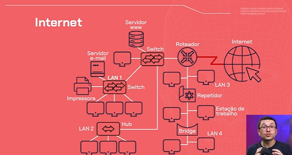
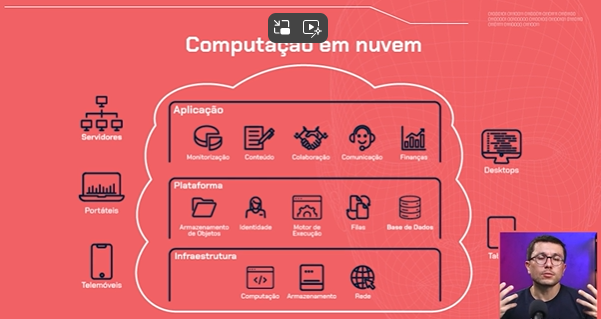

# <span style="color: #87BBA2">===   Começando em Cloud: usando a AWS e explorando os recursos da nuvem como serviço   ===</span> <!-- omit in toc -->

# <span style="color: #87BBA2">INDICE</span> <!-- omit in toc -->
- [NAVEGANDO NA NUVEM](#navegando-na-nuvem)
  - [INDENTIFICANDO A COMPUTAÇÃO COMO SERVIÇO](#indentificando-a-computação-como-serviço)
    - [Onde fica o servidor?](#onde-fica-o-servidor)
    - [Facilidades](#facilidades)
    - [Outras ocorrencias](#outras-ocorrencias)
  - [FUNCIONALIDADES COMUNS NA NUVEM](#funcionalidades-comuns-na-nuvem)
  - [ENTENDENDO ONDE ESTÁ A NUVEM](#entendendo-onde-está-a-nuvem)
    - [Como funcionam as redes](#como-funcionam-as-redes)
    - [O que são protocolos](#o-que-são-protocolos)
    - [Modelo TCP/IP](#modelo-tcpip)
    - [A Internet e estrutura de redes](#a-internet-e-estrutura-de-redes)
    - [Camadas do TCP/IP](#camadas-do-tcpip)
    - [Camada de aplicação](#camada-de-aplicação)
    - [Camada de transporte](#camada-de-transporte)
    - [Camada de rede](#camada-de-rede)
    - [Camada de acesso à rede](#camada-de-acesso-à-rede)
    - [Localizando a Nuvem](#localizando-a-nuvem)
  - [TIPOS DE CLOUD](#tipos-de-cloud)
    - [Cloud Pública](#cloud-pública)
    - [Cloud Privada](#cloud-privada)
    - [Cloud Híbrida](#cloud-híbrida)
  - [CRIANDO UMA CONTA NA AWS](#criando-uma-conta-na-aws)
    - [Qual serviço escolher (SaaS, IaaS, PaaS)](#qual-serviço-escolher-saas-iaas-paas)
    - [Maiores players](#maiores-players)
    - [Modelo de pagamento](#modelo-de-pagamento)
    - [Criando uma conta na AWS](#criando-uma-conta-na-aws-1)
- [AVALIANDO SERVIÇOS, SEGURANÇA E REGIÕES](#avaliando-serviços-segurança-e-regiões)
  - [SELECIONANDO SERVIÇOS NA CLOUD](#selecionando-serviços-na-cloud)
    - [Categoria Computação](#categoria-computação)
    - [Categoria Armazenamento](#categoria-armazenamento)
    - [Categoria Banco de Dados](#categoria-banco-de-dados)
    - [Categoria Rede](#categoria-rede)
    - [Categoria Segurança, Identidade e Conformidade (IAM)](#categoria-segurança-identidade-e-conformidade-iam)
    - [Categoria Monitoramento](#categoria-monitoramento)
  - [GERENCIAMENTO DE ACESSO](#gerenciamento-de-acesso)
    - [Acessando o IAM (Identity and Access Management)](#acessando-o-iam-identity-and-access-management)
    - [Criando Politicas](#criando-politicas)
    - [Criando Grupo de usuários](#criando-grupo-de-usuários)
    - [Conclusão](#conclusão)
  - [DISTRIBUINDO APLICAÇÔES EM REGIÕES](#distribuindo-aplicaçôes-em-regiões)
    - [Regiões de datacenter clound](#regiões-de-datacenter-clound)
    - [Qual escolher?](#qual-escolher)
      - [Sobre o custo](#sobre-o-custo)
    - [Casos de sucesso](#casos-de-sucesso)
    - [Zonas de disponibilidade](#zonas-de-disponibilidade)
    - [Disponibilidade é um diferencial](#disponibilidade-é-um-diferencial)
    - [Atenção a abrangência dos serviços gratuitos](#atenção-a-abrangência-dos-serviços-gratuitos)
  - [PARA SABER MAIS: DATA CENTERS DA AWS](#para-saber-mais-data-centers-da-aws)
    - [Regiões](#regiões)
    - [Zonas de disponibilidades (AZs - Availability zones)](#zonas-de-disponibilidades-azs---availability-zones)
    - [Zonas locais](#zonas-locais)
  - [REVISANDO IAM](#revisando-iam)
    - [Criando grupos de usuários](#criando-grupos-de-usuários)
    - [Estabelecendo políticas de acesso](#estabelecendo-políticas-de-acesso)
    - [Concedendo permissões](#concedendo-permissões)
- [CRIANDO INSTÂNCIAS](#criando-instâncias)
  - [VIRTUALIZANDO RECURSOS](#virtualizando-recursos)
    - [Passo a passo](#passo-a-passo)
    - [O que é uma instância](#o-que-é-uma-instância)
      - [O que é uma maquina virtual](#o-que-é-uma-maquina-virtual)
    - [Criando instancia](#criando-instancia)
      - [Passo a passo](#passo-a-passo-1)
    - [Mais um exemplo de quando usar cloud](#mais-um-exemplo-de-quando-usar-cloud)
    - [On-Premises, IaaS, PaaS, SaaS](#on-premises-iaas-paas-saas)
  - [SOBRE VIRTUALIZAÇÃO E NUVEM](#sobre-virtualização-e-nuvem)
    - [Qual a relação entre virtualização e a nuvem?](#qual-a-relação-entre-virtualização-e-a-nuvem)
  - [CONFIGURANDO REGRAS DE SEGURANÇA](#configurando-regras-de-segurança)
    - [Grupos de segurança](#grupos-de-segurança)
    - [Regras ao subir uma instancia de forma pádrão](#regras-ao-subir-uma-instancia-de-forma-pádrão)
    - [Configurando regras de acesso](#configurando-regras-de-acesso)
  - [PARA SABER MAIS: REGRAS DE SEGURANÇA PARA TRÁGEFO EM INSTANCIAS EC2 DA AWS](#para-saber-mais-regras-de-segurança-para-trágefo-em-instancias-ec2-da-aws)
    - [Protocolo SSH (Secure Shell)](#protocolo-ssh-secure-shell)
    - [Protocolo HTTP (HyperText Transfer Protocol)](#protocolo-http-hypertext-transfer-protocol)
    - [Protocolo HTTPS (HyperText Transfer Protocol Secure)](#protocolo-https-hypertext-transfer-protocol-secure)
  - [EXPOSIÇÃO DE PORTAS E PROTOCOLOS](#exposição-de-portas-e-protocolos)
  - [ACESSANDO A INSTANCIA VIA SSH](#acessando-a-instancia-via-ssh)
    - [Configurando par de chaves de segurança](#configurando-par-de-chaves-de-segurança)
      - [Aba Criar Par de Chaves](#aba-criar-par-de-chaves)
    - [Acessando ambiente](#acessando-ambiente)
    - [Caso queiramos apagar o fingerprint](#caso-queiramos-apagar-o-fingerprint)
      - [1️⃣ **Remover pelo número da linha** (Recomendado)](#1️⃣-remover-pelo-número-da-linha-recomendado)
      - [2️⃣ **Remover diretamente pelo SSH**](#2️⃣-remover-diretamente-pelo-ssh)
    - [Permissão negada](#permissão-negada)
      - [Acessando o EC2 Connect](#acessando-o-ec2-connect)
    - [Cadastrando chave publica na Instancia](#cadastrando-chave-publica-na-instancia)
  - [ATENÇÂO: Por algum motivo, não estava conseguindo acessar a instancia](#atençâo-por-algum-motivo-não-estava-conseguindo-acessar-a-instancia)


# <span style="color: #87BBA2">NAVEGANDO NA NUVEM</span>

## INDENTIFICANDO A COMPUTAÇÃO COMO SERVIÇO
Segue-se o conceito de Cliente / Servidor, onde, lembrando, um servidor é um computador que armazena a aplicação e recebe as requisições do cliente para atender suas solicitações.

Os clientes podem ser telefones, notebooks, a televisão de casa.

### Onde fica o servidor?
O servidor poderia ser um computador que fica em nossa casa ligada 24h sempre respondendo as solicitações das pessoas, **ou**, podemos utilizar a Computação em Núvem, que seu conceito é a oferta de serviços computacionais como armazenamento e hospedagem de website como um serviço.

### Facilidades
Não precisamos, por exemplo, de nos preocuparmos com o estado deste computador, se ele está ligado, e afins, pois isso fica a cargo de um provedor de serviços.

### Outras ocorrencias
Além de armazenamento, podemos observar o Cloud Computing atuando em armazenar Softwares onde os clientes acessem via navegador, e o Software está executando na Clound. Isso se chama Software as a Service (SaaS).


## FUNCIONALIDADES COMUNS NA NUVEM

Armazenamento de dados

Um dos recursos mais populares da nuvem é o armazenamento de dados. Serviços de armazenamento em nuvem são oferecidos por provedores como Google, Microsoft, Amazon e Dropbox, permitindo acessar dados de qualquer dispositivo conectado à Internet. Isso elimina a necessidade de transferências manuais de arquivos e é uma opção confiável para backups e recuperação de dados, garantindo a disponibilidade das informações em caso de falhas.

Muitas aplicações em celulares e notebooks fazem uso desse recurso em suas operações. Anteriormente, os dados eram armazenados localmente em discos rígidos, SSDs e outros dispositivos físicos. Com os avanços tecnológicos, o armazenamento em nuvem se tornou mais popular, permitindo que os usuários armazenem seus dados de forma segura e acessível em servidores remotos.

Compartilhamento de arquivos

Outro recurso bem comum é o compartilhamento de arquivos, a nuvem facilita a colaboração e o compartilhamento de arquivos entre equipes. Ferramentas como Google Docs, Google Drive, Microsoft OneDrive, iCloud e Trello permitem criar, acessar, editar e colaborar em documentos, fotos, planilhas e apresentações, sincronizando e salvando tudo em tempo real na nuvem. Para isso, você só precisa de um dispositivo com conexão à Internet.

Hospedagem de aplicativos

A nuvem também permite a hospedagem de aplicativos, facilitando para pessoas desenvolvedoras e empresas gerenciarem seus aplicativos de maneira escalável e confiável, sem precisar configurar e manter servidores físicos. Amazon Web Services (AWS), Microsoft Azure e Google Cloud Platform possuem vários serviços que podem ser utilizados com essa finalidade.

Processamento de dados

Além de tudo o que já comentamos, a nuvem pode ser usada para processamento de dados, executando tarefas de processamento, análise e armazenamento de grandes volumes de dados.

A flexibilidade e acessibilidade oferecidas pela nuvem são essenciais para indivíduos e empresas modernas, promovendo uma maior colaboração e inovação. À medida que a tecnologia evolui, é provável que vejamos ainda mais recursos e capacidades sendo integrados às soluções em nuvem, solidificando ainda mais sua posição como uma ferramenta indispensável no cotidiano.

## ENTENDENDO ONDE ESTÁ A NUVEM
Indo em um site, na aba de inspecionar > rede, podemos observar as nossas solicitações.

Quando clicamos em algum botão, ou realizamos alguma ação, visualizamos que uma série de Solicitações de Recursos são feitas, e essas solicitações são feitas ao Servidor que está armazenando este site e, ao mesmo tempo, o Servidor está retornando o conteudo da escola de programação.

E o que faz a ligação entre o dispositivo do cliente e o servidor (que pode estar como serviço de computação em nuvem) é a internet. Ou melhor, são as redes de computadores.
> A internet é um sistema global de redes de computadores interligadas.

### Como funcionam as redes
Toda vez que dois dispositivos se conectam para transferencia de conjunto de dados são utilizados conjuntos de protocolos.

Utilizamos um conjunto de protocolos toda vez que interagimos com o site, precisamos nos conectar com um dispositivo, seja para enviar um arquivo ou receber um conjunto de dados.

### O que são protocolos
Eles nos ajudam a organizar o pedido ou o encaminhamento de dados em pacotes. Esses pacotes recebem o endereço de origem, que é o nosso computador encaminhando a solicitação para o site, e também precisam do endereço de destino, para onde o pacote deve ser enviado.

E por isso que todos os computadores recebem endereço (IP), o qual está na camada de Transporte do protocolo TCP/IP.

### Modelo TCP/IP

Essa imagem mostra que a requisição e o conjunto de dados passam por várias camadas antes de serem preparados para serem encaminhados através de uma série de dispositivos interconectados.

Isso porque o servidor que armazena esse site pode estar localizado fora da nossa cidade, possivelmente em outro país ou continente, além da área de cobertura do nosso provedor de internet. Para que nossa requisição alcance esse servidor, ela precisa passar por uma série de dispositivos de rede intermediários, como os roteadores, os quais frequentemente reiniciamos em casa quando a conexão está instável, até chegar ao endereço de destino.

### A Internet e estrutura de redes


### Camadas do TCP/IP
Nesse modelo, temos quatro principais camadas.

### Camada de aplicação
A primeira é a camada de aplicação, que está próxima ao nosso site. É nessa camada que inspecionamos os pacotes, solicitações e requisições. Um dos principais protocolos que operam nesta camada é o HTTP, e sua versão segura HTTPS.

### Camada de transporte
A camada de transporte utiliza o protocolo TCP para garantir a entrega confiável dos pacotes nessa conexão segura.

### Camada de rede
Na camada de rede, o principal protocolo é o IP, que realiza o endereçamento dos pacotes, especificando sua origem e destino.

### Camada de acesso à rede
A camada de acesso à rede, por sua vez, estabelece a conexão física entre os dispositivos.

Na formação das redes, não são apenas os dispositivos clientes, como nossos computadores ou celulares, que estão envolvidos. Também existem os dispositivos de rede, especializados em conectar diferentes redes ao redor do mundo e entre países, encaminhando pacotes e facilitando essa interconexão.

E onde a nuvem se encaixa nisso tudo?

### Localizando a Nuvem
A nuvem é um servidor ou um conjunto de servidores conectados à rede global de computadores, que é a internet.

Quando mencionamos serviços de computação em nuvem, geralmente nos referimos a data centers ("centro de dados"), que são sistemas compostos por múltiplos computadores com grande capacidade de processamento e armazenamento centralizados em um único local.

Esses data centers estão conectados à internet através de redes de alta velocidade, o que permite acessar e armazenar informações rapidamente, além de atender às solicitações rapidamente sempre que clicamos no ícone do site para enviar uma resposta ao nosso dispositivo.

Uma coisa que as pessoas usuárias nunca querem é esperar muito tempo para carregar uma página. Por isso, a conexão é fundamental tanto para a pessoa usuária quanto para os data centers.

Conclusão e Próximos passos
Era inimaginável ter a computação como um serviço usando computação em nuvem cerca de uma década atrás. Por quê? Nossas velocidades de conexão eram bastante baixas, então carregar um vídeo no YouTube, por exemplo, podia levar um tempo considerável. Usar um software como serviço no navegador era pouco prático. Era mais eficiente e rápido ter o software instalado diretamente em nosso desktop.

## TIPOS DE CLOUD

Atualmente temos três tipos principais de Cloud. Que tal analisarmos cada um deles?

### Cloud Pública
É o tipo mais comum de cloud, sendo amplamente utilizado por empresas de vários setores. Nesse tipo, os serviços são mantidos por um provedor, como Google, Microsoft, Amazon, Oracle ou IBM.

Esses provedores possuem data centers com servidores interconectados que compartilham recursos e serviços entre as pessoas usuárias. Trata-se, portanto, de uma solução de cloud bem prática e escalável.

### Cloud Privada
Ao contrário da cloud pública, a cloud privada oferece uma infraestrutura dedicada exclusivamente a uma organização. Isso significa mais controle e segurança, já que os recursos não são compartilhados com outras empresas. A nuvem privada pode ser hospedada no data center da própria empresa.

Você sabia que pode construir sua própria nuvem em casa? Um exemplo simples é usar uma Raspberry Pi para criar uma nuvem pessoal. A Raspberry Pi é um microcomputador de baixo custo e alta versatilidade, ideal para projetos de tecnologia. Com isso, você terá uma nuvem privada em casa, garantindo total controle e segurança sobre seus dados, similar ao que uma organização obteria com uma infraestrutura de cloud privada.

### Cloud Híbrida
Essa opção combina o melhor dos dois mundos, pública e privada. Por exemplo, você pode usar a nuvem pública para executar sistemas e a privada para armazenar dados sensíveis. É uma solução flexível que permite otimizar recursos e segurança conforme necessário.

Além desses tipos de cloud, você pode se deparar com o termo On Premises. Isso refere-se a quando toda a infraestrutura de TI, como servidores e máquinas, está localizada fisicamente na empresa, na conhecida "sala de servidores" ou CPD (Centro de Processamento de Dados). Enquanto a nuvem oferece flexibilidade e escalabilidade, o ambiente On Premises proporciona controle total sobre a infraestrutura.

Escolher a solução certa depende das suas necessidades específicas de segurança, controle e escalabilidade. Compreender essas opções permite tomar decisões informadas e alinhadas com as necessidades e objetivos da sua organização.

## CRIANDO UMA CONTA NA AWS


### Qual serviço escolher (SaaS, IaaS, PaaS)
Qual deles devemos escolher? Todos esses principais provedores oferecem conjuntos de serviços semelhantes. Eles disponibilizam serviços de infraestrutura, plataforma e aplicação. Por exemplo, **aplicação como serviço** para **hospedar software** e **plataforma como serviço** para **hospedar websites**.

E **infraestrutura como serviço** significa **descentralizar toda a infraestrutura, como o data center** que poderíamos ter localmente na nossa organização, e deixar isso sob os cuidados de um provedor de serviços de Computação em Nuvem.

### Maiores players
- Google Cloud
  - Destaca-se pelo foco em inteligência artificial, um campo atualmente em alta. A Google Cloud oferece uma variedade de serviços e soluções para desenvolver algoritmos de IA e disponibilizar essas soluções através da rede.
- Amazon Web Services (AWS)
  - A AWS é conhecida por ser um dos players mais famosos, justamente por ter um conjunto diversificado de serviços e uma abrangência global significativa de data centers.
- Micrososft Azure
  - Destaca-se especialmente quando precisamos integrar aplicações da própria Microsoft.

### Modelo de pagamento
Pay-as-you-go, ou seja, paga-se pelo o que você de fato utiliza.

### Criando uma conta na AWS
Escolhemos a AWS por ser a Cloud mais utilizada no mercado. No caso, as funções centrais costumam ser iguais entre as provedoras de clound, logo, o conhecimento poderá ser intercambéavel.
- Para criar sua conta, use este [link](https://aws.amazon.com/pt/)

# <span style="color: #87BBA2">AVALIANDO SERVIÇOS, SEGURANÇA E REGIÕES</span>

## SELECIONANDO SERVIÇOS NA CLOUD
A Dashboard da AWS mostra os serviços recentemente utilizados, box das aplicações que estamos rodando, box do custo e quais serviços estamos utilizando.

Visualizando os serviços disponibilizados, observamos uma lista variada e pode nos deixar perdidos. Vamos analisar as 5 principais categorias que se aplicam ao nosso problema a ser resolvido.

Clicamos no submenu de Todos os Servicos em Serviços por Categoria.

### Categoria Computação
Dedica-se a oferta de serviço para execução de aplicações em servidores virtuais.
- EC2: Acronimo para Elastic Compunting Cloud
  - Um dos serviços que oferecem para nós a opção de criar servidores virtuais como instancias. Ele será bem importante.
- Lambada: Esse é um serviço especial pois oferece serviços computacionais do tipo servless, ou seja, que não temos uma presença tão central de um servidor. No nosso caso, usaremos servidor então o EC2 nos servirá bem

O Amazon EC2 (Elastic Compute Cloud), é o serviço de computação em nuvem da AWS que permite criar e configurar servidores virtuais de acordo com as suas necessidades específicas.

Com o EC2, você pode selecionar a quantidade de armazenamento, memória, processador e sistema operacional que melhor atendem ao seu projeto.

Vamos imaginar que você está desenvolvendo um aplicativo que precisa processar grandes volumes de dados. Com o EC2, podemos facilmente escalar a capacidade de processamento adicionando ou removendo instâncias de servidores virtuais conforme necessário. Essa característica é muito útil durante picos de uso, como, por exemplo, em lançamentos de produtos ou períodos de promoções especiais (Black Friday, Festas de Fim de Ano, etc).

O Amazon EC2 permite executar diversas instâncias de servidores simultaneamente, garantindo alta disponibilidade e distribuição de carga de trabalho. Ele oferece várias camadas de segurança, incluindo configurações de firewall, permissões de acesso e redes privadas virtuais (VPC), garantindo que nossos dados e aplicações estejam protegidos.

### Categoria Armazenamento
Aqui armazenaremos dados, como textos que irão ser disponibilizados ao site, videos e afins (como a plataforma da Alura)
- S3: Single Storage Service, um dos serviços que realiza essa operação de armazenar

O Amazon Simple Storage Service (S3) é o principal serviço de armazenamento de dados da AWS. O S3 se destaca pela capacidade de fornecer segurança robusta, escalabilidade flexível e desempenho eficiente.

Com o S3, podemos armazenar e recuperar qualquer quantidade de dados a qualquer momento, de forma segura e acessível. Podemos adotá-lo em diferentes contextos, desde armazenamento de dados para websites e aplicativos móveis até backup e recuperação de desastres.

No S3, o armazenamento de dados trabalha com Objetos e Buckets.

Um objeto é composto por um arquivo e os metadados que descrevem esse arquivo. Já o bucket funciona como um contêiner para esses objetos.

### Categoria Banco de Dados
Bons serviços para validar o acesso de clientes.

O Amazon RDS (Amazon Relational Databases) é o serviço da AWS que disponibiliza o gerenciamento de base de dados relacionais na plataforma da AWS, focando em escalabilidade e no autogerenciamento. O RDS dá suporte a toda infraestrutura de banco de dados com um conjunto bem resumido de opções no console do RDS.

Por meio dele conseguimos automatizar rotinas de administração de banco de dados, provisionamento de hardware e configurações de backup e restore.

### Categoria Rede
Podemos ter acesso a esse serviço para melhorar a experiencia do usuário e também garantir a disponibilidade do conteúdo, como armazenar o website em 2 ou mais datacenteres em determinada região.

### Categoria Segurança, Identidade e Conformidade (IAM)
Serviço de gerenciamento de identidade e acesso, quem pode acessar um determinado serviço e como será esse acesso. 

**Tópico muito essencial para a aplicação.**

### Categoria Monitoramento
No Amazon CloudWatch, temos o serviço de monitoramento e observabilidade dos recursos da AWS. Com ele é possível configurar diversas opções de monitoramento e os gastos gerados no consumo de cada recurso.

Esse serviço tem foco especial em pessoas da área de DevOps, em pessoas desenvolvedoras, de engenharia de confiabilidade e de gestão de TI. O CloudWatch entrega uma série de dados e métricas de uso para monitorar as aplicações, a performance e a utilização de todo o sistema.

Entender essas ferramentas é essencial para aproveitar ao máximo o potencial da computação em nuvem e garantir que sua infraestrutura de TI seja eficiente, segura e escalável.

## GERENCIAMENTO DE ACESSO
Quando lidamos com serviço de computação em núvem, teremos segurança de responsabilidade compartilhada, entre o cliente e o provedor de serviço.

Basicamente, a provedora se responsabilizará pelos problemas de segurança quanto à infraestrutura, sendo de responsibilidade do cliente a segurança nos outros cenários que não envolva o hardware da provedora e seus serviços prestados.

No geral, a provedora se responsibiliza PELA Clouds, e o cliente pelo O QUE ACONTECE dentro da Cloud.
- Ou seja, a responsabilidade de quem pode acessar a conta é de responsabilidade estrita do cliente.


### Acessando o IAM (Identity and Access Management)
- Muito importante ativar o **MFA**, ou Multi Factorial Access, que é um método de acessar a conta utilizando mais do que a senha.
  - Hoje em dia, o vazamento de senhas é algo que está acontecendo mais, e se por acaso não configurar o MFA, quem tiver o usuário e senha conseguirá acessar a plataforma.

### Criando Politicas
Ao visualizar o menu da esquerda, podemos ver uma sequencia de sessões. Em Gerenciamento de Acesso, o conceito chave aqui é **Policitas**.

É onde definimos as permissões. Ou seja, uma politica nada mais é do que **um conjunto de regras de permissões.** Poderemos atribuir essa politica a um ou a um grupo de usuários para, por exemplo, criar e/ou gerenciar instancias dentro da organização, seja de EC2, de Banco de Dados, de Machine Learning e afins.

Logo em seguida, é perguntado a nós se queremos aplicar essa politica a um recurso específico ou a todos os recursos. Neste caso, aplicaremos a todos os recursos.

Por ultimo, é solicitado a nós a criarmos um nome e darmos uma descrição a politica que estamos criando. A descrição é opcional.

Apesar de podermos atribuir as politicas à usuários especificos, é uma boa pratica utilizarmos **grupo de usuários**, sendo a exceção uma atribuição de politica à usuários diretamente.

### Criando Grupo de usuários
- Clica-se no botão **Criar Grupo**
- Damos o nome para esse grupo, por exemplo, "devops"
- Selecione os usuários desejados
- Atribuie-se, agora, as politicas para o Grupo em criação. Podemos, por exemplo, procurar pela politica que acabamos de criar
- Um ponto interessante é que a AWS já disponibilza algumas politicas já pré-definidas, caso queiramos utiliza-las.
  - Como a politica "AdministratorAccess"
- Finalizamos clicando em "Criar grupo"

### Conclusão

Para entender melhor o fluxo de permissões e gerenciamento de acesso, precisamos definir políticas, que são as permissões que usuários ou grupos de usuários possuem dentro da nossa organização. Essas políticas determinam quais serviços um usuário pode acessar na AWS.

Toda vez que um usuário faz login na AWS, o sistema verifica se ele tem autorização para realizar ações como criar ou excluir uma instância, criar um banco de dados, ou visualizar informações armazenadas. Por isso, o gerenciamento dessas permissões é crucial. Ele nos permite, por exemplo, restringir o acesso a dados sensíveis dos nossos clientes, como no caso da clínica médica mencionado anteriormente.

## DISTRIBUINDO APLICAÇÔES EM REGIÕES


Um website não existe no ar, ele está armazenado em um servidor (ou datacenter) físico no mundo. Para isso, o Client (como um navegador) envia uma requisição HTTP para este servidor, o qual responde com os dados ou a operação solicitada (um HTML, um JSON, etc).

**Latencia** = Tempo que um pacote de dados leva para se deslocar de um ponto a outro.
- Quanto maior a latência, maior o desconforto do usuário.

E essa variável, a latência, é algo que precisamos considerar quando estamos construindo um website.

### Regiões de datacenter clound
No canto superior direito, proximo ao nome de nosso usário, encontraremos o nome de uma cidade (no curso, foi identificado **Ohio**). Ao clicar nesse dropdown, será disponiblizada uma listagem de regiões e paises.
- Isso tá mostrando pra nós as diferente regiões que a AWS possui datacenters.
- São regiões de disponibilidade

### Qual escolher?
Precisamos considerar a latencia, pois, **quanto maior a distancia entre o SERVIDOR e as PESSOAS USUÁRIAS, o TEMPO DE RESPOSTA PROVAVELMENTE SERÁ MAIOR**.
- O ideal é **escolher um datacenter proximo das pessoas usuárias**

#### Sobre o custo
Outra variável é **O CUSTO**, pois, cada região possui um custo diferente.
- Cobra-se, por exemplo, por demanda (pay as you go) e cada região tem um preço por demanda.
- Por exemplo: No momento do vídeo, o preço por 10tb de transferência em um datacenter em São Paulo é 0,15 dolares. Já em Ohio, está 0,09.
  - Ou seja, a melhor opção nem sempre será o data center de São Paulo.

Podemos conferir os valores nessa [pagina](https://aws.amazon.com/pt/ec2/pricing/on-demand/).

### Casos de sucesso
A **Netflix** é um bom exemplo de aplicação da Cloud, ela utiliza a AWS e ao adotar infraestrutura em Cloud torna desnecessário ela ter seu próprio datacenter em cada região do mundo e que tenha pessoas de infraestrutura cuidando disso, e delega essa necessidade para a AWS.

E caso a **Netflix** opta-se por ter um datacenter em poucas regiões (ou em apenas uma região), a experiência do usuário poderia ser muito comprometida, já que os dados poderiam demorar mais para serem transferidos (ainda mais para a exigencia de video, o qual é uma maior exigencia) e, até, existir congestionamento e afins. O modelo da **Cloud**, neste caso, então, acabou servindo como uma luva.

### Zonas de disponibilidade
Zonas de Disponibilidade é como se fosse um datacenter em uma região, e é comum ver mais de uma zona de disponibilidade em uma mesma regisao como forma de backup para caso uma zona de disponibilidade perder conexão, fazendo com que nossa aplicação corra muito menos riscos de ficar fora do ar. Isso ocorre mesmo se tivermos selecionado apenas uma região de hospedagem.

No caso da **Netflix**, fé comum que armazenemos nosso serviço em diferentes regiões, pois, quanto mais proximo da pessoa usuária, melhor a qualidade do serviço.

No caso de um website simples, é comum escolhermos apenas uma região com alguma zona de disponibilidade para termos backup e manter o site no ar sempre.
- Um minuto de um site de e-commerce fora do ar é prejuizo
- Quando o site cai, é normal recebermos erros como 502 (Bad Gateway) e 504 (Gateway Timeout), que são erros do lado do servidor.

### Disponibilidade é um diferencial
Utilizar infraestrutura Cloud é um diferencial frente as estruturas `on-premisse` (sistema de infraestrutura local)
- Caso perdemos a conexão de nosso data center que está rodando em nossa organização, nossa aplicação ficará fora do ar.

Quando contratamos uma infraestrutura cloud com zonas de disponibilidade, garantimos ao usuário sempre o acesso e o acesso com qualidade (com baixa latencia).

### Atenção a abrangência dos serviços gratuitos
Ao escolher uma região, atente-se se ela está abrangida no período de serviço gratuito, pois, tem regiões que não possuem periodo gratuito.

## PARA SABER MAIS: DATA CENTERS DA AWS
Na AWS, podemos escolher a região onde vamos utilizar um determinado serviço. Essa escolha deve ser realizada com cuidado, pois a localização dos data centers pode impactar diretamente no tempo de resposta de uma aplicação devido a latência.

A proximidade geográfica entre os usuários e os servidores pode reduzir a latência e melhorar o desempenho da aplicação. Além disso, a escolha da região pode influenciar fatores como conformidade com regulamentações locais, custos de operação e disponibilidade de serviços específicos.

Para sermos capazes de fazer uma boa escolha, que tal compreendermos melhor como os data centers da AWS estão organizados em regiões (regions), zonas de disponibilidade (availability zones) e zonas locais (local zones)?

### Regiões
As regiões são locais físicos ao redor do mundo onde os data centers da AWS estão agrupados. Cada região é constituída por várias zonas de disponibilidade isoladas, fisicamente localizadas em uma determinada área geográfica.

Neste modelo de organização, as zonas de disponibilidade de cada região possuem energia, refrigeração e segurança implementadas de forma independente e se conectam por uma infraestrutura de rede redundante.

### Zonas de disponibilidades (AZs - Availability zones)
As zonas de disponibilidade, ou AZs (availability zones), são conjuntos de data centers operando de forma independente dentro de uma região da AWS. Elas fornecem capacidade de operação de aplicativos, bancos de dados com alta disponibilidade, escalabilidade de infraestrutura e tolerância a falhas.

Toda a infraestrutura das AZs opera sob uma rede de banda larga com fibra dedicada, e toda a comunicação dentro da zona é criptografada.

### Zonas locais
As zonas locais visam criar uma proximidade ainda maior para computação, armazenamento, banco de dados e outros serviços AWS. Elas permitem a execução de aplicações que exigem latências de milissegundos para usuários finais, como aplicações de conteúdo multimídia, jogos em tempo real, automação e machine learning.

A escolha correta da região, zona de disponibilidade e zona local é crucial para garantir o desempenho, a segurança e a conformidade da sua aplicação na AWS. Compreendendo tudo isso, você poderá tomar decisões informadas que podem impactar diretamente a eficiência operacional, os custos e a experiência do usuário final.

## REVISANDO IAM
O AWS Identity and Access Management (IAM) é um serviço fundamental na AWS que permite gerenciar o acesso dos usuários aos recursos da nuvem de forma segura.

Com o IAM, é possível criar e gerenciar usuários, grupos e permissões de forma granular, controlando quem pode acessar quais recursos e quais ações podem realizar. Ao criar políticas de acesso, os administradores podem definir permissões específicas para cada usuário ou grupo, limitando o acesso apenas ao necessário para realizar suas tarefas.

Uma das boas práticas fortemente recomendadas no gerenciamento de acesso é o princípio do menor privilégio que consiste em conceder apenas as permissões mínimas necessárias para cada usuário ou grupo, e revisar regularmente as permissões para garantir que estejam alinhadas com as necessidades do negócio e as políticas de segurança.

Que tal praticar as boas práticas de segurança no ambiente de nuvem de uma organização criando grupos de usuários, estabelecendo políticas e permissões aos grupos criados na AWS?

Para mais detalhes sobre o passo a passo desse processo, clique na opinião da pessoa instrutora!

### Criando grupos de usuários
Para começar, acesse o console da AWS usando suas credenciais de administrador. Dentro do console, navegue até o serviço IAM. Lá, você encontrará a opção de criar grupos de usuários. Clique em "Grupos" no painel de navegação à esquerda e, em seguida, clique em "Criar grupo".

Siga as instruções para dar um nome ao grupo e, opcionalmente, adicione uma descrição. Após a criação do grupo, você poderá adicionar usuários a ele, selecionando os usuários existentes na sua conta.

### Estabelecendo políticas de acesso
Agora que os grupos estão criados, é hora de estabelecer políticas de acesso. Na página de detalhes do grupo que você acabou de criar, clique na aba "Políticas de grupo" e depois em "Anexar políticas". Aqui, você pode escolher entre políticas predefinidas fornecidas pela AWS ou criar suas próprias políticas personalizadas.

Selecione as políticas que se adequam às necessidades do grupo e confirme a sua escolha.

### Concedendo permissões
Para estabelecer permissões aos grupos, você precisará associar usuários aos grupos e definir permissões específicas para cada grupo.

Para isso, navegue até a página de detalhes do grupo e clicando na aba "Usuários" para adicionar ou remover usuários do grupo. Uma vez que os usuários estejam no grupo, eles herdarão as permissões associadas a ele através das políticas que você definiu anteriormente.

> Lembre-se de revisar regularmente suas políticas de acesso e permissões para garantir que estejam alinhadas com as necessidades do seu negócio e as melhores práticas de segurança da AWS. Se precisar de mais orientações, consulte a documentação oficial da [AWS](https://docs.aws.amazon.com/pt_br/).

# <span style="color: #87BBA2">CRIANDO INSTÂNCIAS</span>

## VIRTUALIZANDO RECURSOS
Para armazenar nosso website, utilizaremos uma instancia de computação, ou seja, **EC2**.

### Passo a passo
- Na barra de pesquisa, escrever **EC2** e clique nele
- Seremos direcionados para a dashboard do **EC2** (cada serviço tem um dashboard próprio)
- Menu lateral, categoria **instâncias**, clicamos em **tipos de instância** e lá teremos uma lista de instâncias para seleção.

### O que é uma instância
Uma instância é uma máquina virtual hospedada na infraestrutura do provedor de serviços em núvem.

#### O que é uma maquina virtual


Quando falamos de uma maquina virtual, precisamos lembrar que sempre teremos uma única infraestrutura de hardware e temos uma camada de software chamada de **hipervisor que fará o gerenciamento desse hardware**.

A partir dessa camada de hipervisor, podemos construir diferentes maquinas com especificações e configurações diferentes.

Ou seja, assim criamos diversas maquinas distintas a partir de uma mesma infraestrutura de hardware. Isso é crucial na infraestrutura cloud pois é dessa maneira que criamos uma instancia.

### Criando instancia
Os tipos de instancia, então, são os tipos de maquinas que podemos instanciar e suas configurações de desempenho, como quantidade de CPU, processador e afins.
- O instutor escolheu instanciar um `t2.micro`, no Norte da Virginia, pois, este, segundo ele, está abarcado pelo periodo de teste gratuito.
- Ao clicar na linha da instancia, poderemos ver mais informações sobre ela e clicando no nome da instancia, abrirá uma pagina separada para ela

#### Passo a passo
- Escolhemos o tipo de instancia, neste caso, o `t2.micro`
- Canto superior direito, em ações, clicamos em `launch instance`
- Uma janela será aberta para realizar mais configurações
  - Daremos nome para a instancia: `servidor_web`
  - Segunda informação é a imagem do sistema operacional
    - Geralmente, quando estamos falando de servidor, nós utilizaremos alguma distro Linux.
    - Neste exemplo, utilizaremos a distro Amazon Linux (principalmente pelo fato dela estar qualificada para o nível gratuito)
    - Verificamos o tipo de instancia e verificamos, também, que ele está qualificiado para o nível gratuito.
    - Apesar de ser recomendado utilizar **Par de chaves (login)**, optaremos pela desativação nesse momento.
    - Nas configurações de rede é onde configuramos como as pessoas poderão acessar essa instancia.
      - Aqui que configuraremos quais endereços IPs poderão ter acesso a instancia com a aplicação que estiver rodando dentro dela.
    - Selecionaremos a opção de **Criar um grupo de segurança**, que criará um grupo de segurança por padrão
    - Armazenamento nós deixaremos padrão
    - E no final, temos o resumo das configurações e a opção de quantas instancias gostariamos de criar
    - **Importante checar se no final aparece a mensagem de que está apta para o teste gratuito**
- Clicamos em executar instancia e então o build é iniciado

### Mais um exemplo de quando usar cloud
Notou como é simples criar uma máquina virtual usando uma instância da EC2 da AWS?

Inclusive, poderíamos utilizar esse mesmo serviço se estivéssemos preparando um algoritmo de detecção de eventos, de objetos - já usando redes neurais e criando aplicações de inteligência artificial.

Nesses casos, muitas vezes, precisamos processar um grande volume de dados. Não vamos comprar um PC com uma grande capacidade de processamento e boa placa de vídeo para ficar em casa e ser usada apenas ocasionalmente.

Quando criamos uma instância com as configurações adequadas para execução de um determinado serviço, fazemos o seu uso durante o número de dias necessários para o processamento, verifica se os resultados foram satisfatórios. Tendo sido satisfatórios, simplesmente desprovisionamos essa instância e não precisamos pagar mais nada por ela.

Desse modo, sempre teremos acesso às melhores configurações de hardware possíveis - sem precisar adquirir esse hardware que teria alto custo de investimento inicial e que se desatualizaria rapidamente. Sabemos que as tecnologias vão evoluindo conforme o tempo. Aliás, essa é uma das boas características da computação em nuvem.

### On-Premises, IaaS, PaaS, SaaS


Quando estamos trabalhando **on-premises**, ou seja, usando a **infraestrutura local**, temos que cuidar desde a aplicação, ou seja, desde a construção do website, até mesmo as configurações de rede, dos roteadores que estarão fazendo a conexão desse servidor físico com as redes de computadores, ou seja, com a internet.

Quando optamos por um serviço de **infraestrutura como um serviço (IaaS)**, como é o caso de criar uma instância para hospedar uma aplicação web, ou uma instância para fazer um trabalho de processamento, cuidamos apenas da parte da seleção e manutenção do sistema operacional que está sendo executado dentro dessa instância.

Tudo que estiver abaixo do sistema operacional, na camada de virtualização, ficará aos cuidados do provedor do serviço que estivermos utilizando, como AWS, Azure ou Google Cloud.

Quando selecionamos a **plataforma como um serviço (PaaS)**, não vamos cuidar nem da máquina virtual - tudo isso será provido diretamente pela instância. Só vamos inserir os dados e as nossas aplicações para serem executadas sobre aquela plataforma.

Agora, quando usamos o software como um **serviço (SaaS)**, basicamente tudo ficará por conta do provedor. No caso, do Google Docs e Google Sheets, ficaria por conta da Google.

Ao usar o **on-premises, todas as responsabilidades ficam por nossa conta.** Todos os blocos azuis ficam sob a nossa responsabilidade, enquanto os blocos laranja são os componentes que ficam sob a responsabilidade dos provedores de serviços de computação

## SOBRE VIRTUALIZAÇÃO E NUVEM
A virtualização é uma tecnologia que permite a criação de múltiplos ambientes de computação isolados em um único hardware físico.

Imagine um computador físico (máquina host) rodando várias máquinas virtuais (VMs), cada uma operando como um computador completo com seu próprio sistema operacional e recursos de hardware, como memória, processamento e armazenamento. Esse processo de virtualização de recursos é gerenciado por um software denominado hipervisor.

Na hospedagem de websites, podemos usar, por exemplo, um único servidor físico para rodar múltiplos sites. Para isso, cada site deve operar com sua própria VM, garantindo que problemas em um site não afetem os outros. Além disso, podemos criar VMs para testar novos aplicativos em diferentes plataformas sem precisar de vários computadores físicos.

### Qual a relação entre virtualização e a nuvem?
A computação em nuvem consiste na entrega de recursos de computação (como servidores, armazenamento e bancos de dados) pela internet, com pagamento sob demanda. Provedores de nuvem utilizam a virtualização para criar e gerenciar seus data centers de modo eficiente. Portanto, podemos dizer que a virtualização é a base da computação em nuvem.

Ao hospedar um site na AWS, não precisamos nos preocupar com a manutenção do hardware. A AWS usa virtualização para garantir que tenhamos acesso aos recursos necessários. Se nosso site receber um aumento de tráfego, a AWS pode rapidamente alocar mais recursos computacionais para manter o bom desempenho.

Assim, a virtualização de recursos adotada pela nuvem oferece flexibilidade e eficiência, permitindo que organizações e pessoas acessem recursos computacionais conforme suas demandas, sem a complexidade de gerenciar uma infraestrutura física.

## CONFIGURANDO REGRAS DE SEGURANÇA
Clicando no ID da instância, conseguiremos acessar informações diversas referente a essa instancia, como seu id IPv4 público e privado, seu DNS (que é a mascara de ID na internet para acessar um ambiente através da internet).

Porém, ao tentarmos acessar o endereço DNS de nossa instancia, receberemos `ERR_CONNECTION_TIMED_OUT`, ou seja, ela não está disponível na web.

Ao subir uma instancia, precisamos ter em mente os **Grupos de Segurança**, o que é diferente de **Grupos de Usuário (e permissão)**. Podemos ver mais sobre ao descer a pagina das informações detalhadas até acessar, percorrendo por uma barra, a aba **segurança**

### Grupos de segurança
Grupos de segurança definem as **regras de acesso à instancia pela internet**.

Essas regras são o que: Existem regras de entrada e regras de saída. Entrada se refere a todo o tráfego da rede que entra nessa instância, enquanto a saída se refere às respostas que a instância vai encaminhar através da rede.
- Fluxo de entrada: Requisições
- Fluxo de saída: Respostas

### Regras ao subir uma instancia de forma pádrão
No momento que criamos essa instância, clicamos em criar grupo de segurança, e a única opção padrão que era a opção de SSH. Geralmente, a porta do SSH é a porta 22. SSH é um protocolo que usamos para acesso **remoto a máquinas através da web**.

Também é especificado o tipo de protocolo que pode entrar nessa máquina, ou seja, o tráfego que é permitido, e a origem. **Nos quatro octetos do endereço de rede, temos o zero.**

**Isso significa que tráfegos a partir de qualquer origem, ou seja, a partir de qualquer endereço IP, estão autorizados a entrar na instância**, usando o protocolo TCP e na porta 22.

Já para a saída, temos todas as portas, todos os protocolos e o destino pode ser qualquer endereço IP na rede.

### Configurando regras de acesso
Qual o protocolo que geralmente utilizamos em um site? O protocolo HTTPS é o mais usado, pois é a versão segura do protocolo HTTP. Geralmente, **o protocolo HTTPS opera na porta 443 - no caso da HTTP, na porta 80.**

Então, para que essa instância esteja disponível na web e atendendo a esse tipo de requisição, teremos que editar as regras de entrada, para permitirem esse tráfego na instância.

Como fazer isso? Abaixo do nome da seção "grupos de segurança", vamos clicar no link com o ID da regra do grupo de segurança que nos permite acessar as configurações dessas regras e editá-las.

Abaixo dos detalhes, encontramos as abas de regra de entrada e regra de saída. No canto superior direito da caixa dessa regra, clicaremos na opção de "Editar as regras de entrada" para fazer essa edição.

Podemos adicionar ou modificar as regras. Atualmente, a única regra de entrada que temos é do tipo SSH.

Vamos clicar no botão **"Adicionar regra"** na parte inferior que **será do tipo HTTPS**, que já por padrão entra na porta 443. Também vamos adicionar **outra do tipo HTTP**, na porta 80.

Em ambos casos, vamos especificar a origem a partir de qualquer endereço de IP, ou seja, **0.0.0/0 em todos os octetos.**

Uma vez adicionado, precisamos clicar em **"Salvar regras" para salvá-las.**

> Regras de entrada do grupo de segurança modificadas com êxito no grupo de segurança.

Feito isso, retornamos ao painel da instância para testar se conseguimos agora o acesso depois de haver editado as regras de entrada.

Na instância servidor_web, vamos **clicar novamente no endereço aberto do "DNS IPv4 público"** e aguardar um pouco até obter uma resposta.

Agora, a resposta foi um pouco diferente. **Antes, havíamos recebido o aviso de que o site "demorou muito para responder",** ou seja, ela não estava ouvindo essa requisição.

Porém, **agora, a mensagem indica que a conexão foi recusada.** Ela respondeu mais rápido, ou seja, **ela já está ouvindo as requisições HTTP e HTTPS.**

No entanto, **não temos nada ainda dentro dessa instância**. Só temos um sistema operacional que é o Amazon Linux que configuramos no momento da sua criação.

## PARA SABER MAIS: REGRAS DE SEGURANÇA PARA TRÁGEFO EM INSTANCIAS EC2 DA AWS
Ao configurar instâncias EC2 na AWS, é essencial definir regras de segurança para controlar o tráfego de rede. Isso garante que somente tráfego autorizado possa acessar nossas instâncias. Vamos entender os principais protocolos envolvidos nessas configurações e suas portas de operação?

### Protocolo SSH (Secure Shell)
O SSH é um protocolo usado para acessar e gerenciar instâncias EC2 de forma segura e remota. Ele permite que pessoas administradoras e desenvolvedoras consigam acessar suas instâncias, executem comandos e realizem tarefas administrativas. O SSH opera na porta 22. Protocolo TCP (Transmission Control Protocol)

TCP é um protocolo de comunicação que garante a entrega confiável de dados entre dispositivos na rede. Muitas aplicações utilizam TCP para comunicação estável e confiável. A porta utilizada pelo protocolo depende do serviço específico. A configuração de portas TCP específicas permite que essas aplicações funcionem adequadamente.

### Protocolo HTTP (HyperText Transfer Protocol)
O HTTP é o protocolo básico para a transferência de páginas web e dados na internet. Ele é usado por navegadores para carregar websites. O HTTP opera na porta 80.

Se você estiver hospedando um site ou aplicação web, deve permitir tráfego HTTP na porta 80 para que as pessoas usuárias possam acessar seu conteúdo.

### Protocolo HTTPS (HyperText Transfer Protocol Secure)
O HTTPS é uma versão segura do HTTP, que utiliza criptografia para proteger a transferência de dados entre o navegador do usuário e o servidor. Isso é essencial para proteger informações sensíveis, como dados de login e transações financeiras. O HTTPS opera na porta 443.

> Permitir tráfego HTTPS na porta 443 é essencial para garantir a segurança e privacidade dos dados das pessoas usuárias ao acessar sua aplicação web.

## EXPOSIÇÃO DE PORTAS E PROTOCOLOS
Quais configurações de regras de segurança para instância EC2 é a mais adequada para hospedagem do site?
- Permitir tráfego de entrada nas portas 80 (HTTP) e 443 (HTTPS) de qualquer endereço (0.0.0.0/0) e restringir o tráfego de saída apenas para serviços essenciais.
- Esta configuração equilibra segurança e acessibilidade, permitindo acesso público ao website através das portas padrão para web, enquanto limita o tráfego de saída a operações necessárias, minimizando o risco de atividades maliciosas.

E se permitirmos todo trafego de entrada na porta 22 (SSH) de qualquer endereço também e permitir todo o tráfego de saída?
- Embora essa configuração permita acesso ao website e administração remota, permitir SSH de qualquer endereço e todo o tráfego de saída pode expor a instância a riscos de segurança desnecessários.

## ACESSANDO A INSTANCIA VIA SSH
Para acessarmos nossa instancia para instlaarmos o servidor web nela, podemos acessá-la através do protocolo SSH com uma par de chaves configurada. Com este par de chaves de segurança, estabeleceremos acesso entre o terminal do nosso dispositivo (no caso, o nosso PC/notebook) e a instancia que está rodando no data center da Amazon.

### Configurando par de chaves de segurança
No Dashboard EC2, menu lateral > seção Rede e Segurança > aba Pares de chaves, clicaremos neste ícone e criaremos um par de chaves.

#### Aba Criar Par de Chaves
- Nome: Colocamos `chave_instancia`
- Tipo de par de chaves (Algoritmos de criptografia)
  - Algoritmo RSA: Bem tradicional e alta compatibilidade com uma ampla variedade de sistemas
  - ALgoritmo ED25519: Algoritmo mais moderno e performatico
  - Selecionaremos o **ED25519**
- Formato do arquivo de chave privada
  - Utilizaremos o .pem, que é para uso do OpenSSH.
  - Tem também o .ppk, que é para utilização com o PuTTY
- Tags: Opcional, para identificação

Ao clicar em Criar par de chaves, um arquivo de download é gerado
- Foi gerado um par de chaves e este arquivo deve ser salvo em meu dispositivo e deverá ser utilizado toda vez que eu for realizar uma requisição de acesso SSH
- Toda vez que esta chave tiver salva em nosso dispositivo, a AWS fará uma comparação se a nossa chave está cadastrada e é correta para acessá-la.
- É um mecanismo de segurança para assegurar que não tenhamos acessos não autorizados à nossa instância.


### Acessando ambiente
Agora que baixamos a chave SSH, a moveremos para uma pasta que desejamos e, no terminal (no caso, o instrutor está usando um ambiente WSL com Ubuntu), rodaremos o seguinte código:
```bash
ssh -1 /caminho/do/ssh.pem usuario-cloud@enderco_dns_ipv4_cloud
```
- Por default, o usuário ec2 é `ec2-user`
- O endereço DNS IPv4 podemos observar nos detalhes de nossa instancia

No nosso caso, realizamos da seguinte forma:
```bash
ssh -i /Downloads/chave_instancia.pem ec2-user@ec2-18-208-156-114.compute-1.amazonaws.com
```

Um aviso será retornado, como:
- `The authenticity of host 'ec2-18-208-156-114.compute-1.amazonaws.com (18.208.156.114)' can't be established.`
- Isso é normal ao conectar pela primeira vez a uma nova instancia EC2. A pergunta se refere se nós confiamos na identidade do servidor.
- Ao clicar `yes`, o fingerprint do host será salvo no arquivo `~/.ssh/known_hosts` para futuras conexões.

### Caso queiramos apagar o fingerprint
#### 1️⃣ **Remover pelo número da linha** (Recomendado)
- Liste os hosts salvos:
  ```bash
  nano ~/.ssh/known_hosts
  ```
  ou  
  ```bash
  cat -n ~/.ssh/known_hosts
  ```
- Encontre a linha que contém o IP ou domínio da sua instância (`ec2-18-208-156-114.compute-1.amazonaws.com`).  
- Remova essa linha com:
  ```bash
  sed -i '<número_da_linha>d' ~/.ssh/known_hosts
  ```
  ou edite manualmente no `nano`.

---

#### 2️⃣ **Remover diretamente pelo SSH**
Outra opção é remover pelo comando:
```bash
ssh-keygen -R ec2-18-208-156-114.compute-1.amazonaws.com
```
Isso apagará qualquer entrada relacionada a essa instância no `known_hosts`.

Se precisar de algo mais, só chamar! 🚀🔥

### Permissão negada
Retorno ao tentarmos nos conectar:
```bash
ec2-user@ec2-18-208-156-114.compute-1.amazonaws.com: Permission denied (publickey,gssapi-keyex,gssapi-with-mic).
```

Isso aconteceu pois criamos um par de chaves mas não a associamos a uma instancia. Nós criamos um par de chaves mas este par de chaves está associado a nenhum serviço. Ou seja, tirando como referencia aquela imagem da chave SSH, nós temos a chave de um lado, porém, a instancia que desejamos não possui esta chave.


Agora, precisamos associar esse par de chaves à instancia que desejamos acessar.

No terminal Ubuntu:
```bash
# Mudar o modo de acesso do arquivo para evitar acesso não autorizado
chmod 600 /Downloads/chave_instancia.pem

# Obtendo chave publica
ssh-keygen -y -f /Downloads/chave_instancia.pem
```
- Copiaremos essa chave publica e salvaremos na instancia através do `EC2 Connect`

#### Acessando o EC2 Connect
1. Entre no Console da AWS (AWS Console).
2. Vá para o EC2:
   - No menu de serviços, procure por "EC2" e clique.
3. Encontre sua instância:
  - No painel esquerdo, clique em "Instâncias".
  - Localize a instância desejada.
4. Acesse via EC2 Connect:
  - Clique na instância para abrir os detalhes.
  - Vá até o botão "Conectar".
  - Escolha a opção "EC2 Instance Connect" e clique em "Conectar".

Isso abrirá um terminal diretamente no navegador, permitindo acesso à instância sem precisar de SSH e chaves

### Cadastrando chave publica na Instancia
Ao conectar na instancia, executaremos o seguinte comando:
```bash
nano ~/.ssh/authorized_keys
```
- Damos um enter e abrirá um arquivo de texto
- Dentro do arquivo de texto estarão salvas todas as chaves que vão permitir acesso à essa instancia utilizando o protocolo SSH
- Agora, colaremos toda a linha que foi gerada a partir do comando `ssh-keygen`.
- Feito isso, apertamos "Ctrl + X" para sair. Iremos salvar e manter o mesmo nome de arquivo apertando "Enter". Não podemos mudar o nome porque senão a chave não será encontrada.
- Agora executaremos o mesmo comando `ssh -i` e os caminhos especificos e então conseguiremos acessar a nossa instancia a partir de nosso PC

## ATENÇÂO: Por algum motivo, não estava conseguindo acessar a instancia