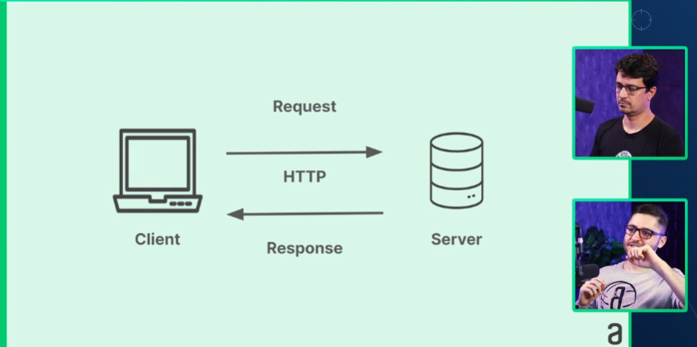

# <span style="color: #87BBA2">=== C#: consumindo API, gravando arquivos e utilizando o LINQ ===</span> <!-- omit in toc -->

# <span style="color: #87BBA2">INDICE</span> <!-- omit in toc -->

- [01. Integrando uma API externa](#01-integrando-uma-api-externa)
  - [APRESENTAÇÃO](#apresentação)
  - [REALIZANDO UMA REQUISIÇÃO](#realizando-uma-requisição)
    - [Endpoint](#endpoint)
    - [CLIENT AND SERVER](#client-and-server)
    - [Biblioteca HttpClient](#biblioteca-httpclient)
    - [CONTEXTOS DE USING](#contextos-de-using)
      - [Gerenciamento de recurso](#gerenciamento-de-recurso)
    - [Sobre async](#sobre-async)
    - [Sobre await](#sobre-await)
    - [Como ficou o código](#como-ficou-o-código)
  - [TRY CATCH](#try-catch)
    - [Código de resposta HTTP (status code)](#código-de-resposta-http-status-code)
    - [Por que usar Try/Catch aqui?](#por-que-usar-trycatch-aqui)
- [02. Linq e ordenação](#02-linq-e-ordenação)
  - [MODELO DE MÚSICA](#modelo-de-música)
    - [Quais campos deveremos serializar?](#quais-campos-deveremos-serializar)
    - [Qual o nome usar para conseguir apontar para cada uma das propriedades?](#qual-o-nome-usar-para-conseguir-apontar-para-cada-uma-das-propriedades)
    - [Referênciando em uma propriedade um campo da API](#referênciando-em-uma-propriedade-um-campo-da-api)
  - [DESERIALIZANDO OS DADOS](#deserializando-os-dados)
    - [JsonSerializer](#jsonserializer)
    - [O que é Desserialização](#o-que-é-desserialização)
    - [Desserializando](#desserializando)
    - [Aviso de nulidade](#aviso-de-nulidade)
  - [DESAFIOS](#desafios)
    - [Mentalidade](#mentalidade)
    - [Minha Resolução](#minha-resolução)
    - [Desserialização direta](#desserialização-direta)
      - [Os campos do JSON precisam ter o mesmo nome das propriedades?](#os-campos-do-json-precisam-ter-o-mesmo-nome-das-propriedades)
      - [\[JsonProperty\]](#jsonproperty)
- [03. Linq](#03-linq)
  - [SELECIONANDO GÊNEROS MUSICAIS](#selecionando-gêneros-musicais)
    - [Classe LinqFilter](#classe-linqfilter)
    - [Não usamos using System.Linq?](#não-usamos-using-systemlinq)
    - [Chamando método do LinqFilter no Program.cs](#chamando-método-do-linqfilter-no-programcs)
    - [Como eu fiz no desafio](#como-eu-fiz-no-desafio)
  - [ORDENANDO OS ARTISTAS](#ordenando-os-artistas)
    - [Classe LinqOrder.cs](#classe-linqordercs)
  - [ARTISTAS POR GÊNERO MUSICAL](#artistas-por-gênero-musical)
    - [Na classe LinqFilter.cs](#na-classe-linqfiltercs)
  - [EXIBINDO MÚSICAS POR ARTISTAS](#exibindo-músicas-por-artistas)
    - [Na classe LinqFiler.cs](#na-classe-linqfilercs)
    - [LINQ](#linq)
      - [Três partes de uma Operação de Consulta](#três-partes-de-uma-operação-de-consulta)
- [04. Criando arquivos com C#](#04-criando-arquivos-com-c)
  - [MUSICAS PREFERIDAS](#musicas-preferidas)
    - [Classe de MusicasPreferidas](#classe-de-musicaspreferidas)
  - [INSTANCIANDO A CLASSE](#instanciando-a-classe)
  - [CRIANDO ARQUIVOS COM C#](#criando-arquivos-com-c)
    - [Utilizando de objeto anônima](#utilizando-de-objeto-anônima)
    - [Escrevendo arquivo](#escrevendo-arquivo)
  - [UTILIZANDO O JSON](#utilizando-o-json)
    - [Demosntração em um frontend](#demosntração-em-um-frontend)
    - [StreamWriter: Método alternativo para criar arquivos de texto](#streamwriter-método-alternativo-para-criar-arquivos-de-texto)
- [05. Desafio](#05-desafio)
  - [APRESENTAÇÃO DO DESAFIO #1](#apresentação-do-desafio-1)
    - [Minha resolução](#minha-resolução-1)
  - [RESOLVENDO O DESAFIO #1](#resolvendo-o-desafio-1)
    - [Resolução Alura](#resolução-alura)
    - [Refatoração](#refatoração)
  - [APRESENTAÇÃO DO DESAFIO #2](#apresentação-do-desafio-2)
    - [Minha resolução](#minha-resolução-2)
  - [RESOLVENDO O DESAFIO #2](#resolvendo-o-desafio-2)

# <span style="color: #87BBA2">01. Integrando uma API externa</span>

## APRESENTAÇÃO

Aprenderemos:

- Integração com API utilizando biblioteca HttpClient
- Exceções
- Manipulação de Coleções
- Linq
- Geração de consumo de arquivos
  - Serialização e Desserialização

## REALIZANDO UMA REQUISIÇÃO

Integraremos nosso projeto a uma API criada pela Alura com diversas músicas.

### Endpoint

Um endpoint é o ponto final de comunicação em um sistema de rede, onde um serviço está disponível para interação. Em APIs (Interfaces de Programação de Aplicações), um endpoint geralmente se refere a uma URL específica que aceita requisições e retorna respostas. Ele define onde e como o software pode acessar funcionalidades ou dados de outro sistema, geralmente usando métodos HTTP como GET, POST, PUT, e DELETE.

**Endpoint da API que utilizaremos:** https://guilhermeonrails.github.io/api-csharp-songs/songs.json

### CLIENT AND SERVER



Quando clicamos em um link, realizamos uma **requisição**: "Eu quero visualizar as músicas dessa API".

- Foi uma requisição para um determinado servidor.
- Não sabemos, e não precisamos saber, como foi montada essa API:
  - Em que linguagem originou essa API.
  - Como foi disposto os dados
  - Se tem Classe ou não
  - Se foi utilizado Orientação a Objetos

O servidor, então, "falou": "Você quer as músicas? Tá aí as músicas".

Um bom exemplo de **Client** é o nosso navegador, mas, nosso programa também pode ser um **Client** (quando consome uma API) quanto um **Server** (quando disponibiliza a API para consumo).

### Biblioteca HttpClient

Quando temos uma operação muito comum a ser realizada, normalmente existe uma biblioteca para isso, como é o caso de consumo de APIs através de Http, utilizando a biblioteca **HttpClient**.

### CONTEXTOS DE USING

Conhecemos a utilização da palavra reserva **using** para alguns contextos, como:

- **Referenciar arquivos internos**: Para referenciar um arquivo interno, servindo como encurtador para suas chamadas.
- **Referenciar de pacotes externos**: Para referênciar a utilização de pacotes externos que foram baixados.
- **Referenciar com alias**: Referenciar classes ou funcionalidades de pacotes ou arquivos distintos de mesmo nome, apelidando-os para poder distinguí-los.
- E agora, aprenderemos um outro contexto para utilização de **using**: **Gerenciamento de recurso**

#### Gerenciamento de recurso

```c#
using (HttpClient client = new HttpClient())
{

}
```

Esse recurso será gerenciado até o fechamento das chaves. Quando a chave fechar, esse recurso será liberado.

### Sobre async

Não sabemos de fato a quantidade de músicas e recursos que existe nessa API ou qual deste recurso que receberemos e **queremos garantir que receberemos todos esses recursos**.

- Caso não utilizarmos do **async** o programa receberá uma parte (ou nada, pois foi muito rápido) e já vai passar para a próxima instrução

A async é uma palavra reservada para indicar que uma funcionalidade é **assíncrona**. No caso de um método, deverá ser inserida **na declaração do método**.

- É uma convenção em C# para no final de um método assíncrono colocar o termo **Async**, para indicar que é assíncrono.

### Sobre await

> O `await` é usado para indicar que a operação assíncrona deve ser aguardada. Ela permite que a execução do código seja pausada até que a operação seja concluída, sem bloquear a thread principal.

Indicação para aguardar uma tarefa ser concluída, atribuindo o valor da operação quando esta for concluída.

- Caso não colocar o `await`, a variável atribuiria o valor do método imediatamente, tendo enormes chances de atirbuir um valor vazio ou parcial, pois o método assíncrono ainda estaria processando a informação.

Sobre a dinâmica Async/Await, [recomendo verificar a seguinte explicação]("D:\Workroom\studyRoom\learning__cs\course__alura\dominando_oo\Explicacoes\async-await.md")

### Como ficou o código

```c#
using (HttpClient client = new HttpClient())
{
    string resposta = await client.GetStringAsync("https://guilhermeonrails.github.io/api-csharp-songs/songs.json");

    Console.WriteLine(resposta);
}
```

Utilizamos declaramos a resposta como `string` pois o `JSON` que receberemos contém apenas informações em `string` (ou seja, com aspas duplas). Para pegar a **API** como uma string, o tipo `HttpClient` possui um método chamado `GetStringAsync()`, o qual a utilizamos.

- Na realidade, o `JSON` tem dados inteiros também. Não entendi muito bem o porque utilizaram `resposta` como `string`.

## TRY CATCH

> O bloco try-catch é essencial para lidar com erros em um programa. Ele protege o código que pode gerar problemas, permitindo capturar e tratar as exceções que ocorrem. Sem o try-catch, o programa poderia travar e mostrar mensagens de erro confusas para o usuário, deixando o programa em um estado ruim.

O que acontece caso a conexão não tiver funcionando, tiver caído a internet, mudou o endpoint?

- Forçando erro de endpoint: A aplicação para e a seguinte mensagem é retornada

```cmd
Unhandled exception. System.Net.Http.HttpRequestException: Response status code does not indicate success: 404 (Not Found).
   at System.Net.Http.HttpResponseMessage.EnsureSuccessStatusCode()
   at System.Net.Http.HttpClient.GetStringAsyncCore(HttpRequestMessage request, CancellationToken cancellationToken)
   at Program.<Main>$(String[] args) in D:\Workroom\studyRoom\learning__cs\course__alura\consumindo_api_arquivos_linq\ScreenSound04\ScreenSound04\Program.cs:line 3
   at Program.<Main>(String[] args)
```

Para lidar com essa exceção, temos ferramentas para não fazer a aplicação necessáriamente parar. Para isso, nós **tentamos** realizar a ação e, caso não tenha conseguido **vá para outro caminho**, isso se chama **tratar exceções com estrutura Try/Catch**.

> - Caminho feliz: Comportamento esperado na execução de um código.
> - Caminho de exceções: Comportamentos distintos ao esperado na execução de um código.

No nosso caso, não queremos que o programa pare caso encontre um problema, então:

- Indicaremos qual código é para tentar a execução
- Capturaremos qualquer exceção, caso ocorra
- Retornaremos uma mensagem
- Código continuará

```c#
try
{
    string resposta = await client.GetStringAsync("https://guilhermeonrails.github.io/api-csharp-songs/songs.jso");

    Console.WriteLine(resposta);
}
catch(Exception ex)
{
    Console.WriteLine($"Temos um problema: {ex.Message}");
}
```

- **Código a ser tentado:** tudo que está dentro das chaves de `Try`
- **Exceção capturada:** No caso serão todas, pois indicamos uma exceção do tipo `Exception`, que é o tipo de **todas as exceções** nomeando-a como `ex`.
- **Tratamento à exceção:** Instruções que estão internas às chaves do `catch`, do tipo de exceção que está em seu parenteses. Após a execução deste bloco, o código continuará.

### Código de resposta HTTP (status code)

Convenção de códigos em numeração que retorna o estado do retorno à requisição HTTP feita. O código e descrito em faixas (range) de númeração e cada faixa significa uma coisa.

- Do número 500 para cima é o pior: Erro no Servidor

> Status code no HTTP é um código numérico retornado pelo servidor para indicar o resultado de uma requisição feita pelo cliente

| Código |                    Descrição                     |
| :----- | :----------------------------------------------: |
| 200    |           OK - Requisição bem-sucedida           |
| 201    |       Created - Recurso criado com sucesso       |
| 204    |     No Content - Sem conteúdo para retornar      |
| 400    |        Bad Request - Requisição inválida         |
| 401    |          Unauthorized - Não autorizado           |
| 403    |           Forbidden - Acesso proibido            |
| 404    |        Not Found - Recurso não encontrado        |
| 500    | Internal Server Error - Erro interno do servidor |
| 502    |          Bad Gateway - Gateway inválido          |
| 503    |    Service Unavailable - Serviço indisponível    |

Para saber mais sobre **status code**, recomenda-se a leitura [deste artigo](https://developer.mozilla.org/pt-BR/docs/Web/HTTP/Status)

### Por que usar Try/Catch aqui?

É muito comum que o endereço da API mude, por exemplo:

- endpoint: https://guilhermeonrails.github.io/api-csharp-songs/songs.json
- Após uma atualização, o endpoint acrescentou versionamento em sua rota, passando a ser: https://guilhermeonrails.github.io/api-csharp-songs/v2/songs.json

Isso gerou uma alteração. Visualmente é pequena, mas o suficiente para estarmos endereçando a um endpoint errado retornando erro para nós.

O código sempre estará passando por mudanças, seja o nosso, seja um externo, por isso é **importantíssimo pensar nas exceções para tornar nosso código mais robusto e preparado**.

- Uma alternativa para o nosso catch, nessa situação, seria em caso de erro apontar para uma API interna nossa que contenha alguns dados base enquanto corrigi-se a conexão a API externa.
- Talvez, então, apontar para uma API de backup interno.

# <span style="color: #87BBA2">02. Linq e ordenação</span>

## MODELO DE MÚSICA
Transformos a resposta da API em string, porém, manipular essa longa resposta como uma string unica.
- Observando a API, ela possui campos próprios como "artist", "song". Seria interessante se pudessemos consumir essa API e dizer "Aponte para essa classe!" que possua os campos que a API tem.
> Se existe uma estrutura na respota, nada melhor do que estruturarmos nosso código também

### Quais campos deveremos serializar?
Quando recebemos uma API, nem sempre usaremos todos os seus dados. Depende da aplicação.

Vamos escolher, no nosso caso:
- Nome do artista
- Nome da música
- Duração
- Genero

### Qual o nome usar para conseguir apontar para cada uma das propriedades?
Usarmos o nome que está na API é uma boa prática?
- **Não!**: Uma coisa muito comum é a **tradução de estrutura de dados**
  - As vezes está em inglês e queremos passar para portugues
  - As vezes está em uma hierarquia e queremos mudar para outra hierarquia
  - A tradução é um passo importante para nossa carreira

### Referênciando em uma propriedade um campo da API
```c#
internal class Musica
{
    [JsonPropertyName("song")]
    public string? Nome { get; set; }
}
```
[JsonPropertyName("song")] é **atributo que representa um metadado específico para a propriedade nome** 

A anotação [JsonPropertyName("song")] é um atributo em C#. Atributos em C# são usados para fornecer metadados adicionais sobre classes, métodos ou propriedades. Esses metadados não alteram diretamente o comportamento do código, mas influenciam como certas operações, como a serialização/deserialização de JSON, devem tratar esses elementos.

> **Porque a interrogação na frente de "string"?**: Para indicar ao compilador que esta variável poderá ser nula e, no nosso caso, todos os campos de string poderão ser.

**O que o atributo [JsonPropertyName] faz?**

O atributo [JsonPropertyName("song")] especifica como a propriedade Nome deve ser representada quando o objeto for convertido para ou a partir de JSON.

- Propriedade original: Nome (em português).
- Metadado definido: Quando essa propriedade for convertida para JSON, ela será associada à chave "song", e não à chave "Nome".

>**O que é Metadados?**
>
>Metadado é **um dado sobre outro dado**. Ele fornece informações descritivas que ajudam a identificar, categorizar ou organizar um dado principal. Por exemplo, em uma foto, os metadados podem incluir o autor, a data de criação, o formato da imagem, ou a localização onde foi tirada. Metadados são usados para facilitar a compreensão e a gestão dos dados.
>
>**Exemplo**
>
>Imagine que você tem um arquivo de foto chamado praia.jpg.
>- Dado principal: a própria imagem da praia.
>- Metadados: informações sobre a imagem, como:
>- Nome do arquivo: "praia.jpg"
>- Data de criação: "2023-09-15"
>- Resolução: "1920x1080"
>- Tamanho do arquivo: "2MB"
>- Localização GPS: "Lat: -23.5505, Long: -46.6333"
>
>Esses metadados descrevem a imagem e ajudam a organizá-la ou encontrar mais facilmente, mas não são a imagem em si.

O que estamos fazendo é basicamente pegando os campos em ingles da API e atribuindo às propriedades de nome em Português.
```c#
internal class Musica
{
    [JsonPropertyName("song")]
    public string? Nome { get; set; }

    [JsonPropertyName("artist")]
    public string? Artista { get; set; }

    [JsonPropertyName("duration_ms")]
    public int Duracao { get; set; }

    [JsonPropertyName("genre")]
    public string? Genero { get; set; }

    public void ExibirDetalhesDaMusica()
    {
        Console.WriteLine($"Artista: {Artista}");
        Console.WriteLine($"Musica: {Nome}");
        Console.WriteLine($"Duração em segundos: {Duracao / 100}");
        Console.WriteLine($"Gênero Musical: {Genero}");
    }
}
```

> **Atributo ou Anotação?**
>
> Este atributo, em outras linguagens, é chamado de **Anotação**, como em Java que é colocado um `@`. No C#, é o colchete que determina.

## DESERIALIZANDO OS DADOS
Criaremos uma variável genérica que será:
1. O Json que pegaremos
2. Apontando para aquela música
3. Apontando para a resposta que pegamos
- Ou seja: Essa resposta em JSON, quero criar uma lista baseada neste objeto

### JsonSerializer
Antigamente existia uma biblioteca chamada `Newtonsoft` e agora foi incorporada pelo `JsonSerializer`.

> Estrutura atual do JsonSerializar: System.Text.Json.JsonSerializer.

Vamos utilizar essa biblioteca para realizaer a **Desserialização** dos dados, onde falaremos:
1. Pegue este Json
2. Você vai converter esse JSON em um objeto que é manipulável em C#

**Isso é comum para qualquer linguagem**, convertendo um JSON para um tipo que a linguagem que estamos trabalhando utiliza.
- O processo de converter um JSON para a linguagem que estamos trabalhando nós chamamos de **Desserialização**

### O que é Desserialização
Desserialização é o processo de converter dados que estão em um formato serializado (como JSON, XML, ou outros) de volta para um objeto ou estrutura de dados que pode ser utilizada por uma linguagem de programação.

Em termos simples: quando você recebe dados de uma API em um formato como JSON, a desserialização transforma esse JSON em objetos, listas, ou outras estruturas que você pode manipular no seu código.

### Desserializando
```c#
using System.Text.Json;
using ScreenSound04.Modelos;

using (HttpClient client = new HttpClient())
{
    try
    {
        string resposta = await client.GetStringAsync("https://guilhermeonrails.github.io/api-csharp-songs/songs.json");

        var musicas = JsonSerializer.Deserialize<List<Musica>>(resposta);
    }
    catch(Exception ex)
    {
        Console.WriteLine($"Temos um problema: {ex.Message}");
    }
}
```
- Note que não precisamos instanciar o `JsonSerializer` por ser um método estático, chamando-o em seguida da classe.
- `var musicas` é, agora, uma `lista de musica` ou seja, um `List<Music>`.
- `JsonSerializer.Deserialize<List<Musica>>(resposta)`: Estamos utilizando o método `Deserialize` da biblioteca `JsonSerializer` para buscar os dados da API e **convertê-los em uma Lista de Música**, onde **Música possui 4 propriedades com os metadados de quais campos JSON ele pegará**.
  - Ou seja, ele pega o JSON, transforma em uma Lista e cada item da Lista será uma nova instancia de Música, tendo as propriedades vinculadas ao JSON conforme definimos.

Podemos, agora, realizar teste como:
- `Console.WriteLine(musicas.Count);`: Verificar a quantidade de músicas
- `musicas[0].ExibirDetalhesDaMusica();`: Acessando o método `ExibirDetalhesDaMusica()` do objeto `Música`, pois, cada item da Lista será um objeto do tipo `Música`.
- `musicas[1998].ExibirDetalhesDaMusica();`: Mesma coisa acima, mas acessando o último.

### Aviso de nulidade
```c#
var musicas = JsonSerializer.Deserialize<List<Musica>>(resposta);
musicas[0].ExibirDetalhesDaMusica();
musicas[1998].ExibirDetalhesDaMusica();
```
A IDE, está nos avisando quando indicamos o acesso à `musicas[0]` de que ela pode ser nula 
- "CS8602 - Dereference of a possibly null reference."

Para retirar este aviso, vamos indicar que var musicas será **obrigatóriamente não nula** ao inserir o operador de supressão de nulidade `!` no final da instrução, antes do `;`.
```c#
var musicas = JsonSerializer.Deserialize<List<Musica>>(resposta)!;
```
- Isso indica que no momento em que ele fizer o parse, **eu preciso de uma classe que não seja nula**
  - E que tenha conteúdo nesta string também.
  - Veja mais sobre [nesta explicação](explicacao\null_forgiving_operator.md)
    - Esse operador **deve ser usado com bastante cautela**, sendo ideal utilizar-se de validações de nulidade ao invés de utilizar este operador. A IDE nos avisa onde está uma possibilidade de nulo e, caso não tratemos e recebermos um nulo onde não deveriamos, **o código lançará uma exceção em tempo de execução.**
    - Novamente, a explicação no link acima está bem interessante e aborda estes pontos.

## DESAFIOS
Agora temos uma lista de músicas e estamos pronto para manipulá-la. Algo muito comum no dia a dia do desenvolver é receber uma demanda e precisa trabalhar com uma **coleção de dados**.

- Exibir todos os gêrenos musicais da lista;
- Ordenar os atista por nome
- Filtrar artistas por gênero musical
- Filtrar as músicas de um artista

Manualmente, não dá para fazer isso e todos esses 1999 dados só foi possivel realizarmos pois transformamos isso em uma classe.

Trabalhar com um `for each` na lista é possível, mas não ideal, pois o nosso propósito não é apenas printar um resultado, e sim fornecer essas informaçôes à outros.

### Mentalidade
Nós, como desenvolvedores C#, nosso objetivo é garantir o backend e a forma como esses dados serão entregues para uma outra equipe, como uma equipe de React, Angular, View e afins.

Quando falamos "Exibir um gênero musical da lista", pode não ser muito importante para nós mas **para o Fronend será**, para quem montará a tela será.
- Precisamos Ordenar por artista: Sabe aquela setinha pra cima e pra baixo para ordenação? Quem for trabalhar provavelmente utilizará
- Filtro de artista: Por exemplo, aquele "filtrinho" ou um checkbox o utilizará para filtrar.

### Minha Resolução
A forma que utilizei para atender o requisito é criando uma classe controladora para o modelo `Música` contendo as operações desejadas. Para isso, essa classe captura as músicas como lista, possibilitando sua manipulação.
- Apesar do load inicial ser robusto, por ter de capturar todas as informações, fiz dessa forma para consultar a API apenas uma vez, não necessitando realizar diversas consultas para cada operação.
- Para a resolução, utilizei `LINQ`

```c#
using ScreenSound04.Modelos;

namespace ScreenSound04.Controlador;

internal class ControladorMusica
{
    private List<string> _generos = [];
    private List<string> _artistas = [];
    public IEnumerable<Musica> Musicas { get; }

    public IEnumerable<string> Generos => _generos;
    public IEnumerable<string> Artistas => _artistas;

    public ControladorMusica (List<Musica> musicas)
    {
        Musicas = musicas;

        musicas.ForEach(m =>
        {
            string[] generoSplit = m.Genero!.Split(",")
                                            .Select(n => n.Trim())
                                            .ToArray();

            foreach (string genero in generoSplit)
            {
                if (!_generos.Contains(genero))
                    _generos.Add(genero);
            }

            if (!_artistas.Contains(m.Artista!))
                _artistas.Add(m.Artista!);
        });
    }

    public List<string> GetArtistasOrdenadoPorNome(bool descendente)
    {
        List<string> artistasOrdenado = descendente == false ?
            _artistas.OrderBy(a => a).ToList() :
            _artistas.OrderByDescending(a => a).ToList();

        return artistasOrdenado;
    }

    public List<string> GetArtistasByGenero(int indiceGenero)
    {
        if (indiceGenero < 0 || indiceGenero >= _generos.Count)
            throw new ArgumentOutOfRangeException(nameof(indiceGenero), "Índice inválido!");

        // Filtrando musicas por gênero
        List<Musica> musicasFiltradas = Musicas
            .Where(m => m.Genero != null && m.Genero.Contains(_generos[indiceGenero]))
            .ToList();

        // Pegando artistas com LINQ (mais eficiente que foreach)
        List<string> artistasFiltrados = musicasFiltradas
            .Select(m => m.Artista) // Seleciona artistas
            .Where(a => a != null)  // Garante que não tenha nulo
            .Select(a => a!)        // Usa o operador '!' para garantir que não seja null
            .Distinct()             // Remove duplicatas
            .ToList();              // Transforma em lista

        return artistasFiltrados;
    }

    public List<string> GetSongByArtists(string artista)
    {
        // Filtrando musicas por gênero
        List<Musica> musicasFiltradas = Musicas
            .Where(m => m.Artista != null && m.Artista.Contains(artista))
            .ToList();

        if (musicasFiltradas.Count == 0)
            throw new ArgumentException("Artista não encontrado", nameof(artista));

        // Pegando nome da musica com LINQ (mais eficiente que foreach)
        List<string> musicasDoArtista = musicasFiltradas
            .Select(m => m.Nome)
            .Where(m => m != null)
            .Select(m => m!)
            .ToList();

        return musicasDoArtista;
    }

}
```

### Desserialização direta
Inicialmente, vamos criar uma classe que utiliza 2 informações da API: o nome do personagem e seus apelidos.

```c#
class Personagem
{
    public string name { get; set; }
    public List<string>? aliases { get; set; }

    public void ExibirApelidosDaPersonagem()
    {
        Console.WriteLine($"Nome: {name}");
        Console.WriteLine("Apelidos:");
        foreach (string apelido in aliases)
        {
            Console.WriteLine($"- {apelido}");
        }
    }
}
```
Vamos realizar a deserialização utilizando a classe:
```c#
using screensound_04.Models;
using System.Text.Json;
using (HttpClient client = new HttpClient())
{
    string json = await client.GetStringAsync("https://www.anapioficeandfire.com/api/characters/16");

    Personagem margaery = JsonSerializer.Deserialize<Personagem>(json)!;
    margaery.ExibirApelidosDaPersonagem();
}
```
A saída do console será:
```bash
Nome: Margaery Tyrell
Apelidos:
- The Little Queen
- The Little Rose
- Maid Margaery
```
#### Os campos do JSON precisam ter o mesmo nome das propriedades?
No caso de deserialização de JSON sem o [JsonPropertyName("")], as propriedades da classe em que você está deserializando precisam ter nomes correspondentes aos campos no JSON para que a deserialização seja bem-sucedida por padrão, como vimos no exemplo acima.

No exemplo fornecido, a classe Personagem possui propriedades name e aliases, e a resposta JSON contém campos com os mesmos nomes. Portanto, a deserialização funcionará corretamente, e os valores correspondentes no JSON serão atribuídos às propriedades da classe Personagem.

#### [JsonProperty]
Se os nomes das propriedades da classe forem diferentes dos campos no JSON, você pode usar atributos de serialização, como o atributo [JsonProperty("nomeCampoJson")] assim como fizemos as aulas.

> Lembrando: Ao fazer a deserialização de um objeto JSON para uma classe em C#, você não precisa ter todas as propriedades correspondentes no objeto. O processo de deserialização é flexível e apenas as propriedades presentes no JSON serão mapeadas para as propriedades da classe.

# <span style="color: #87BBA2">03. Linq</span>

## SELECIONANDO GÊNEROS MUSICAIS
Iniciando a criação dos filtros:
- Não realizaremos na pasta Modelos
- Queremos criar um filtro onde independente da lista que for passada, conseguiremos reutilizar isso depois

Quem vai nos ajudar na tarefa de ordenar, selecionar, filtrar, será **um método chamado LINQ**.

### Classe LinqFilter
> Primeiro desafio é **Exibir todos os gêneros musicais da lista**
- Usaremos o **System.Linq** nesta classe

```c#
using ScreenSound04.Modelos;

namespace ScreenSound04.Filtros;

internal class LinqFilter
{
    public static void FiltrarTodosOsGenerosMusicais(List<Musica> musicas)
    {
      var todosOsGenerosMusicais = musicas
          .Select(generos => generos.Genero)
          .Distinct()
          .ToList();

      todosOsGenerosMusicais.ForEach(g => Console.WriteLine($"- {g}"));
    }
}
```
1. `var` = Definição de variável por inferência, não definindo explicitamente o que ela é
2. `static` = Definição de método de classe (método estático), que utiliza nenhum valor de seus objetos internos e, logo, não deve ser instanciado.
3. `.Select()` = Propriedade LINQ para selecionar todos os valores de uma coleção
  - Poderiamos passar o `.Select()` para uma outra função, para aí essa função retornasse todas as listas com base no gênero que estamos buscando, ou seja, filtrando todos os gêneros.
  - Mas não faremos isso, usaremos **a função anônima** iterando por todos os valores da coleção:
    - `.Select(generos => generos.Genero)`
4. `.Distinct()` = Armazena os valores de forma Única, não armazenando usas duplicatas, ou seja, não haverá valores repetidos.
5. `.ToList()` = Método para transformar a consulta Linq em uma lista, é normal ela vir como `IEnumerable`, o qual não tem os mesmos métodos de uma lista, como `Add()` e `ForEach()`. No nosso caso, não seria um problema, mas é interessante fazer isso para um padrão ou caso queira utilizar algum dos métodos citados.
   - Se eu quiser realizar um `foreach` de um `IEnumerable`, precisarei usar a estrutura de repetição, e não um método interno com função lambda.

### Não usamos using System.Linq?
Esse é mais um exemplo dos avanços do `.NET`. A forma que estamos realizando nossa consulta é através de `LINQ`, que são os métodos `.Select`, `.Distinct` e afins, mas, **não precisamos importar a biblioteca pois intrinsicamente o .NET já está o importando.** Ou seja, **está importando-a de forma nativa**.

Igual a economia de esforços proporcionado pela inexistência da classe no `Program.cs`, o caso do `using System.Linq` é igual. **Alguns namespaces são importados por default, using System.Linq é um deles**.

### Chamando método do LinqFilter no Program.cs
```c#
string resposta = await client.GetStringAsync("https://guilhermeonrails.github.io/api-csharp-songs/songs.json");

var musicas = JsonSerializer.Deserialize<List<Musica>>(resposta)!;
LinqFilter.FiltrarTodosOsGenerosMusicais(musicas);
```
Obtivemos o filtro dos gêneros musicais, porém, **essa base de dados não classifica uma música por apenas um gênero**. Ou seja, essa API está retorno mais de um gênero no mesmo campo e interpretando-o como uma string unica, algo como:
> Musica X | Gênero: "rock, Folk/Acoustic, pop"

Ou seja, por mais que usamos `.Distinct()`, cada combinação de gênero será visto como um gênero único:
> Genero: "rock, classical" != Gênero: "classical, rock"

### Como eu fiz no desafio
No meu método de resolução, eu utilizei formas para separar os gêneros para realizar filtragem através de um gênero único, ou seja:
- A string será decomposta a cada ",", transformando-a em uma Array
- Armazena-se os gêneros de forma distinta
- Isso garantirá que deremos gêneros únicos ao invés de aglomerados

Posteriormente, fazemos a busca por esse gênero que retornará todas as músicas que **contenha este genero**
- Caso busquemos pelo gênero "rock", uma música que seja "rock, classical" será encontrada.

Porém, eu realizei essa operação em uma pasta **Controller** em uma classe destinada à música.

## ORDENANDO OS ARTISTAS
1º desafio concluido, vamos para o 2º:
- Ordernar os artistas por nome

Para não ficarmos com um arquivo muito grande, criaremos um arquivo para cada tipo de filtro específico.

### Classe LinqOrder.cs
```c#
using ScreenSound04.Modelos;

namespace ScreenSound04.Filtros;

internal class LinqOrder
{
    public static void ExibirListaDeArtistasOrdenados(List<Musica> musicas)
    {
        var artistasOrdenados = musicas
            .OrderBy(musica => musica.Artista)
            .Select(musica => musica.Artista)
            .Distinct()
            .ToList();

        Console.WriteLine("Lista de artistas ordenados");
        artistasOrdenados.ForEach(a => Console.WriteLine($"- {a}"));
    }
}
```
1. `.OrderBy` = Ordena a lista (quando string, alfabeticamente) com referência à propriedade iterada.
  - `.OrderBy(musica => musica.Artista)` = Ordenando pelos Artistas.
2. `.Select(musica => musica.Artista)` = Seleciona apenas os Artistas.
  - Caso não fizessemos isso, seria retornado a nós uma lista ordenada de Musicas, ou seja, retornando todos os atributos dela (Seu nome, duração e afins).
  - Com este `Select`, selecionamos apenas o Artista do elemento desta lista ordenada.
3. `.Distinct()` = Para pegar apenas um valor, não suas repetições, pois o Artista pode ter mais de uma música e poderia aparecer mais de uma vez.
4. `.ToList()` = Para manter o padrão, sendo um método para transformar a consulta Linq em uma lista, é normal ela vir como `IEnumerable`, o qual não tem os mesmos métodos de uma lista, como `Add()` e `ForEach()`.
   - Se eu quiser realizar um `foreach` de um `IEnumerable`, precisarei usar a estrutura de repetição, e não um método interno com função lambda.

**O que está ocorrendo, então, em artistasOrdenados**: 
- A partir do resultado da lista do tipo Musica ordenada (`OrderBy`)
- eu vou pegar apenas uma parte (propriedade Artistas) (`Select`) deixando de ser uma lista do tipo `Musica` para ser uma lista de `strings` (que representa os artistas)
- Depois, nesta lista de strings, retirarei o que é repetido (`Distinct`)
- E por fim, vou jogar em memória para uma lista de strings (`ToList`)
  - **Passando o mouse em `artistasOrdenados`, veremos que ele estará como um "List<string?>?"**

## ARTISTAS POR GÊNERO MUSICAL
Agora, vamos ao desafio:
- Filtrar artistas por gênero musical

Vamos criar um novo método na classa `LinqFilter` pela classe já fazer sentido para essa implementação

### Na classe LinqFilter.cs
```c#
public static void FiltrarArtistasPorGeneroMusical(List<Musica> musicas, string genero)
{
    var artistasPorGeneroMusical = musicas
        .Where(musica => musica.Genero!.Contains(genero))
        .Select(musica => musica.Artista)
        .Distinct()
        .ToList();

    Console.WriteLine($"Exibindo os artistas por gênero musical >>> {genero}");
    artistasPorGeneroMusical.ForEach(a => Console.WriteLine($"- {a}"));
}
```
1. `.Where()` = Realize a operação onde essa condição for atendida
   - Porque usamos `.Contains()` ao invés do operador "Exatamente igual" (`==`)?
     - Como o gênero da música da aplicação é uma string com mais de um gênero, caso optássemos pelo "Exatamente igual", deveria ser inserido o genero igual ao da aplicação, com todos os gêneros de uma música na mesma string.
     - Com `.Contains()`, será buscada a música que contenha o gênero inserido em sua string de gêneros. Então, se a música tiver como gênero "rock / classical / punk" e o usuário inserio "rock", essa música conseguirá ser encontrada por esse input, por justamente ter "rock" em seu nome.
2. `.Select()` = Muito importante, nesse caso, pois **queremos filtrar os artistas por gênero**
   - `.Select(musica => musica.Artista)`, com isso, estamos selecionando os Artistas da filtragem do gênero realizado anteriormente
3. `.Distinct()` = Para remover duplicados
4. `.ToList()` = Para manter o padrão, sendo um método para transformar a consulta Linq em uma lista, é normal ela vir como `IEnumerable`, o qual não tem os mesmos métodos de uma lista, como `Add()` e `ForEach()`.
   - Se eu quiser realizar um `foreach` de um `IEnumerable`, precisarei usar a estrutura de repetição, e não um método interno com função lambda.

- **Importante:** O compilador alertou que `musica.Genero` tem a possibilidade de ser nulo. Colocamos um `!` ao lado (chamado de `null-forgiving`) onde estamos dizendo ao compilador "Eu garanto que aqui não virá um valor nulo".
  - Isso **não é uma boa pratica**, pois você esta dando **certeza** que não virá um valor nulo.
  - Não recomenda-se fazer isso no mundo real
 
## EXIBINDO MÚSICAS POR ARTISTAS
Próximo desafio:
- Filtrar músicas de um artista

### Na classe LinqFiler.cs
```c#
public static void FiltrarMusicasDeUmArtista(List<Musica> musicas, string nomeDoArtista)
{
    var musicasDoArtistas = musicas
        .Where(musica => musica.Artista!.Equals(nomeDoArtista))
        .ToList();

    Console.WriteLine(nomeDoArtista);
    musicasDoArtistas.ForEach(m => Console.WriteLine($"- {m.Nome}"));
}
```
1. `.Where()` = Aqui utilizamos o `Where` e não o `Select` porque sempre que queremos pegar um subconjunto de uma lista aí usaremos o `Where`.
   - `Equals()` = Método para verificar a igualdade entre strings. Caso não usasse-o, retornaria **False**, pois, o "total igualdade" (`==`) verifica se o valor corresponde ao mesmo endereço de memória, e não que os valores são equivalentes.
2. `.ToList()` = Para manter o padrão, sendo um método para transformar a consulta Linq em uma lista, é normal ela vir como `IEnumerable`, o qual não tem os mesmos métodos de uma lista, como `Add()` e `ForEach()`.
   - Se eu quiser realizar um `foreach` de um `IEnumerable`, precisarei usar a estrutura de repetição, e não um método interno com função lambda.

Para entender melhor a diferença entre `Where` e `Select` no LINQ, veja essa [explicação muito elucidativa.](explicacao\diferenca_de_where_e_select.md)

> String são recursos que são muito utilizados nas aplicações e terão uma área de memória específica para sua gestão. O `.NET` faz essa especificação, o `JVM` do `Java` também faz. O método `.Equals()` serve para verificar a paridade entre duas strings, já que possuem um endereço de memória especifico para elas.

### LINQ
Finalizado o desafio e para isso usamos o LINQ (Language Integrated Query), sendo uma biblioteca .NET usada para separar de onde pegamos as coleções (seja uma API, uma lista, dados do vindos do banco) e separando em métodos para realizarmos todo esse trabalho de operações em coleções, ou seja, para realização de `consultas`.
> Uma consulta é uma expressão que recupera dados de uma fonte de dados.

O LINQ (consulta integrada à linguagem) é o nome de um conjunto de tecnologias com base na integração de recursos de consulta diretamente na linguagem C#. Tradicionalmente, consultas feitas em dados são expressas como cadeias de caracteres simples sem verificação de tipo no tempo de compilação ou suporte a IntelliSense. Além disso, você precisará aprender uma linguagem de consulta diferente para cada tipo de fonte de dados: bancos de dados SQL, documentos XML, vários serviços Web etc. Com o LINQ, uma consulta é um constructo de linguagem de primeira classe, como classes, métodos, eventos.

#### Três partes de uma Operação de Consulta
Todos as operações de consulta LINQ consistem em três ações distintas:
- Obter a fonte de dados.
- Criar a consulta.
- Executar a consulta.

Confira mais sobre LINQ nesta pagina de [documentação oficial, está muito boa!](https://learn.microsoft.com/pt-br/dotnet/csharp/linq/)

# <span style="color: #87BBA2">04. Criando arquivos com C#</span>

## MUSICAS PREFERIDAS
Vamos fazer uma ação contrária ao que fizemos agora. Vamos:
- Manipular um valor
- Criar classe
- Dessa classe exportarmos para um arquivo JSON
  - Ou seja, da memória da aplicação para um arquivo JSON

### Classe de MusicasPreferidas
```cs
namespace ScreenSound04.Modelos;

internal class MusicasPreferidas
{
    public string? Nome { get; set; } // Nome da Lista
    public List<Musica> ListaDeMusicasFavoritas { get;  }

    public MusicasPreferidas(string? nome)
    {
        Nome = nome;
        ListaDeMusicasFavoritas = [];
    }

    public void AdicionarMusicasFavoritas(Musica musica)
    {
        ListaDeMusicasFavoritas.Add(musica);
    }

    public void ExibirMusicasFavoritas()
    {
        Console.WriteLine($"Essas são as músicas favoritas -> {Nome}");
        foreach (var musica in ListaDeMusicasFavoritas)
        {
            Console.WriteLine($"- {musica.Nome} de {musica.Artista}");
        }
    }
}
```

## INSTANCIANDO A CLASSE
```cs
        var musicasPreferidasDoDaniel = new MusicasPreferidas("Daniel");
        musicasPreferidasDoDaniel.AdicionarMusicasFavoritas(musicas[1]);
        musicasPreferidasDoDaniel.AdicionarMusicasFavoritas(musicas[377]);
        musicasPreferidasDoDaniel.AdicionarMusicasFavoritas(musicas[4]);
        musicasPreferidasDoDaniel.AdicionarMusicasFavoritas(musicas[6]);
        musicasPreferidasDoDaniel.AdicionarMusicasFavoritas(musicas[1467]);

        musicasPreferidasDoDaniel.ExibirMusicasFavoritas();

        var musicasPreferidasEmilly = new MusicasPreferidas("Emy");
        musicasPreferidasEmilly.AdicionarMusicasFavoritas(musicas[500]);
        musicasPreferidasEmilly.AdicionarMusicasFavoritas(musicas[637]);
        musicasPreferidasEmilly.AdicionarMusicasFavoritas(musicas[428]);
        musicasPreferidasEmilly.AdicionarMusicasFavoritas(musicas[13]);
        musicasPreferidasEmilly.AdicionarMusicasFavoritas(musicas[71]);

        musicasPreferidasEmilly.ExibirMusicasFavoritas();
```

## CRIANDO ARQUIVOS COM C#
Agora, vamos criar um método de objeto para gerar um arquivo Json com essa lista.

Criaremos como objeto e pedirá nenhum parametro, justamente por ele utilizar as informações do próprio objeto.

Para isso, criaremos uma string que contenha essas informações, ou seja, faremos a **serialização**
> No inicio, nós tinhamos um JSON e convertiamos o JSON em um tipo que o C# entende para conseguirmos manipular, isso se chama **Desserialização**. Realizar o oposto, se chama **Serialização**

### Utilizando de objeto anônima
> Utilizado para criar uma **estrutura de objeto temporária**, é um um tipo que só será utilizado nesta hora
>

Para realizar a serialização, usaremos a mesma bibliteca que utilizamos para a desserialização. Para o parametro, precisaremos passar algumas informações e, no caso, utilizaremos de **objeto anônimo** para ser serializado.
```cs
string json = JsonSerializer.Serialize(new
{
    nome = Nome,
    musicas = ListaDeMusicasFavoritas
});
```
O **objeto anônimo** é representado pelo `new{}` dentro do parametro da **Serialização**. Não precisamos passar nenhum tipo, pois ele é de nenhum tipo mesmo, sendo, em si, um tipo temporário.
- No caso, ele é um tipo temporário (anônimo) que tem como campos "nome" (que recebe Nome, propriedade do objeto MusicasPreferidas) e "musicas" (que recebe propriedade do objeto MusicasPreferidas).

### Escrevendo arquivo
Agora, para criar o arquivo, passamos o nome desejado ao arquivo e o conteúdo do arquivo (que é a serielização do json) no método estático da classe `File` chamada `WriteAllText`
```cs
  public void GerarArquivoJson()
  {
      string json = JsonSerializer.Serialize(new
      {
          nome = Nome,
          musicas = ListaDeMusicasFavoritas
      });
      string nomeDoArquivo = $"musicas-favoritas-{Nome}.json";

      File.WriteAllText(nomeDoArquivo, json);
      Console.WriteLine("O arquivo Json foi criado com sucesso!");
  }
  ```

## UTILIZANDO O JSON
Vamos acrescentar, no `Console.WriteLine()` algo que nos demonstre onde esse arquivo foi salvo, para isso, utilizaremos o método estático da classe `Path` chamado `GetFullPath`, passando como parametro o nome do arquivo.
```cs
Console.WriteLine($"O arquivo Json foi criado com sucesso! {Path.GetFullPath(nomeDoArquivo)}");
```

No caso da Alura, o arquivo foi salvo em uma pasta bem específica. O **Visual Studio** já possui uma estrutura de organização para execução desse programa que é:
- Usar a parte chamada de `bin` (que são os arquivos binários)
- Depois ele usa outra pasta para indicar o tipo de execução (No caso, é o modo Debug)
- Depois, outra pasta para indicar qual a versão do .NET que estamos utilizando (no caso, net6.0)
- Por fim, chegamos no arquivo.
- **Resumindo:** `C:\Users\nomeUsuario\source\repos\NomeProjeto\bin\Debug\net6.0\arquivo.json`
- **Observação:** No nosso caso, salvo na raiz do projeto
- **Abrindo o arquivo:** Abrindo o arquivo em alguma IDE, observaremos que a classe foi serializada, ou seja, virou JSON

### Demosntração em um frontend
A Alura montou um frontend básico para consumo do arquivo que geramos. Neste frontend, há um espaço para submeter o arquivo json e o frontend lerá este arquivo e montará um visual com as 5 musicas da lista.

[Link para o site hospendando o frontend (na Vercel), que possui função de submissão do json para consumo](https://screen-sound.vercel.app/)

**Guilherme pergunta: No mundo real, geralmente ficamos trafegando arquivo json?**
- Pode ser, mas não é tão comum. O mais comum é **expor estes arquivos JSON em forma de API**.
- Pode-se, também, consumir as informações diretamente de um banco de dados
- Ou até utilizar o JSON como testes iniciais

### StreamWriter: Método alternativo para criar arquivos de texto
Para criar um arquivo de texto com C# de forma simples, você pode usar a classe StreamWriter juntamente com o método WriteLine() para escrever conteúdo no arquivo. Primeiro, você precisa instanciar a classe StreamWriter passando o caminho e o nome do arquivo como parâmetro. Em seguida, você pode usar o método WriteLine() para escrever linhas de texto no arquivo. Por fim, lembre-se de fechar o arquivo usando o método Close() para garantir que todas as alterações sejam salvas.

```cs
public void GerarDocumentoTXTComAsMusicasFavoritas()
{
    string nomeDoArquivo = $"musicas-favoritas-{Nome}.txt";
    using (StreamWriter arquivo = new StreamWriter(nomeDoArquivo))
    {
        arquivo.WriteLine($"Músicas favoritas do {Nome}\n");
        foreach (var musica in listaDasMusicasFavoritas)
        {
            arquivo.WriteLine($"- {musica.Song}");
        }
    }
    Console.WriteLine("txt gerado com sucesso!");
}
```

Agora podemos instânciar as músicas favoritas no Program.cs, como ilustra o código abaixo:
```cs
var musicasFavoritasDoGuilherme = new MusicasFavoritas("Guilherme");
musicasFavoritasDoGuilherme.AdicionarMusicaFavorita(songs[980]);
musicasFavoritasDoGuilherme.AdicionarMusicaFavorita(songs[513]);
musicasFavoritasDoGuilherme.AdicionarMusicaFavorita(songs[1024]);
musicasFavoritasDoGuilherme.AdicionarMusicaFavorita(songs[999]);
musicasFavoritasDoGuilherme.AdicionarMusicaFavorita(songs[37]);

musicasFavoritasDoGuilherme.GerarDocumentoTXTComAsMusicasFavoritas();
```

Ao executar o código, a saída do console será txt gerado com sucesso! seguido do caminho onde o arquivo se encontra. Ao abrir o arquivo txt teremos as seguintes informações:
```bash
Músicas favoritas do Guilherme

- Locked out of Heaven
- Feel This Moment (feat. Christina Aguilera)
- LoveGame
- Lost in the Fire (feat. The Weeknd)
- A Thousand Years
```
Lembre-se: Com C#, você é capaz de criar diversos tipos de arquivos, incluindo arquivos de texto, arquivos binários, arquivos XML, arquivos JSON e muitos outros.

# <span style="color: #87BBA2">05. Desafio</span>

## APRESENTAÇÃO DO DESAFIO #1
Pegaremos de novo a API de coleção de músicas:
- Mapeie a propriedade `Key`
- Traduza o número conforme a tonalidade da tabela apresentada (veja tabela 05.01 e 05.02)


### Minha resolução
- Transformei a tabela em dicionario
- Busquei da API a Key como tipo int em um campo privado
- Busco com Get em uma propriedade passando pelo método `getSongKey` que espera um valor inteiro (chave do dicionario) e retorna uma string (valor do dicionario)
```cs
// Musica.cs
[JsonPropertyName("key")]
public int Key { get; set; }

public string? Tonalidade
{
    get => GetSongKey(Key);
}

private static string GetSongKey(int keyId)
{
    Dictionary<int, string> keyValuePairs = new() {
        [0] = "C",
        [1] = "C#",
        [2] = "D",
        [3] = "D#",
        [4] = "E",
        [5] = "F",
        [6] = "F#",
        [7] = "G",
        [8] = "G#",
        [9] = "A",
        [10] = "A%",
        [11] = "B",
    };

    return keyValuePairs[keyId];
}
```

## RESOLVENDO O DESAFIO #1
Temos duas opções para mapear os campos da API:
- Usando `JsonPropertyName`, passando o nome identico que estiver no campo da API
- Ou, podemos passar o nome identico que está na API diretamente na nossa propriedade, porém, impotante dizer: **Deve-se escrever de forma identica ao que está na API, seja minusculo, maiusculo, o que for**. Seria da mesma forma que passariamos no campo `JsonPropertyName` mas diretamente no nome da propriedade.
- Como estamos utilizando o padrão com `JsonPropertyName`, seguiremos por ele.
- **IMPORTANTISSIMO:** Para buscar os valores de uma API utilizando a **Desserialização** do **JsonSerializer**, **precisamos utilizar de PROPRIEDADES com SET. Caso deixemos apenas o GET a informação não será coletada**

### Resolução Alura
```cs
// Musica.cs
private string[] tonalidades = { "C", "C#", "D", "D#", "E", "F", "F#", "G", "G#", "A", "A%", "B"};

[JsonPropertyName("key")]
public int Key { get; set; }

public string Tonalidade { 
  get
  {
    return tonalidades[key];
  }
}

public void ExibirDetalhesDaMusica()
{
    Console.WriteLine($"Artista: {Artista}");
    Console.WriteLine($"Musica: {Nome}");
    Console.WriteLine($"Duração em segundos: {Duracao / 100}");
    Console.WriteLine($"Gênero Musical: {Genero}");
    Console.WriteLine($"Tonalidade: {Tonalidade}");
}

```
Guilherme resolveu utilizando `array de strings`:
- Criou-se um campo para buscar desserialização de Key da API
- Criou-se um campo privado com uma array de strings
- Criou-se uma propriedade que, ao chamar sua leitura, ele retorna o valor correspondente ao indice da `array de strings`
- Ou seja, é uma forma bem mais elegante do que criar uma função com dicionario

### Refatoração
```cs
using System.Reflection.Metadata.Ecma335;
using System.Text.Json.Serialization;

namespace ScreenSound04.Modelos;

internal class Musica
{
    private readonly string[] _tonalidades = { "C", "C#", "D", "D#", "E", "F", "F#", "G", "G#", "A", "A%", "B" };
    
    [JsonPropertyName("song")]
    public string? Nome { get; set; }

    [JsonPropertyName("artist")]
    public string? Artista { get; set; }

    [JsonPropertyName("duration_ms")]
    public int Duracao { get; set; }

    [JsonPropertyName("genre")]
    public string? Genero { get; set; }

    [JsonPropertyName("key")]
    public int Key { get; set; }
    public string? Tonalidade => _tonalidades[Key];

    public void ExibirDetalhesDaMusica()
    {
        Console.WriteLine($"Artista: {Artista}");
        Console.WriteLine($"Musica: {Nome}");
        Console.WriteLine($"Duração em segundos: {Duracao / 100}");
        Console.WriteLine($"Gênero Musical: {Genero}");
        Console.WriteLine($"Tonalidade: {Tonalidade}");
    }
}
```

Realizei essa refatoração para deixar as operações mais clara e o código mais limpo

## APRESENTAÇÃO DO DESAFIO #2
- Crie um método que exiba todas as músicas que estejam em uma tonalidade específica
  - Pode ser só o nome da música
  - Por exemplo, quero todas as músicas que estejam em um índice específico

### Minha resolução
```cs
// No LinqFilter.cs
public static void FiltarMusicasPorTonalidade(List<Musica> musicas, int keyId)
{
    var musicasPorTonalidade = musicas
        .Where(m => m.Key == keyId)
        .ToList();

    Console.WriteLine($"Musicas na tonalidade de {musicasPorTonalidade[0].Tonalidade}");
    musicasPorTonalidade.ForEach(m => Console.WriteLine($"- {m.Nome}"));
}

// No Program.cs
LinqFilter.FiltarMusicasPorTonalidade(musicas, 1);
```

## RESOLVENDO O DESAFIO #2
Uma dica: Se, no program.cs, criarmos um método inexistente em um tipo, podemos utilizar as sugestões da IDE para criar o método para nós.
```cs
// No LinqFilter.cs
internal static void FiltrarMusicasEmCSharp(List<Musica> musicas)
{
  var musicasEmCSharp = musicas
    .Where(musica => musica.Tonalidade.Equals("C#"));
    .Select(musica => musica.Nome) // Transforma a Lista de Musicas em Lista de String com os nomes das músicas
    .ToList();

  Console.WriteLine("Musicas em C#:");
  foreach (var musica in musicasEmCSharp)
  {
    Console.WriteLine($"- {musica}");
  }
}

// No Program.cs
LinqFilter.FiltrarMusicasEmCSharp();
```