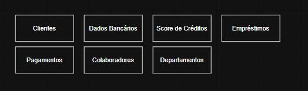
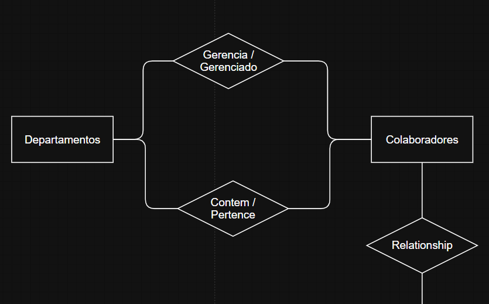
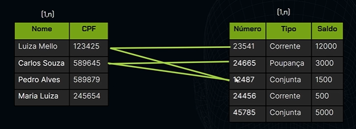
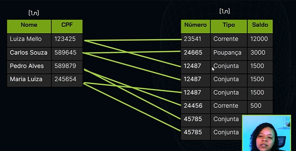
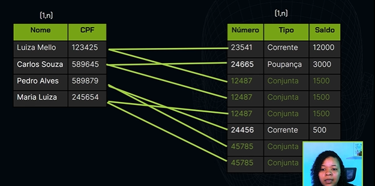
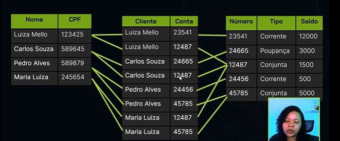
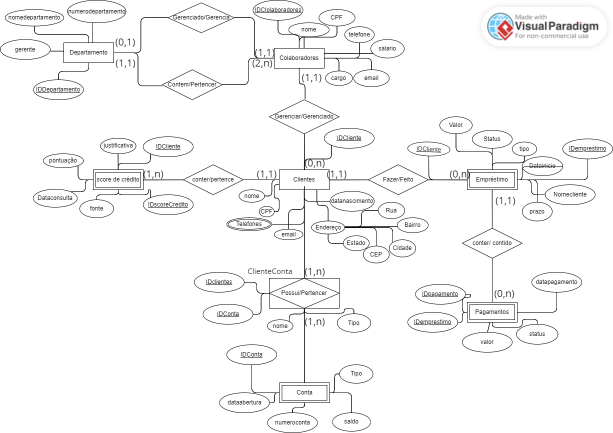
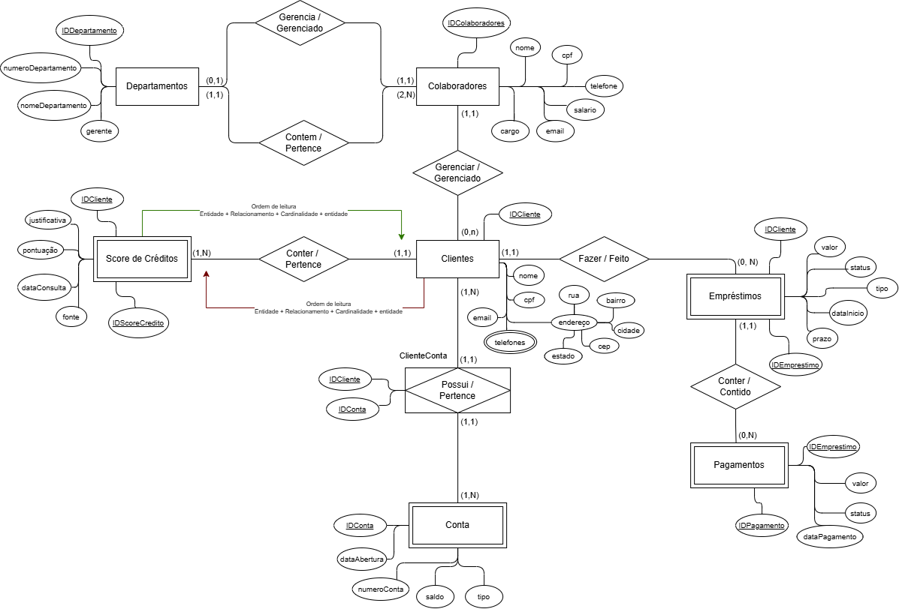

# <span style="color: #87BBA2">===   Modelagem de dados: identificando entidades, atributos, relacionamentos   ===</span> <!-- omit in toc -->

# <span style="color: #87BBA2">INDICE</span> <!-- omit in toc -->
- [Conhecendo o projeto](#conhecendo-o-projeto)
  - [PROJETO A SER DESENVOLVIDO](#projeto-a-ser-desenvolvido)
  - [ALINHAMENTO DO TIME](#alinhamento-do-time)
    - [Problemas identificados no material de consumo](#problemas-identificados-no-material-de-consumo)
    - [O que podemos fazer](#o-que-podemos-fazer)
  - [IMPOTANCIA DO ALINHAMENTO ENTRE TIMES](#impotancia-do-alinhamento-entre-times)
  - [MODELO CONCEITUAL](#modelo-conceitual)
    - [Conceito do Minimundo](#conceito-do-minimundo)
    - [Levantamento de requisitos](#levantamento-de-requisitos)
    - [Modelo conceitual (Diagrama de Chen ou DER - Modelo de Entidade e Relacionamento)](#modelo-conceitual-diagrama-de-chen-ou-der---modelo-de-entidade-e-relacionamento)
  - [MINIMUNDO, LEVANTAMENTO DE REQUISITOS E MODELO CONCEITUAL NO CONTEXTO DE UMA BIBLIOTECA](#minimundo-levantamento-de-requisitos-e-modelo-conceitual-no-contexto-de-uma-biblioteca)
    - [Minimundo](#minimundo)
    - [Levantamento de Requisitos](#levantamento-de-requisitos-1)
    - [Modelo Conceitual (Diagrama de Chen ou DER - Modelo de Entidade e Relacionamento)](#modelo-conceitual-diagrama-de-chen-ou-der---modelo-de-entidade-e-relacionamento-1)
    - [Conclusão](#conclusão)
- [Criando entidades](#criando-entidades)
  - [LEVANTAMENTO DE REQUISITOS](#levantamento-de-requisitos-2)
    - [Abstração](#abstração)
  - [SOBRE MER E DER](#sobre-mer-e-der)
  - [ENTIDADES](#entidades)
    - [Como identificar Entidade](#como-identificar-entidade)
    - [Entidades identificadas (Esboço do MER)](#entidades-identificadas-esboço-do-mer)
    - [Construindo o DER](#construindo-o-der)
  - [ENTIDADE FORTES](#entidade-fortes)
  - [ENTIDADE FRACAS](#entidade-fracas)
- [RELACIONAMENTO](#relacionamento)
  - [REPRESENTANDO RELACIONAMENTOS](#representando-relacionamentos)
    - [Refletindo sobre entidades Fortes e Fracas no momento](#refletindo-sobre-entidades-fortes-e-fracas-no-momento)
    - [**Interpretação**](#interpretação)
  - [SOBRE GRAU DE RELACIONAMENTO](#sobre-grau-de-relacionamento)
  - [ENTENDENDO SOBRE CARDINALIDADE](#entendendo-sobre-cardinalidade)
    - [Cardinalidade mínima](#cardinalidade-mínima)
    - [Cardinalidade máxima](#cardinalidade-máxima)
    - [Sentido de leitura](#sentido-de-leitura)
    - [Ordem de leitura do relacionamento](#ordem-de-leitura-do-relacionamento)
  - [MAIS SOBRE CARDINALIDADE](#mais-sobre-cardinalidade)
    - [Tipos de Cardinalidade](#tipos-de-cardinalidade)
      - [Um-para-Um (1:1):](#um-para-um-11)
      - [Um-para-Muitos (1:N):](#um-para-muitos-1n)
      - [Muitos-para-Muitos (N:M):](#muitos-para-muitos-nm)
    - [Representação da Cardinalidade](#representação-da-cardinalidade)
    - [Importância da Cardinalidade](#importância-da-cardinalidade)
  - [CARDINALIDADE](#cardinalidade)
    - [Regras de negócio da FlexEmpresta](#regras-de-negócio-da-flexempresta)
  - [SOBRE REGRAS DE NEGÓCIO](#sobre-regras-de-negócio)
    - [O que são Regras de Negócio?](#o-que-são-regras-de-negócio)
    - [Por que são importantes?](#por-que-são-importantes)
    - [Influência no Modelo Conceitual](#influência-no-modelo-conceitual)
    - [Implementação no Modelo Conceitual](#implementação-no-modelo-conceitual)
    - [Exemplo Prático](#exemplo-prático)
    - [Conclusão](#conclusão-1)
  - [ENTIDADE ASSOCIATIVA](#entidade-associativa)
    - [Como o banco se comportaria sem entidade associativa](#como-o-banco-se-comportaria-sem-entidade-associativa)
      - [Sem associação](#sem-associação)
      - [Representação do banco sem associação](#representação-do-banco-sem-associação)
      - [Com associação](#com-associação)
  - [MAIS SOBRE ENTIDADE ASSOCIATIVA](#mais-sobre-entidade-associativa)
    - [Definição de Entidade Associativa](#definição-de-entidade-associativa)
    - [Funcionalidade da Entidade Associativa](#funcionalidade-da-entidade-associativa)
      - [Exemplo de Entidade Associativa](#exemplo-de-entidade-associativa)
    - [Benefícios da Entidade Associativa](#benefícios-da-entidade-associativa)
  - [ESCLARECENDO ENTIDADES FORTES E FRACAS](#esclarecendo-entidades-fortes-e-fracas)
    - [Exemplo](#exemplo)
      - [**🟢 Exemplo de Strong Entity (Entidade Forte)**](#-exemplo-de-strong-entity-entidade-forte)
      - [**🔴 Exemplo de Weak Entity (Entidade Fraca)**](#-exemplo-de-weak-entity-entidade-fraca)
      - [**🤔 E quanto à relação "mínimo 1"?**](#-e-quanto-à-relação-mínimo-1)
    - [Quando usar relação entidade forte e fraca](#quando-usar-relação-entidade-forte-e-fraca)
      - [**1️⃣ Se a relação já garante a dependência, por que não deixar tudo forte?**](#1️⃣-se-a-relação-já-garante-a-dependência-por-que-não-deixar-tudo-forte)
      - [**2️⃣ Quando vale a pena usar entidades fracas?**](#2️⃣-quando-vale-a-pena-usar-entidades-fracas)
        - [**📌 1. Quando a entidade fraca só faz sentido dentro do contexto da entidade forte**](#-1-quando-a-entidade-fraca-só-faz-sentido-dentro-do-contexto-da-entidade-forte)
        - [**📌 2. Quando a identificação precisa ser significativa dentro do escopo da entidade forte**](#-2-quando-a-identificação-precisa-ser-significativa-dentro-do-escopo-da-entidade-forte)
        - [**📌 3. Quando não queremos um ID aleatório longo para a entidade fraca**](#-3-quando-não-queremos-um-id-aleatório-longo-para-a-entidade-fraca)
      - [**3️⃣ Como o UUID afeta a chave primária da entidade fraca?**](#3️⃣-como-o-uuid-afeta-a-chave-primária-da-entidade-fraca)
      - [**4️⃣ Conclusão: Quando usar entidades fracas ou não?**](#4️⃣-conclusão-quando-usar-entidades-fracas-ou-não)
      - [**🔹 Sobre seu questionamento final: "UUID não bagunça a chave composta?"**](#-sobre-seu-questionamento-final-uuid-não-bagunça-a-chave-composta)
      - [**🔥 Resumo Final**](#-resumo-final)
- [IDENTIFICANDO ATRIBUTOS](#identificando-atributos)
  - [CRIANDO ATRIBUTOS](#criando-atributos)
    - [O que são atributos](#o-que-são-atributos)
      - [Importância dos Atributos](#importância-dos-atributos)
    - [Como representar](#como-representar)
  - [TIPOS DE ATRIBUTOS](#tipos-de-atributos)
    - [Atributos simples](#atributos-simples)
    - [Atributos Multivalorados](#atributos-multivalorados)
    - [Atributos Derivados](#atributos-derivados)
    - [Atributos Composto](#atributos-composto)
    - [Atributos descritivos](#atributos-descritivos)
    - [Atributos Chaves](#atributos-chaves)
      - [Atributos Chaves em Entidades Fortes e Fracas](#atributos-chaves-em-entidades-fortes-e-fracas)
      - [Quando existe entidade associativa](#quando-existe-entidade-associativa)
- [CONHECENDO AS FERRAMENTAS](#conhecendo-as-ferramentas)
  - [DIAGRAMA DE ENTIDADE E RELACIONAMENTO CONCLUIDO](#diagrama-de-entidade-e-relacionamento-concluido)
  - [SGBDs](#sgbds)


# <span style="color: #87BBA2">Conhecendo o projeto</span>

## PROJETO A SER DESENVOLVIDO
Utilizaremos a modelagem de dados
- A modelagem de dados se constitue de diversas etapas que serão utilizadas para identificar os dados que queremos armazenar e padronizar através do desenho de fluxogramas.

## ALINHAMENTO DO TIME
Um dos pontos é o uso do mesmo material referencial. É essencial utilizar os mesmos conceitos para poder utilizá-los na criação de modelos conceituais e lógicos nesse fluxo de modelagem de dados.

### Problemas identificados no material de consumo
- Repetição de informação
  - Os dados de um mesmo cliente é replicado em varias linhas, ou seja, se precisar atualizar o cadastro deste cliente, precisará atualizar em todas a linhas ao qual ele aparece
- Informações estão todas juntas
  - Informações de clientes entra em score de crédito, que entra em tipo de conta de por aí vai, tudo em uma mesma linha
- Campos de mesmo nome
  - Temos dois campos chamado "Status". Vendo os valores dos dados, observamos que um é referente ao pagamento e outro é referente ao empréstimo, mas, indo apenas pelo titulo, gera-se confusão.

### O que podemos fazer
- Criar padronização de dados
- Separação e organização de dados
  - O que é cliente
  - O que é score
  - Informações bancárias e etc

## IMPOTANCIA DO ALINHAMENTO ENTRE TIMES

Desenvolver um projeto de banco de dados utilizando modelagem de dados é uma tarefa complexa que requer uma compreensão clara dos requisitos do sistema, dos processos de negócio e das necessidades dos usuários finais. O alinhamento de toda a equipe durante este processo é crucial, pois cada membro pode ter perspectivas únicas e contribuições essenciais para o sucesso do projeto. Aqui estão os principais motivos pelos quais é importante manter todos os membros do time alinhados ao desenvolver um projeto de banco de dados:

1 - Compreensão compartilhada dos requisitos

Um projeto de banco de dados bem-sucedido começa com um entendimento claro dos requisitos do negócio. O alinhamento entre os membros da equipe garante que todos entendam os objetivos do projeto, os dados que precisam ser capturados e como esses dados serão usados. Isso ajuda a evitar mal-entendidos e a garantir que o banco de dados atenda às necessidades do negócio de forma eficaz.

2 - Consistência no design

Quando todos na equipe estão alinhados, o design do banco de dados tende a ser mais consistente. Isso inclui a nomenclatura padronizada de tabelas e campos, a aplicação consistente de normas de normalização e a implementação uniforme de regras de negócio. A consistência facilita a manutenção, o desenvolvimento e a escalabilidade futura do banco de dados.

3 - Eficiência na implementação

O alinhamento da equipe reduz a duplicação de esforços e aumenta a eficiência. Com todos os membros da equipe trabalhando com o mesmo conjunto de expectativas e diretrizes, menos tempo é desperdiçado corrigindo erros ou redefinindo aspectos do projeto. Isso não apenas acelera o desenvolvimento, mas também ajuda a manter o projeto dentro do cronograma e do orçamento.

4 - Decisões mais informadas

Em um ambiente colaborativo, as decisões sobre o design e a implementação do banco de dados são geralmente mais informadas e bem pensadas. A diversidade de conhecimentos e experiências na equipe pode levar a soluções mais inovadoras e eficazes, reduzindo a probabilidade de problemas futuros.

5 - Facilidade de manutenção

Um banco de dados que é desenvolvido com a contribuição de toda a equipe tende a ser mais fácil de manter. Isso ocorre porque as decisões tomadas durante a fase de design são mais prováveis de considerar todos os aspectos do uso do banco de dados, incluindo a manutenção rotineira, a atualização de dados e a escalabilidade.

6 - Melhor adoção pelo usuário final

Quando o desenvolvimento do banco de dados é alinhado com as necessidades dos usuários finais (que podem ser representadas pela equipe), a adoção pelo usuário tende a ser mais alta. Um sistema que atende bem às necessidades dos usuários finais é mais provável de ser aceito e utilizado efetivamente.

7 - Redução de erros e riscos

Alinhamento e comunicação eficazes ajudam a identificar e resolver problemas potenciais mais cedo no processo de desenvolvimento. Isso minimiza o risco de erros significativos que poderiam ser caros e demorados para corrigir após o banco de dados estar em produção.

Manter todos os membros da equipe alinhados durante o desenvolvimento de um projeto de banco de dados é essencial para garantir que o resultado final seja robusto, eficiente e eficaz. A colaboração e o compromisso com objetivos comuns permitem não apenas um desenvolvimento mais suave, mas também um produto final que realmente suporta as operações e estratégias de negócio da organização.

## MODELO CONCEITUAL

### Conceito do Minimundo
> O minimundo é uma porção do mundo real, ou seja, uma parte do nosso todo.

Suponha que vamos construir um projeto para uma empresa bancária, como um banco. Normalmente, em um banco físico, existem clientes, gerência e parte de atendimento. Mas, muitas vezes, também podemos ter uma lanchonete dentro de um banco. A lanchonete não é relevante para a modelagem.

Por isso, devemos construir um minimundo apenas com o que é importante para o nosso projeto.

Os dados para construção do minimundo vêm do levantamento de requisitos.

### Levantamento de requisitos
No levantamento de requisitos, iremos reunir pontos importantes que precisam estar presentes no projeto.

É um dos momentos mais importantes quando vamos desenvolver um projeto, porque é quando teremos o contato com a clientela para entender suas necessidades. Por exemplo, uma entrevista com gerência, stakeholders (pessoas interessadas no projeto), pessoas colaboradoras e pessoas que vão usar o sistema para entender exatamente quais as necessidades do dia a dia.

Por meio do levantamento de requisitos, vamos conhecer o todo do nosso projeto para continuar o desenvolvimento do minimundo.

### Modelo conceitual (Diagrama de Chen ou DER - Modelo de Entidade e Relacionamento)
Depois que fazemos o levantamento de requisitos, vamos para o primeiro modelo, que é justamente o modelo conceitual.

No modelo conceitual, vamos desenvolver o nosso primeiro diagrama. Também é a etapa onde conheceremos o projeto e as regras de negócio, ou seja, começaremos a descrever quais são os dados que queremos armazenar.

## MINIMUNDO, LEVANTAMENTO DE REQUISITOS E MODELO CONCEITUAL NO CONTEXTO DE UMA BIBLIOTECA

### Minimundo
O conceito de Minimundo refere-se a uma parte específica do mundo real que é relevante para o sistema que está sendo desenvolvido. Imagine que você está construindo um sistema para uma biblioteca; o minimundo incluiria coisas como livros, empréstimos, leitores e funcionários, mas não incluiria elementos irrelevantes como o café vendido na cafeteria ao lado. O minimundo ajuda a definir claramente o escopo do que será incluído no sistema de banco de dados.

### Levantamento de Requisitos
O Levantamento de Requisitos é o processo de coletar informações sobre o que os usuários precisam e esperam do sistema. No contexto da biblioteca, isso poderia envolver entender como os leitores gostariam de pesquisar livros, quais informações sobre os livros são importantes (como título, autor, gênero), e como os funcionários gerenciam os empréstimos. Esse processo é crucial porque define as funcionalidades que o sistema precisa suportar e influencia diretamente como o banco de dados será projetado.

### Modelo Conceitual (Diagrama de Chen ou DER - Modelo de Entidade e Relacionamento)
Após definir o minimundo e coletar os requisitos, o próximo passo é criar um Modelo Conceitual. Este modelo é uma representação visual de alta abstração de como os dados no sistema são organizados. Ele usa elementos como entidades (objetos do mundo real como 'Livro' ou 'Leitor'), atributos (propriedades das entidades como 'Título do Livro' ou 'Nome do Leitor') e relacionamentos (como 'empresta' entre 'Leitor' e 'Livro'). O modelo conceitual é geralmente criado usando um Diagrama Entidade-Relacionamento (DER), que ajuda a visualizar como os diferentes elementos estão interconectados.

### Conclusão
Esses três componentes — Minimundo, Levantamento de Requisitos e Modelo Conceitual — são fundamentais na modelagem de dados porque juntos eles garantem que o sistema de banco de dados será bem projetado, funcional e capaz de atender às necessidades dos usuários. Ao começar com uma compreensão clara do minimundo, passando por uma coleta meticulosa de requisitos, até a criação de um modelo conceitual eficaz, os desenvolvedores podem construir bases de dados robustas e eficientes que apoiam os processos e operações críticas de negócios.

# <span style="color: #87BBA2">Criando entidades</span>

## LEVANTAMENTO DE REQUISITOS

### Abstração
Após o levantamento de requisitos, é fundamental aplicar o conceito de abstração. Esse princípio consiste em identificar e isolar os elementos essenciais para o nosso projeto, ignorando detalhes irrelevantes.

Por exemplo, ao modelar os dados dos clientes, sabemos que podem ser pessoa física ou pessoa jurídica. No caso de uma pessoa física, diversas informações poderiam ser armazenadas, como nome, CPF e endereço. No entanto, características como cor do cabelo, hobbies ou cor dos olhos não são relevantes para a empresa FlexEmpresta.

Portanto, a abstração nos ajuda a focar apenas nos dados necessários para o projeto, garantindo um modelo mais eficiente e alinhado aos objetivos do sistema.

A **abstração** envolve tanto **isolar os elementos essenciais quanto identificar pontos em comum dentro de um contexto**.

Por exemplo, ao modelar um sistema para clientes, percebemos que tanto uma pessoa física quanto uma pessoa jurídica compartilham atributos comuns, como nome, telefone e endereço. Já os atributos específicos, como CPF (para pessoa física) e CNPJ (para pessoa jurídica), podem ser tratados separadamente.

Dessa forma, a abstração permite generalizar conceitos para facilitar a organização dos dados e evitar redundâncias, ajudando na criação de estruturas mais reutilizáveis e eficientes

## SOBRE MER E DER

Na modelagem de dados, dois conceitos fundamentais que frequentemente aparecem são o Modelo Entidade-Relacionamento (MER) e o Diagrama Entidade-Relacionamento (DER). Esses conceitos são vitais para planejar e visualizar como os dados serão organizados e interagirão em um sistema de banco de dados. Vamos explorá-los de forma simplificada.

**Modelo Entidade-Relacionamento (MER)**

O Modelo Entidade-Relacionamento (MER) é uma abordagem teórica usada para descrever e especificar a estrutura de dados de um sistema de banco de dados. O MER ajuda a identificar os dados que devem ser armazenados no banco de dados e a definir as relações entre esses grupos de dados. No MER, os dados são organizados em entidades, atributos e relacionamentos:

Entidades: São objetos ou conceitos do mundo real que possuem dados que precisam ser armazenados. Exemplos de entidades podem ser 'Cliente', 'Pedido', ou 'Produto'.
Atributos: São as propriedades ou características de uma entidade. Por exemplo, a entidade 'Cliente' pode ter atributos como 'Nome do Cliente', 'Endereço' e 'Telefone'.
Relacionamentos: Descrevem como as entidades estão conectadas entre si e interagem. Por exemplo, um relacionamento entre 'Cliente' e 'Pedido' pode ser descrito como um cliente que 'realiza' um pedido.

**Diagrama Entidade-Relacionamento (DER)**

O Diagrama Entidade-Relacionamento (DER) é a representação gráfica do MER. O DER utiliza um conjunto de símbolos gráficos como retângulos, losangos e linhas para representar entidades, relacionamentos e atributos, respectivamente. O objetivo do DER é fornecer uma visualização clara e compreensível da estrutura do banco de dados, facilitando a compreensão das relações entre os dados, mesmo para aqueles sem conhecimento técnico profundo.

Por exemplo, num DER:

- Retângulos representam as entidades.
- Losangos representam os relacionamentos.
- Oval representa os atributos.
- Linhas conectam entidades com seus atributos e relacionamentos.

**Importância do MER e do DER**

- Comunicação e Planejamento: MER e DER são ferramentas essenciais para comunicar a estrutura de dados proposta entre os desenvolvedores e stakeholders do projeto, incluindo analistas de sistemas, gerentes de projeto e clientes. Eles facilitam a discussão e o planejamento antes da implementação do banco de dados.
- Organização e Design: Ajudam na organização dos dados de forma lógica, garantindo que todas as informações necessárias sejam capturadas e corretamente interligadas.
- Prevenção de Erros: Usar MER e DER na fase de design pode ajudar a identificar e corrigir potenciais erros de modelagem, como redundâncias de dados ou relações mal definidas, antes que o banco de dados seja fisicamente implementado.

Em resumo, o Modelo Entidade-Relacionamento e o Diagrama Entidade-Relacionamento são fundamentais na modelagem de dados, ajudando a estruturar, planejar e visualizar a organização de dados em sistemas de banco de dados de maneira eficiente e eficaz.

## ENTIDADES
Agora identificaremos as entidades, onde elas poderão ser abstratas ou concretas.
- Abstrato: Aquilo que não existe fisicamente no mundo real.
- Concreto: O que existe fisicamente no mundo real.

Foi identificado, por exemplo, as Entidades Cliente e Dados Bancários, sendo Cliente uma Entidade Concreta e Dados Bancários uma Entidade Abstrata.

Foi identificado, também, o Score de Crédito como uma Entidade para o Banco de dados.

### Como identificar Entidade
Pelo que identifiquei, este exemplo utilizou como forma para identificar quais seriam as Entidades do banco de dados a interpretação do Levantamento de Requisitos, tendo a pergunta 3 (Quais informações devem ser Armazenadas) uma pergunta extremamente importante.
- Vemos no texto varias menções de caracteristicas de algo, isso é uma dica de Entidade e Atributos, já que Atributos são as características que definem uma Entidade.

Ou seja, quando se diz: Armazenamos os CPF, Nome e Email dos Clientes, podemos entender como: Para uma Entidade Cliente, teremos atributos CPF, Nome e Email

### Entidades identificadas (Esboço do MER)
- Cliente: Nome, CPF, Telefones, endereço, data de nascimento e email
- Dados Bancários: Tipo de conta, saldo, número da conta e data de abertura
- Score de Crédito: Justificativa, pontuação, data da consulta e fonte
- Empréstimos: Valor do empréstimo, status, tipo de empréstimo, data de inicio, nome do cliente e prazo
- Pagamentos: Data pagamento da parcela, valor pago, status da parcerla
- Colaboradores: CPF, telefone, salário, cargo e e-mail
- Deparatamentos: Numero do departamento, nome do departamento e gerente

### Construindo o DER
Inicia-se a construção do DER com a separação das Entidades


## ENTIDADE FORTES
- Entidade forte: existe por si só, sem dependência de outra entidade. Ou seja, ela não precisa de outra entidade ligada a ela para existir.
- Entidade fraca: É o inverso, ela só existe porque outra entidade também existe.

No nossocaso, Clientes, Colaboradores e Departamentos são Fortes, pois, elas não dependem de outras tabelas para existirem.

Já Score de Créditos, Conta, Empréstimo e Pagamento são entendidades fracas, pois, as 3 primeiras inerentemente dependem da tabela de Clientes (pois, não existirá Crédito, Conta ou Empréstimo sem Clientes) e só existe Pagamento com a existencia de Empréstimo.
- Ou seja, uma entidade fraca pode depender de outra entidade fraca.

## ENTIDADE FRACAS
Entidades fracas são representadas por retangulos duplos. 

# <span style="color: #87BBA2">RELACIONAMENTO</span>

## REPRESENTANDO RELACIONAMENTOS
Um ponto muito interessante é na representação da relação de Colaboradores com Departamentos.
- Como existe cargo de Colaborador que gerencia um Departamento, temos essa relação de gerenciamento.
- Porém, temos uma segunda relação, pois, um Departamento, no minimo, possui dois colaboradores.


Imagem do sistema geral


### Refletindo sobre entidades Fortes e Fracas no momento
1. **Entidade Forte**  
   - É uma entidade que **pode existir por conta própria**, ou seja, **não depende de outra entidade** para existir.  
   - No banco de dados, isso significa que ela **possui uma chave primária própria** e **não depende de uma chave estrangeira obrigatória**.  
   - Exemplo:  
     - No seu caso, **Departamento, Colaborador e Cliente** podem ser entidades fortes, pois fazem sentido existir independentemente.  

2. **Entidade Fraca**  
   - É uma entidade que **não pode existir sem estar associada a uma entidade forte**.  
   - Isso significa que **a sua chave primária depende da chave primária de outra entidade** (chave primária composta).  
   - No banco, isso geralmente se traduz em uma **chave estrangeira obrigatória**.  
   - Exemplo:  
     - Se tivéssemos uma entidade **Dependente** (filho de um colaborador), ela **só faria sentido existir se estiver associada a um Colaborador**.  
     - Assim, a tabela **Dependente** teria como chave primária uma composição entre um **ID próprio** e o **ID do Colaborador** ao qual pertence.  

### **Interpretação**  
O ponto principal não é aceitar ou não **null**, mas sim **se a entidade pode ou não existir sem outra**.  

- Se a entidade for **forte**, a FK pode ser **opcional** (pode aceitar `NULL`), pois ela pode existir sozinha.  
- Se a entidade for **fraca**, a FK **não pode ser nula**, pois ela precisa obrigatoriamente de uma entidade forte para existir.  

## SOBRE GRAU DE RELACIONAMENTO

1. Relacionamento Unário (Auto-relacionamento)
Um relacionamento unário, também conhecido como auto-relacionamento, ocorre quando uma entidade está relacionada a si mesma. Esse tipo de relacionamento é usado para expressar uma relação onde instâncias da mesma entidade estão conectadas de alguma forma.

Exemplo:
- Supervisão em uma Empresa: Um colaborador(a) pode ser supervisor de outro colaborador(a). Aqui, a entidade colaborador tem um relacionamento consigo mesma, onde cada instância (colaborador) pode ser 'supervisor de' outra instância (outro colaborador).

2. Relacionamento Binário
Um relacionamento binário envolve duas entidades diferentes. É o tipo de relacionamento mais comum na modelagem de dados e pode expressar uma variedade de interações entre as entidades.

Exemplos:
- Cliente e Pedido: Um relacionamento binário típico pode ser entre Cliente e Pedido, onde um cliente realiza um pedido.

3. Relacionamento Ternário
Um relacionamento ternário envolve três entidades diferentes. Esses relacionamentos são usados quando uma interação não pode ser adequadamente representada por vários relacionamentos binários.

Exemplo:
- Professores, Estudantes e Cursos: Um relacionamento ternário pode existir entre Professor, Estudante, e Curso, onde um professor pode ensinar a um estudante em um curso específico. Esse tipo de relacionamento indica que a interação envolve todas as três entidades simultaneamente e não pode ser simplificada em relacionamentos menores sem perder informações críticas.

Importância dos Graus de Relacionamento
- Clareza no Design: Compreender o grau de relacionamento ajuda a definir claramente como as entidades interagem dentro do sistema, permitindo um design mais claro e lógico do banco de dados.
- Precisão na Modelagem: Usar o grau correto de relacionamento assegura que o modelo conceitual capture todas as nuances das relações entre as entidades, o que é crucial para a integridade dos dados e a funcionalidade do sistema.
- Eficiência na Implementação: Identificar o grau correto de relacionamento pode simplificar a implementação do banco de dados e otimizar o desempenho, pois o sistema pode ser mais diretamente alinhado com as necessidades reais de interação de dados.

## ENTENDENDO SOBRE CARDINALIDADE
A cardinalidade será utilizada para definir quantas vezes as entidades vão se relacionar.

### Cardinalidade mínima
A cardinalidade mínima define a participação da entidade no relacionamento, indicando se é obrigatório que um colaborador esteja associado a um cliente, por exemplo.

### Cardinalidade máxima
Já a cardinalidade máxima determina a quantidade de ocorrências que podem realmente acontecer.

Por exemplo, um colaborador pode estar associado a 5 clientes, o que representa a cardinalidade máxima, ou seja, o número máximo de ocorrências.

### Sentido de leitura
O sentido de leitura da cardinalidade é sempre oposto à entidade, ou seja, a cardinalidade de uma entidade está ligada proxima à entidade a qual ela se liga. Algo como 
- [ ENTIDADE A ] (cardinalidade da Entidade B) ---- < RELACIONAMENTO > ---- (Cardinalidade da Entidade A) [ ENTIDADE B ]

Ou seja, se for:
- [ A ] 1:n --- Relacionamento --- 1:1 [ B ]
- Interpreta-se: Entidade B possui 1, e somente 1, relaçaão com Entidade A e Entidade A possui no minimo 1 e no maximo N (varias) relações com entidade B.
- [ FUNCIONARIO ] 1:N --- Trabalha/Contem --- 1:1 [ DEPARTAMENTO ]
- Interpreta-se: Um DEPARTAMENTO pode conter no minimo 1 e no maximo N FUNCIONARIOS
- No outro sentido: Um FUNCIONARIO pode trabalhar em no minimo 1 e somente 1 DEPARTAMENTO

### Ordem de leitura do relacionamento
A ordem de leitura de um relacionamento **sempre será**: ENTIDADE + RELACIONAMENTO + CARDINALIDADE + ENTIDADE.
- DEPARTAMENTO + pode CONTER + 1:N + FUNCIONARIOS

## MAIS SOBRE CARDINALIDADE
A cardinalidade nos relacionamentos em um modelo conceitual é um aspecto fundamental que descreve como as entidades estão quantitativamente relacionadas em um banco de dados. Em outras palavras, a cardinalidade define o número de instâncias de uma entidade que podem ou devem estar associadas a um número de instâncias de outra entidade. Este conceito é crucial para desenhar um sistema de banco de dados que reflita com precisão as regras e necessidades de negócio.

### Tipos de Cardinalidade
A cardinalidade é tipicamente expressa em termos das possíveis quantidades de conexões entre entidades e é categorizada principalmente em três tipos:

Obs.: Nesta representação, apenas a cardinalidade máxima é informada

#### Um-para-Um (1:1):
Descrição: Cada instância de uma entidade está associada a no máximo uma instância da outra entidade.

Exemplo: Suponha um sistema onde cada Gerente é responsável por um único Departamento e cada Departamento é gerenciado por um único Gerente. Aqui, a relação entre Gerente e Departamento é um-para-um.

#### Um-para-Muitos (1:N):
Descrição: Uma instância de uma entidade pode estar associada a várias instâncias de outra entidade, mas uma instância da segunda entidade pode estar associada a no máximo uma instância da primeira entidade.

Exemplo: Em um sistema escolar, um Professor pode lecionar várias Turmas, mas cada Turma é lecionada por apenas um Professor. Assim, a relação entre Professor e Turma é um-para-muitos.

#### Muitos-para-Muitos (N:M):
Descrição: Instâncias de uma entidade podem estar associadas a várias instâncias da outra entidade e vice-versa.

Exemplo: Em uma universidade, um Estudante pode se inscrever em várias Disciplinas e cada Disciplina pode ter vários Estudantes inscritos. Esta é uma relação muitos-para-muitos.

### Representação da Cardinalidade
Em um Diagrama Entidade-Relacionamento (DER), a cardinalidade é representada por meio de símbolos ou etiquetas nas linhas que conectam as entidades. Esses símbolos indicam as regras de cardinalidade, como "1", "N" ou "M", mostrando como as entidades estão relacionadas.

### Importância da Cardinalidade
Integridade dos Dados: As regras de cardinalidade ajudam a manter a integridade dos dados ao garantir que os relacionamentos entre as entidades respeitem as regras de negócio definidas. Isso previne erros como ter uma Turma sem Professor em um sistema que exige que todas as turmas tenham professores.

Eficiência na Consulta: Entender as cardinalidades ajuda a otimizar as consultas ao banco de dados. Por exemplo, saber que a relação entre Professor e Turma é 1 permite otimizações ao buscar todas as turmas de um professor específico.

Design do Banco de Dados: A cardinalidade informa decisões sobre como as tabelas devem ser estruturadas, como os índices devem ser criados e como as chaves estrangeiras são definidas, influenciando diretamente a performance e a escalabilidade do banco de dados.

Portanto, definir corretamente as cardinalidades dos relacionamentos no modelo conceitual é crucial para o sucesso do design e da funcionalidade de um sistema de banco de dados, garantindo que ele seja capaz de atender eficientemente às necessidades do usuário e às exigências do negócio.

## CARDINALIDADE
Realizar a definição correta de cardinalidade estamos garantindo que nossos dados sejam integro e estamos atendendo às regras de negócio, como visto no exemplo da conta conjunta. Onde, quando a conta é de uma pessoa, tinhamos a relação de N:1 entre Cliente e Conta e quando passou a ser conjunta se tornou N:N.

Para representar nossas cardinalidades, é **importantissimo** sempre seguirmos as **regras de negócios**;

### Regras de negócio da FlexEmpresta
- Um cliente pode ter nenhum ou varios emprestimos
- Um emprestimo DEVE estar associado a UMA e exclusivamente UMA pessoa
- Ao criar um emprestimo, não precisa-se pagar a primeira parcela de imediato, mas o pagamento poderá ser parcelado
- Um pagamento sempre deve estar associado a um emprestimo, quitando apenas um emprestimo
- Nem todo colaborador gerencia um cliente, mas pode gerenciar mais de um
  - Pois, temos colaboradores que não são gerentes
  - Mas um gerente pode gerenciar mais de um cliente
- Um cliente sempre será gerenciado por um colaborador
- Um departamento precisa ser gerenciado no minimo e no maximo 1 colaborador (gerente)
- Nem todo colaborador é gerente, então, nem todos estarão gerenciando um Departamento
  - Mas quando o colaborador gerencia, ele só pode gerenciar um departamento
- Um departamento pode conter no minimo 2 colaboradores atuando e no maximo é N
- Um colaborador deve e só pode pertencer a um departamento
- Um cliente, no momento da criação, PRECISA ter uma conta, no minimo, e varias contas no maximo
- Pra conta existir, precisa estar associada a um cliente, mas, no maximo, precisará de varios clientes pois a FlexEmpresta aceita conta conjunta

## SOBRE REGRAS DE NEGÓCIO

Quando estamos criando um sistema, uma das etapas mais importantes é entender como esse sistema vai funcionar, certo? É aí que entram as Regras de Negócio. Imagine que você está montando um quebra-cabeça. As peças são os dados que você tem, e as regras de negócio são as instruções de como essas peças devem se encaixar. Sem essas instruções, você pode até montar algo, mas provavelmente não será o que você queria no início.

### O que são Regras de Negócio?
As regras de negócio são, basicamente, as leis que definem como uma empresa ou sistema deve operar. Elas são as diretrizes que dizem como os dados devem ser tratados, quais operações são permitidas, e como diferentes partes do sistema interagem entre si. Por exemplo, uma regra de negócio pode dizer que "um cliente deve ter mais de 18 anos para abrir uma conta".

### Por que são importantes?
Sem regras de negócio bem definidas e implementadas, um sistema pode se comportar de maneira imprevisível, causar erros, ou até mesmo falhar em realizar suas funções básicas. Além disso, elas ajudam a garantir que o sistema esteja alinhado com os objetivos da empresa, cumprindo com regulamentações e oferecendo um serviço de qualidade para os usuários.

### Influência no Modelo Conceitual
O Modelo Conceitual é como o esboço de um edifício antes de começar a construção. Ele mostra a estrutura dos dados, como eles se relacionam, e quais são as principais operações que podem ser realizadas. As regras de negócio influenciam diretamente esse modelo porque definem:

Quais dados são necessários: Se a regra diz que todo cliente deve ter mais de 18 anos, o modelo precisa de um campo para a data de nascimento ou idade do cliente.
Como os dados se relacionam: Se uma regra determina que cada pedido deve estar associado a um único cliente, isso define uma relação específica entre os dados de pedidos e clientes.
Restrições e validações: Por exemplo, se uma regra estabelece que o estoque de um produto não pode ser negativo, isso precisa ser considerado no modelo para garantir que a regra seja respeitada.

### Implementação no Modelo Conceitual
A implementação dessas regras no modelo conceitual é crucial para o sucesso do sistema. Isso geralmente envolve:

Definir entidades e atributos: Identificar quais são os elementos de dados necessários e suas características.
Estabelecer relações: Determinar como as entidades se relacionam entre si.
Aplicar restrições: Incluir regras que limitam os valores que os dados podem ter ou como eles podem ser alterados.

### Exemplo Prático
Vamos considerar um sistema de biblioteca. Uma regra de negócio pode ser que "um usuário pode pegar no máximo 5 livros por vez". No modelo conceitual, isso influencia:

A criação de uma entidade Usuário e uma entidade Livro.
Uma relação entre Usuário e Livro que permite associar múltiplos livros a um único usuário.
Uma restrição na relação que limita o número de livros associados a um usuário a no máximo 5.

### Conclusão
As regras de negócio são fundamentais para o desenvolvimento de sistemas eficientes e eficazes. Elas orientam a modelagem de dados, garantindo que o sistema atenda às necessidades da empresa e dos usuários. Implementá-las corretamente no modelo conceitual é essencial para construir uma base sólida para o desenvolvimento do sistema. Portanto, entender e aplicar essas regras é uma habilidade valiosa para qualquer desenvolvedor ou analista de sistemas.

## ENTIDADE ASSOCIATIVA
Para um banco de dados relacional, não é possivel mantermos um relacionamento muitos-para-muitos (N:N), mas, como podemos resolver a questão deste relacionamento, uma vez que se faz necessário a relação de muitos-para-muitos entre essas duas entidades. Resolvemos isso através das **Entidades Associativas**, tornando uma relação N:N em uma relação indireta.

A entidade associativa não é nem uma entidade, nem um relacionamento. Ela vem da mistura desses dois objetos. Trata-se da junção de uma entidade com um relacionamento, porque ela será uma entidade ao final do projeto, mas também é responsável por associar duas entidades.

### Como o banco se comportaria sem entidade associativa

#### Sem associação

- Observe que Luiza e Carlos compartilhar a mesma conta 12487

#### Representação do banco sem associação


- Como Luiza e Carlos estavam fazendo referencia a uma mesma linha, e isso não é possivem no banco de dados, uma solução para isso seria replicar a linha, tornando uma delas associada a Luiza e uma delas associada a Carlos.
- Isso não é pratico, pois, se tivesse um caso de 30 instancias de um objeto fazendo referencia a 2 instancia de outro objeto, já seriam 60 linhas. Se fossem para 3 instancias, 90 linhas, sendo 60 linhas replicadas (só mudando a quem está associado), ocupando desnecessariamente espaço no banco e necessitando realizar operações especificas para fazer alguma alteração, caso necessita-se de atualização, e afins.

#### Com associação

Agora, tendo uma tabela intermediaria realizando as associações, sempre teremos relacionamentos unicos.
- A tabela de associação unirá uma entidade com a outra, ou seka, Luiza tem conta X, Luiza tem conta Y, Carlos tem Conta Z, Carlos tem conta Y, e por aí vai.
- Isso facilita a manutenção e economiza espaço, pois associa-se apenas chaves únicas.

## MAIS SOBRE ENTIDADE ASSOCIATIVA
Uma entidade associativa no contexto de modelagem de dados é um conceito crucial quando se lida com relacionamentos muitos-para-muitos (N:M) entre duas entidades. Em modelos conceituais, uma entidade associativa é usada para resolver a complexidade que surge ao tentar implementar diretamente um relacionamento muitos-para-muitos em um sistema de banco de dados relacional.

### Definição de Entidade Associativa
Uma entidade associativa, também conhecida como tabela de junção, tabela de associação, ou tabela intermediária, é uma tabela que serve como uma ponte entre duas outras entidades para gerenciar um relacionamento muitos-para-muitos entre elas. Essa entidade não só armazena as chaves das duas entidades relacionadas como também pode conter atributos adicionais que são específicos para o relacionamento.

### Funcionalidade da Entidade Associativa
Gerenciamento de Relacionamentos (N:M): A principal função de uma entidade associativa é transformar um complicado relacionamento muitos-para-muitos em dois relacionamentos um-para-muitos (1:N), o que é mais simples de implementar em bancos de dados relacionais.

Armazenamento de Dados de Relacionamento: Além de conectar duas entidades, a entidade associativa frequentemente armazena informações relevantes para o relacionamento. Por exemplo, se uma entidade associativa conecta Estudantes e Cursos em um relacionamento de inscrição, ela pode também armazenar informações como Data de Inscrição, Nota Final ou Status da Inscrição.

#### Exemplo de Entidade Associativa
Vamos considerar um sistema de gerenciamento universitário onde estudantes podem se inscrever em múltiplos cursos e cada curso pode ter vários estudantes. Aqui, temos um relacionamento muitos-para-muitos entre as entidades Estudante e Curso.

- Estudantes (EstudanteID, Nome, Email)
- Cursos (CursoID, NomeCurso, Professor)

Para gerenciar esse relacionamento, criamos uma entidade associativa chamada Inscrições:

- Inscrições (EstudanteID, CursoID, DataInscrição, NotaFinal)

Aqui, EstudanteID e CursoID são chaves que referenciam Estudantes e Cursos, respectivamente, e DataInscrição e NotaFinal são atributos específicos do relacionamento.

### Benefícios da Entidade Associativa
Clareza e Organização: Facilita o entendimento e a gestão de relacionamentos muitos-para-muitos, proporcionando uma visão clara de como as entidades estão inter-relacionadas.

Integridade de Dados: Mantém a integridade referencial ao garantir que todas as relações sejam válidas dentro do contexto das regras de negócio definidas.

Flexibilidade para Armazenar Dados Complexos: Permite o armazenamento de dados detalhados sobre o relacionamento, que não seriam possíveis de armazenar diretamente nas tabelas das entidades principais.

Em resumo, a entidade associativa é uma ferramenta valiosa no arsenal de modelagem de dados, essencial para lidar com complexidades específicas de relacionamentos muitos-para-muitos e para enriquecer o banco de dados com informações detalhadas sobre as interações entre entidades.

## ESCLARECENDO ENTIDADES FORTES E FRACAS

A diferença fundamental está na forma como a entidade é identificada:

- **Entidade (Strong Entity):**  
  - Possui um identificador único (chave primária) que a define independentemente.  
  - Pode existir por conta própria, mesmo que esteja relacionada a outras entidades.

- **Weak Entity (Entidade Fraca):**  
  - Não possui um identificador único próprio.  
  - Sua identificação depende da existência de uma entidade forte (através de uma relação de identificação).  
  - Geralmente, sua chave primária é composta pela chave primária da entidade forte associada e por um atributo parcial (discriminador) próprio.

Quanto à relação de "mínimo 1":  
Nem toda entidade que possui uma relação obrigatória com outra é automaticamente uma weak entity. Uma relação obrigatória (mínimo 1) pode ser apenas uma restrição de integridade sem que a entidade perca sua identidade própria. Para ser considerada uma weak entity, ela precisa depender **exclusivamente** da entidade forte para sua identificação – ou seja, não ter um identificador independente.

Portanto, só definimos uma entidade como weak quando ela **não consegue ser identificada de forma única sem o apoio da entidade forte**. Se a entidade tem um identificador próprio, mesmo com uma relação obrigatória, ela continua sendo considerada uma entidade forte.

### Exemplo

#### **🟢 Exemplo de Strong Entity (Entidade Forte)**  
Suponha que temos duas tabelas: **Cliente** e **Pedido**.  

```sql
CREATE TABLE Cliente (
    id_cliente INT PRIMARY KEY,
    nome VARCHAR(100)
);

CREATE TABLE Pedido (
    id_pedido INT PRIMARY KEY,
    data_pedido DATE,
    id_cliente INT,
    FOREIGN KEY (id_cliente) REFERENCES Cliente(id_cliente)
);
```

📌 **Por que são entidades fortes?**  
- **Cliente** tem um **ID próprio** e pode existir sozinho.  
- **Pedido** também tem um **ID próprio** e pode existir sem depender da chave primária de outra tabela (ele apenas faz referência a um cliente).  
- A relação entre elas não influencia na identificação da entidade.  

---

#### **🔴 Exemplo de Weak Entity (Entidade Fraca)**  
Agora, imagine que um **Dependente** só pode existir se estiver vinculado a um **Cliente**.  

```sql
CREATE TABLE Cliente (
    id_cliente INT PRIMARY KEY,
    nome VARCHAR(100)
);

CREATE TABLE Dependente (
    id_dependente INT,
    id_cliente INT,
    nome VARCHAR(100),
    PRIMARY KEY (id_dependente, id_cliente),
    FOREIGN KEY (id_cliente) REFERENCES Cliente(id_cliente)
);
```

📌 **Por que Dependente é uma Weak Entity?**  
- **Não tem um identificador próprio único**: a chave primária é **composta** (`id_dependente, id_cliente`).  
- Para identificar um dependente, **precisamos saber a qual Cliente ele pertence**.  
- Ele **não faz sentido sem um Cliente** – não pode existir sozinho.  

---

#### **🤔 E quanto à relação "mínimo 1"?**  
- Se **Pedido** exige que todo pedido pertença a um cliente (`NOT NULL` na FK), isso **não o torna uma weak entity**, pois ele ainda pode ser identificado de forma única com `id_pedido`.  
- Mas **Dependente**, sem um `id_cliente`, não pode ser identificado sozinho, então ele **é uma weak entity**.  

🔹 **Resumo:**  
✅ Se a entidade tem um identificador único próprio, é uma **strong entity**.  
❌ Se precisa da chave de outra entidade para ser identificada, é uma **weak entity**.  

### Quando usar relação entidade forte e fraca

#### **1️⃣ Se a relação já garante a dependência, por que não deixar tudo forte?**  

Sim, a relação entre tabelas já pode garantir que um Dependente só exista se houver um Cliente (`FOREIGN KEY NOT NULL`). **Mas isso não é suficiente para tornar Dependente uma entidade fraca!**  

A verdadeira diferença entre **entidades fortes e fracas** está na **forma como elas são identificadas** e não apenas na dependência da FK.  

**Comparação de Modelagens:**  

✅ **Usando Dependente como Entidade Forte**  
```sql
CREATE TABLE Cliente (
    id_cliente UUID PRIMARY KEY DEFAULT gen_random_uuid(),
    nome VARCHAR(100) NOT NULL
);

CREATE TABLE Dependente (
    id_dependente UUID PRIMARY KEY DEFAULT gen_random_uuid(),
    id_cliente UUID NOT NULL,
    nome VARCHAR(100) NOT NULL,
    FOREIGN KEY (id_cliente) REFERENCES Cliente(id_cliente) ON DELETE CASCADE
);
```
📌 **Características:**  
- `Dependente` tem **UUID próprio** e não depende da chave primária de `Cliente` para ser identificado.  
- Relação é garantida pela `FOREIGN KEY (id_cliente)`.  

❌ **Usando Dependente como Entidade Fraca**  
```sql
CREATE TABLE Cliente (
    id_cliente UUID PRIMARY KEY DEFAULT gen_random_uuid(),
    nome VARCHAR(100) NOT NULL
);

CREATE TABLE Dependente (
    id_dependente SMALLINT,
    id_cliente UUID NOT NULL,
    nome VARCHAR(100) NOT NULL,
    PRIMARY KEY (id_dependente, id_cliente),
    FOREIGN KEY (id_cliente) REFERENCES Cliente(id_cliente) ON DELETE CASCADE
);
```
📌 **Características:**  
- `Dependente` **não tem um identificador único próprio**.  
- A **chave primária é composta** (`id_dependente, id_cliente`).  
- O `id_dependente` **é apenas um número incremental dentro de cada Cliente**.  

Agora, a questão principal: **por que usar a segunda abordagem se a primeira já funciona?**  

---

#### **2️⃣ Quando vale a pena usar entidades fracas?**  

Aqui estão **três cenários onde a modelagem com entidade fraca pode ser melhor**:  

##### **📌 1. Quando a entidade fraca só faz sentido dentro do contexto da entidade forte**  
- Um **Dependente** pode ter o ID `11`, mas **sem o Cliente, esse ID não tem sentido**.  
- Isso acontece em casos como:
  - **Assentos de um voo** (não existem fora do voo).  
  - **Itens de um pedido** (só existem dentro do pedido).  

📌 **Se Dependente for uma entidade forte, ele pode existir isoladamente, o que não faz sentido.**  

---

##### **📌 2. Quando a identificação precisa ser significativa dentro do escopo da entidade forte**  
Imagine que cada Cliente tenha até **99 Dependentes**. Se usarmos uma **entidade fraca**, podemos numerar os dependentes de `01` a `99` dentro de cada Cliente:  

```
Cliente: João (ID: a123)
Dependente 01 - Maria
Dependente 02 - José

Cliente: Ana (ID: b456)
Dependente 01 - Pedro
Dependente 02 - Laura
```
📌 **Com uma entidade fraca, sabemos que:**  
- `01` e `02` pertencem ao Cliente `a123`.  
- `01` e `02` pertencem ao Cliente `b456`.  
- Os números **são reaproveitados para cada Cliente**, deixando a identificação mais intuitiva.  

🔹 **Se Dependente fosse uma entidade forte, os IDs seriam UUIDs aleatórios**, dificultando a leitura direta.  

---

##### **📌 3. Quando não queremos um ID aleatório longo para a entidade fraca**  
Se Dependente tiver um UUID próprio, teremos algo assim:  

```
Dependente:
ID: 550e8400-e29b-41d4-a716-446655440000
ID_Cliente: a123
Nome: Maria

ID: 550e8400-e29b-41d4-a716-446655440001
ID_Cliente: a123
Nome: José
```
📌 **Com UUIDs, os IDs são irreconhecíveis sem consulta ao banco**.  

Mas, se Dependente for uma **entidade fraca**, ficaria assim:  

```
Dependente:
ID: 01
ID_Cliente: a123
Nome: Maria

ID: 02
ID_Cliente: a123
Nome: José
```
📌 **Agora o ID é menor e mais significativo dentro do contexto do Cliente**.  

---

#### **3️⃣ Como o UUID afeta a chave primária da entidade fraca?**  

Se usarmos **UUIDs**, **perdemos o benefício da chave composta ser legível**, pois ela ficaria assim:  

```
PRIMARY KEY (id_dependente, id_cliente) -- Exemplo com UUID
```
🔹 Se o **id_dependente** for um número pequeno (`01, 02, 03`), faz sentido.  
🔹 Mas se o **id_dependente** for um UUID, a chave primária seria algo como:  

```
(550e8400-e29b-41d4-a716-446655440000, a123)
(550e8400-e29b-41d4-a716-446655440001, a123)
```
📌 **Nesse caso, perde-se um dos principais benefícios da entidade fraca: a simplicidade na chave primária.**  

---

#### **4️⃣ Conclusão: Quando usar entidades fracas ou não?**  

✅ **Use entidades fracas quando:**  
- A entidade **só faz sentido dentro do contexto da entidade forte** (exemplo: Dependentes, Itens de Pedido, Assentos de Voo).  
- A chave primária precisa ser **composta e significativa** dentro do escopo da entidade forte.  
- Você deseja um **ID mais curto e legível** dentro do contexto da entidade forte.  

❌ **Use entidades fortes quando:**  
- A entidade **pode existir isoladamente**.  
- Cada entidade precisa ter **um UUID único** independente.  
- Você quer evitar chaves compostas e **facilitar joins**.  

---

#### **🔹 Sobre seu questionamento final: "UUID não bagunça a chave composta?"**  

✅ **Sim, se a chave composta tiver um UUID como ID secundário, a leitura fica mais difícil**.  
✅ **Por isso, quando usamos UUID, muitas vezes evitamos entidades fracas e deixamos tudo forte.**  
✅ **Mas se quisermos manter a ideia de entidade fraca, podemos usar um número pequeno para o `id_dependente` ao invés de um UUID.**  

---

#### **🔥 Resumo Final**  
- Se **UUID está sendo usado**, a **vantagem das entidades fracas diminui**, pois a chave primária fica longa e ilegível.  
- Para **sistemas com UUIDs, pode ser mais fácil tornar tudo forte** e usar apenas relações (`FOREIGN KEY NOT NULL`).  
- **Entidades fracas ainda são úteis** quando o ID pode ser pequeno (exemplo: `01, 02, 03` dentro de um Cliente).  

# <span style="color: #87BBA2">IDENTIFICANDO ATRIBUTOS</span>

## CRIANDO ATRIBUTOS
Consultando o documento de requisitos identificaremos também as caracteristicas de nossas entidades.

As caracteristicas das entidades identificamos como **atributos**.

### O que são atributos
Em modelagem de dados, um atributo é uma propriedade ou característica de uma entidade que armazena dados. Atributos representam aspectos quantitativos ou qualitativos das entidades e são fundamentais para definir a estrutura de informações de um sistema de banco de dados. Cada atributo em uma tabela geralmente corresponde a uma coluna na tabela de um banco de dados.

#### Importância dos Atributos
**Descrição**: Atributos fornecem detalhes necessários que descrevem cada instância de uma entidade, permitindo que o banco de dados armazene informações mais completas e úteis.

**Funcionalidade**: Atributos também são fundamentais para as operações do banco de dados, tais como pesquisas, filtros, e análises, pois são os pontos de dados que essas operações utilizam.

**Relacionamentos**: Atributos podem também definir ou influenciar os relacionamentos entre entidades.

**Por exemplo:**
- No local onde identificamos a entidade Clientes, foi informado da existencia dos dados como: CPF, telefones, endereço, data de nascimento e email. Esses dados especificos são so atributos, uma vez que dão caracteristica à entidade.

### Como representar
Representa-se com a forma **elipse**, o mesmo indicado pelo **Draw.io**.

## TIPOS DE ATRIBUTOS

### Atributos simples
Representada como uma elipse simples.

Atributos simples são aqueles que não podem ser divididos em subpartes que têm significado independente no contexto do modelo de banco de dados.

**Exemplo:**
- Idade de uma pessoa.
- Preço de um produto.

### Atributos Multivalorados
Representado como uma elipse dupla.

Atributos multivalorados podem conter dois ou mais valores para uma única instância de uma entidade. Este tipo de atributo é útil quando uma entidade pode possuir várias ocorrências de uma propriedade.

Quando um mesmo campo pede mais de um valor, como:
- Atributo "telefones" em Cliente, dizendo que é obrigatória a existencia de pelo menos 2 telefones.

**Exemplo:**
- Telefone: Uma pessoa pode ter vários números de telefone, incluindo telefone residencial, celular e trabalho.
- Habilidades: Um funcionário pode possuir várias habilidades técnicas.

### Atributos Derivados
Atributos derivados são aqueles cujos valores são calculados ou derivados de outros atributos.

**Exemplo:**
- Idade pode ser derivada a partir da Data de Nascimento de uma pessoa.
- Salário Anual pode ser calculado a partir do salário mensal multiplicado por 12.

### Atributos Composto
Representado por elipses conectadas a uma elipse central, demonstrando que um atributo é a composição de varios atributos.

Existencia de pedaços de atributos distintos em um mesmo atributo.
- Isso ocorre no atributo "endereço" de Clientes, onde, na realidade, preencheremos "Rua", "Bairro", "Cidade", etc, tudo em um mesmo campo.

> Atributos compostos podem ser divididos em partes menores, cada uma com um significado próprio e que, juntas, compõem o atributo completo.

**Exemplo:**
- Nome de uma pessoa pode ser dividido em Primeiro Nome, Nome do Meio e Sobrenome.
- Endereço, que pode ser dividido em Rua, Número, Cidade, Estado e CEP.

### Atributos descritivos
Atributos descritivos são aqueles que fornecem mais informações sobre uma instância de entidade e ajudam a qualificar, classificar ou esclarecer a entidade.

**Exemplo:**
- Cor de um carro.
- Descrição de um produto.

### Atributos Chaves
Regra para um projeto de banco de dados.

Atributos-chave são usados para identificar de forma única cada instância de uma entidade em um banco de dados.

**Exemplo:**
- CPF de uma pessoa.
- Registro Acadêmico de um estudante em uma universidade.

Utilizado para identificar de forma unica todos os registros (dados) que serão inseridos em uma entidade.

Representação: Elipse (como atributo simples) mas com seu texto sublinhado
- Atributo chave de Cliente: IDCliente

#### Atributos Chaves em Entidades Fortes e Fracas
Os atributos chaves sempre estarão presentes em Entidades Fortes, mas, em Entidades Fracas o comportamento é um pouco diferente

Como para uma entidade fraca existir ela depende da existencia de outra entidade, como, por exemplo, para uma entidade `Dependente` existir, precisará da existencia da entidade `Colaborador` para a dizermos que essa seria uma entidade representando Filhos de Colaboradores, ou `Pedido` dependendo da entidade `Cliente` para representarmos os pedidos de um cliente, seu atributo chave será o seu atributo chave unido ao atributo chave da entidade ao qual ela depende.

Representaremos, então, com uma Elipse de texto sublinhado em seu atributo chave e em todos os atributos chaves que ele dependa.

No caso do diagrama de exemplo, `Score de Crédito` terá os atributos `IDCliente` e `IDscoreCredito` como atributos chave.

#### Quando existe entidade associativa
No caso da entidade `Conta` (entidade fraca), ela possui uma entidade associativa com `Clientes` (entidade forte), ou seja, não existe mais uma relação direta entre `Conta` e `Clientes`, elas, agora, possuem uma relação com a entidade associativa `ClienteConta`.

No caso, então, `Conta` terá somente um atributo chave, o `IDConta` e a entidade associativa `ClienteConta` terá os atributos chaves de `Clientes` e `Conta`, sendo, respectivamente `IDclientes` e `IDConta`.

# <span style="color: #87BBA2">CONHECENDO AS FERRAMENTAS</span>

## DIAGRAMA DE ENTIDADE E RELACIONAMENTO CONCLUIDO



## SGBDs
SGBDs são softwares (ferramentas) de gerenciamendo de base de dados. No caso, utilizaremos SGBDs relacionais, destinados a gerenciar banco de dados relacional.
- São nesses gerenciadores que vamos consultar, inserir, editar e excluir informações em uma base de dados, basicamente, são os ambientes que rodaremos nossos códigos de consultas (querys, instruções para banco de dados)

Também existem os Banco de Dados não relacionais, onde as informações não são tão estruturadas. Não precisaremos definir, por exemplo, o que será armazenado em cada entidade.

A Modelagem de Dados é mais direcionada para Banco de Dados relacional, mas nada impede de utilizar seus conceitos para organizar dados em outros tipos de base.