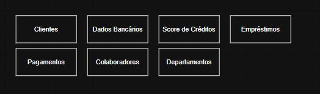
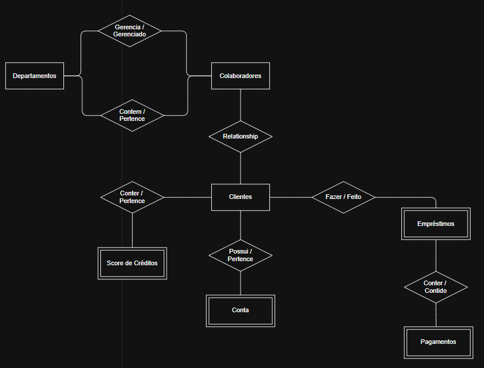

# ===   Modelagem de dados: identificando entidades, atributos, relacionamentos   === <!-- omit in toc -->

# INDICE <!-- omit in toc -->
- [Aula XX: TituloAula](#aula-xx-tituloaula)
  - [Capitulo](#capitulo)

# Conhecendo o projeto

## PROJETO A SER DESENVOLVIDO
Utilizaremos a modelagem de dados
- A modelagem de dados se constitue de diversas etapas que serão utilizadas para identificar os dados que queremos armazenar e padronizar através do desenho de fluxogramas.

## ALINHAMENTO DO TIME
Um dos pontos é o uso do mesmo material referencial. É essencial utilizar os mesmos conceitos para poder utilizá-los na criação de modelos conceituais e lógicos nesse fluxo de modelagem de dados.

### Problemas identificados no material de consumo
- Repetição de informação
  - Os dados de um mesmo cliente é replicado em varias linhas, ou seja, se precisar atualizar o cadastro deste cliente, precisará atualizar em todas a linhas ao qual ele aparece
- Informações estão todas juntas
  - Informações de clientes entra em score de crédito, que entra em tipo de conta de por aí vai, tudo em uma mesma linha
- Campos de mesmo nome
  - Temos dois campos chamado "Status". Vendo os valores dos dados, observamos que um é referente ao pagamento e outro é referente ao empréstimo, mas, indo apenas pelo titulo, gera-se confusão.

### O que podemos fazer
- Criar padronização de dados
- Separação e organização de dados
  - O que é cliente
  - O que é score
  - Informações bancárias e etc

## IMPOTANCIA DO ALINHAMENTO ENTRE TIMES

Desenvolver um projeto de banco de dados utilizando modelagem de dados é uma tarefa complexa que requer uma compreensão clara dos requisitos do sistema, dos processos de negócio e das necessidades dos usuários finais. O alinhamento de toda a equipe durante este processo é crucial, pois cada membro pode ter perspectivas únicas e contribuições essenciais para o sucesso do projeto. Aqui estão os principais motivos pelos quais é importante manter todos os membros do time alinhados ao desenvolver um projeto de banco de dados:

1 - Compreensão compartilhada dos requisitos

Um projeto de banco de dados bem-sucedido começa com um entendimento claro dos requisitos do negócio. O alinhamento entre os membros da equipe garante que todos entendam os objetivos do projeto, os dados que precisam ser capturados e como esses dados serão usados. Isso ajuda a evitar mal-entendidos e a garantir que o banco de dados atenda às necessidades do negócio de forma eficaz.

2 - Consistência no design

Quando todos na equipe estão alinhados, o design do banco de dados tende a ser mais consistente. Isso inclui a nomenclatura padronizada de tabelas e campos, a aplicação consistente de normas de normalização e a implementação uniforme de regras de negócio. A consistência facilita a manutenção, o desenvolvimento e a escalabilidade futura do banco de dados.

3 - Eficiência na implementação

O alinhamento da equipe reduz a duplicação de esforços e aumenta a eficiência. Com todos os membros da equipe trabalhando com o mesmo conjunto de expectativas e diretrizes, menos tempo é desperdiçado corrigindo erros ou redefinindo aspectos do projeto. Isso não apenas acelera o desenvolvimento, mas também ajuda a manter o projeto dentro do cronograma e do orçamento.

4 - Decisões mais informadas

Em um ambiente colaborativo, as decisões sobre o design e a implementação do banco de dados são geralmente mais informadas e bem pensadas. A diversidade de conhecimentos e experiências na equipe pode levar a soluções mais inovadoras e eficazes, reduzindo a probabilidade de problemas futuros.

5 - Facilidade de manutenção

Um banco de dados que é desenvolvido com a contribuição de toda a equipe tende a ser mais fácil de manter. Isso ocorre porque as decisões tomadas durante a fase de design são mais prováveis de considerar todos os aspectos do uso do banco de dados, incluindo a manutenção rotineira, a atualização de dados e a escalabilidade.

6 - Melhor adoção pelo usuário final

Quando o desenvolvimento do banco de dados é alinhado com as necessidades dos usuários finais (que podem ser representadas pela equipe), a adoção pelo usuário tende a ser mais alta. Um sistema que atende bem às necessidades dos usuários finais é mais provável de ser aceito e utilizado efetivamente.

7 - Redução de erros e riscos

Alinhamento e comunicação eficazes ajudam a identificar e resolver problemas potenciais mais cedo no processo de desenvolvimento. Isso minimiza o risco de erros significativos que poderiam ser caros e demorados para corrigir após o banco de dados estar em produção.

Manter todos os membros da equipe alinhados durante o desenvolvimento de um projeto de banco de dados é essencial para garantir que o resultado final seja robusto, eficiente e eficaz. A colaboração e o compromisso com objetivos comuns permitem não apenas um desenvolvimento mais suave, mas também um produto final que realmente suporta as operações e estratégias de negócio da organização.

## MODELO CONCEITUAL

### Conceito do Minimundo
> O minimundo é uma porção do mundo real, ou seja, uma parte do nosso todo.

Suponha que vamos construir um projeto para uma empresa bancária, como um banco. Normalmente, em um banco físico, existem clientes, gerência e parte de atendimento. Mas, muitas vezes, também podemos ter uma lanchonete dentro de um banco. A lanchonete não é relevante para a modelagem.

Por isso, devemos construir um minimundo apenas com o que é importante para o nosso projeto.

Os dados para construção do minimundo vêm do levantamento de requisitos.

### Levantamento de requisitos
No levantamento de requisitos, iremos reunir pontos importantes que precisam estar presentes no projeto.

É um dos momentos mais importantes quando vamos desenvolver um projeto, porque é quando teremos o contato com a clientela para entender suas necessidades. Por exemplo, uma entrevista com gerência, stakeholders (pessoas interessadas no projeto), pessoas colaboradoras e pessoas que vão usar o sistema para entender exatamente quais as necessidades do dia a dia.

Por meio do levantamento de requisitos, vamos conhecer o todo do nosso projeto para continuar o desenvolvimento do minimundo.

### Modelo conceitual (Diagrama de Chen ou DER - Modelo de Entidade e Relacionamento)
Depois que fazemos o levantamento de requisitos, vamos para o primeiro modelo, que é justamente o modelo conceitual.

No modelo conceitual, vamos desenvolver o nosso primeiro diagrama. Também é a etapa onde conheceremos o projeto e as regras de negócio, ou seja, começaremos a descrever quais são os dados que queremos armazenar.

## MINIMUNDO, LEVANTAMENTO DE REQUISITOS E MODELO CONCEITUAL NO CONTEXTO DE UMA BIBLIOTECA

### Minimundo
O conceito de Minimundo refere-se a uma parte específica do mundo real que é relevante para o sistema que está sendo desenvolvido. Imagine que você está construindo um sistema para uma biblioteca; o minimundo incluiria coisas como livros, empréstimos, leitores e funcionários, mas não incluiria elementos irrelevantes como o café vendido na cafeteria ao lado. O minimundo ajuda a definir claramente o escopo do que será incluído no sistema de banco de dados.

### Levantamento de Requisitos
O Levantamento de Requisitos é o processo de coletar informações sobre o que os usuários precisam e esperam do sistema. No contexto da biblioteca, isso poderia envolver entender como os leitores gostariam de pesquisar livros, quais informações sobre os livros são importantes (como título, autor, gênero), e como os funcionários gerenciam os empréstimos. Esse processo é crucial porque define as funcionalidades que o sistema precisa suportar e influencia diretamente como o banco de dados será projetado.

### Modelo Conceitual (Diagrama de Chen ou DER - Modelo de Entidade e Relacionamento)
Após definir o minimundo e coletar os requisitos, o próximo passo é criar um Modelo Conceitual. Este modelo é uma representação visual de alta abstração de como os dados no sistema são organizados. Ele usa elementos como entidades (objetos do mundo real como 'Livro' ou 'Leitor'), atributos (propriedades das entidades como 'Título do Livro' ou 'Nome do Leitor') e relacionamentos (como 'empresta' entre 'Leitor' e 'Livro'). O modelo conceitual é geralmente criado usando um Diagrama Entidade-Relacionamento (DER), que ajuda a visualizar como os diferentes elementos estão interconectados.

### Conclusão
Esses três componentes — Minimundo, Levantamento de Requisitos e Modelo Conceitual — são fundamentais na modelagem de dados porque juntos eles garantem que o sistema de banco de dados será bem projetado, funcional e capaz de atender às necessidades dos usuários. Ao começar com uma compreensão clara do minimundo, passando por uma coleta meticulosa de requisitos, até a criação de um modelo conceitual eficaz, os desenvolvedores podem construir bases de dados robustas e eficientes que apoiam os processos e operações críticas de negócios.

# Criando entidades

## LEVANTAMENTO DE REQUISITOS

### Abstração
Após o levantamento de requisitos, é fundamental aplicar o conceito de abstração. Esse princípio consiste em identificar e isolar os elementos essenciais para o nosso projeto, ignorando detalhes irrelevantes.

Por exemplo, ao modelar os dados dos clientes, sabemos que podem ser pessoa física ou pessoa jurídica. No caso de uma pessoa física, diversas informações poderiam ser armazenadas, como nome, CPF e endereço. No entanto, características como cor do cabelo, hobbies ou cor dos olhos não são relevantes para a empresa FlexEmpresta.

Portanto, a abstração nos ajuda a focar apenas nos dados necessários para o projeto, garantindo um modelo mais eficiente e alinhado aos objetivos do sistema.

A **abstração** envolve tanto **isolar os elementos essenciais quanto identificar pontos em comum dentro de um contexto**.

Por exemplo, ao modelar um sistema para clientes, percebemos que tanto uma pessoa física quanto uma pessoa jurídica compartilham atributos comuns, como nome, telefone e endereço. Já os atributos específicos, como CPF (para pessoa física) e CNPJ (para pessoa jurídica), podem ser tratados separadamente.

Dessa forma, a abstração permite generalizar conceitos para facilitar a organização dos dados e evitar redundâncias, ajudando na criação de estruturas mais reutilizáveis e eficientes

## SOBRE MER E DER

Na modelagem de dados, dois conceitos fundamentais que frequentemente aparecem são o Modelo Entidade-Relacionamento (MER) e o Diagrama Entidade-Relacionamento (DER). Esses conceitos são vitais para planejar e visualizar como os dados serão organizados e interagirão em um sistema de banco de dados. Vamos explorá-los de forma simplificada.

**Modelo Entidade-Relacionamento (MER)**

O Modelo Entidade-Relacionamento (MER) é uma abordagem teórica usada para descrever e especificar a estrutura de dados de um sistema de banco de dados. O MER ajuda a identificar os dados que devem ser armazenados no banco de dados e a definir as relações entre esses grupos de dados. No MER, os dados são organizados em entidades, atributos e relacionamentos:

Entidades: São objetos ou conceitos do mundo real que possuem dados que precisam ser armazenados. Exemplos de entidades podem ser 'Cliente', 'Pedido', ou 'Produto'.
Atributos: São as propriedades ou características de uma entidade. Por exemplo, a entidade 'Cliente' pode ter atributos como 'Nome do Cliente', 'Endereço' e 'Telefone'.
Relacionamentos: Descrevem como as entidades estão conectadas entre si e interagem. Por exemplo, um relacionamento entre 'Cliente' e 'Pedido' pode ser descrito como um cliente que 'realiza' um pedido.

**Diagrama Entidade-Relacionamento (DER)**

O Diagrama Entidade-Relacionamento (DER) é a representação gráfica do MER. O DER utiliza um conjunto de símbolos gráficos como retângulos, losangos e linhas para representar entidades, relacionamentos e atributos, respectivamente. O objetivo do DER é fornecer uma visualização clara e compreensível da estrutura do banco de dados, facilitando a compreensão das relações entre os dados, mesmo para aqueles sem conhecimento técnico profundo.

Por exemplo, num DER:

- Retângulos representam as entidades.
- Losangos representam os relacionamentos.
- Oval representa os atributos.
- Linhas conectam entidades com seus atributos e relacionamentos.

**Importância do MER e do DER**

- Comunicação e Planejamento: MER e DER são ferramentas essenciais para comunicar a estrutura de dados proposta entre os desenvolvedores e stakeholders do projeto, incluindo analistas de sistemas, gerentes de projeto e clientes. Eles facilitam a discussão e o planejamento antes da implementação do banco de dados.
- Organização e Design: Ajudam na organização dos dados de forma lógica, garantindo que todas as informações necessárias sejam capturadas e corretamente interligadas.
- Prevenção de Erros: Usar MER e DER na fase de design pode ajudar a identificar e corrigir potenciais erros de modelagem, como redundâncias de dados ou relações mal definidas, antes que o banco de dados seja fisicamente implementado.

Em resumo, o Modelo Entidade-Relacionamento e o Diagrama Entidade-Relacionamento são fundamentais na modelagem de dados, ajudando a estruturar, planejar e visualizar a organização de dados em sistemas de banco de dados de maneira eficiente e eficaz.

## ENTIDADES
Agora identificaremos as entidades, onde elas poderão ser abstratas ou concretas.
- Abstrato: Aquilo que não existe fisicamente no mundo real.
- Concreto: O que existe fisicamente no mundo real.

Foi identificado, por exemplo, as Entidades Cliente e Dados Bancários, sendo Cliente uma Entidade Concreta e Dados Bancários uma Entidade Abstrata.

Foi identificado, também, o Score de Crédito como uma Entidade para o Banco de dados.

### Como identificar Entidade
Pelo que identifiquei, este exemplo utilizou como forma para identificar quais seriam as Entidades do banco de dados a interpretação do Levantamento de Requisitos, tendo a pergunta 3 (Quais informações devem ser Armazenadas) uma pergunta extremamente importante.
- Vemos no texto varias menções de caracteristicas de algo, isso é uma dica de Entidade e Atributos, já que Atributos são as características que definem uma Entidade.

Ou seja, quando se diz: Armazenamos os CPF, Nome e Email dos Clientes, podemos entender como: Para uma Entidade Cliente, teremos atributos CPF, Nome e Email

### Entidades identificadas (Esboço do MER)
- Cliente: Nome, CPF, Telefones, endereço, data de nascimento e email
- Dados Bancários: Tipo de conta, saldo, número da conta e data de abertura
- Score de Crédito: Justificativa, pontuação, data da consulta e fonte
- Empréstimos: Valor do empréstimo, status, tipo de empréstimo, data de inicio, nome do cliente e prazo
- Pagamentos: Data pagamento da parcela, valor pago, status da parcerla
- Colaboradores: CPF, telefone, salário, cargo e e-mail
- Deparatamentos: Numero do departamento, nome do departamento e gerente

### Construindo o DER
Inicia-se a construção do DER com a separação das Entidades

## ENTIDADE FORTES
- Entidade forte: existe por si só, sem dependência de outra entidade. Ou seja, ela não precisa de outra entidade ligada a ela para existir.
- Entidade fraca: É o inverso, ela só existe porque outra entidade também existe.

No nossocaso, Clientes, Colaboradores e Departamentos são Fortes, pois, elas não dependem de outras tabelas para existirem.

Já Score de Créditos, Conta, Empréstimo e Pagamento são entendidades fracas, pois, as 3 primeiras inerentemente dependem da tabela de Clientes (pois, não existirá Crédito, Conta ou Empréstimo sem Clientes) e só existe Pagamento com a existencia de Empréstimo.
- Ou seja, uma entidade fraca pode depender de outra entidade fraca.

## ENTIDADE FRACAS
Entidades fracas são representadas por retangulos duplos. 

# RELACIONAMENTO

## REPRESENTANDO RELACIONAMENTOS
Um ponto muito interessante é na representação da relação de Colaboradores com Departamentos.
- Como existe cargo de Colaborador que gerencia um Departamento, temos essa relação de gerenciamento.
- Porém, temos uma segunda relação, pois, um Departamento, no minimo, possui dois colaboradores.

Imagem do sistema geral

### Refletindo sobre entidades Fortes e Fracas no momento
1. **Entidade Forte**  
   - É uma entidade que **pode existir por conta própria**, ou seja, **não depende de outra entidade** para existir.  
   - No banco de dados, isso significa que ela **possui uma chave primária própria** e **não depende de uma chave estrangeira obrigatória**.  
   - Exemplo:  
     - No seu caso, **Departamento, Colaborador e Cliente** podem ser entidades fortes, pois fazem sentido existir independentemente.  

2. **Entidade Fraca**  
   - É uma entidade que **não pode existir sem estar associada a uma entidade forte**.  
   - Isso significa que **a sua chave primária depende da chave primária de outra entidade** (chave primária composta).  
   - No banco, isso geralmente se traduz em uma **chave estrangeira obrigatória**.  
   - Exemplo:  
     - Se tivéssemos uma entidade **Dependente** (filho de um colaborador), ela **só faria sentido existir se estiver associada a um Colaborador**.  
     - Assim, a tabela **Dependente** teria como chave primária uma composição entre um **ID próprio** e o **ID do Colaborador** ao qual pertence.  

### **Interpretação**  
O ponto principal não é aceitar ou não **null**, mas sim **se a entidade pode ou não existir sem outra**.  

- Se a entidade for **forte**, a FK pode ser **opcional** (pode aceitar `NULL`), pois ela pode existir sozinha.  
- Se a entidade for **fraca**, a FK **não pode ser nula**, pois ela precisa obrigatoriamente de uma entidade forte para existir.  

## SOBRE GRAU DE RELACIONAMENTO

1. Relacionamento Unário (Auto-relacionamento)
Um relacionamento unário, também conhecido como auto-relacionamento, ocorre quando uma entidade está relacionada a si mesma. Esse tipo de relacionamento é usado para expressar uma relação onde instâncias da mesma entidade estão conectadas de alguma forma.

Exemplo:
- Supervisão em uma Empresa: Um colaborador(a) pode ser supervisor de outro colaborador(a). Aqui, a entidade colaborador tem um relacionamento consigo mesma, onde cada instância (colaborador) pode ser 'supervisor de' outra instância (outro colaborador).

2. Relacionamento Binário
Um relacionamento binário envolve duas entidades diferentes. É o tipo de relacionamento mais comum na modelagem de dados e pode expressar uma variedade de interações entre as entidades.

Exemplos:
- Cliente e Pedido: Um relacionamento binário típico pode ser entre Cliente e Pedido, onde um cliente realiza um pedido.

3. Relacionamento Ternário
Um relacionamento ternário envolve três entidades diferentes. Esses relacionamentos são usados quando uma interação não pode ser adequadamente representada por vários relacionamentos binários.

Exemplo:
- Professores, Estudantes e Cursos: Um relacionamento ternário pode existir entre Professor, Estudante, e Curso, onde um professor pode ensinar a um estudante em um curso específico. Esse tipo de relacionamento indica que a interação envolve todas as três entidades simultaneamente e não pode ser simplificada em relacionamentos menores sem perder informações críticas.

Importância dos Graus de Relacionamento
- Clareza no Design: Compreender o grau de relacionamento ajuda a definir claramente como as entidades interagem dentro do sistema, permitindo um design mais claro e lógico do banco de dados.
- Precisão na Modelagem: Usar o grau correto de relacionamento assegura que o modelo conceitual capture todas as nuances das relações entre as entidades, o que é crucial para a integridade dos dados e a funcionalidade do sistema.
- Eficiência na Implementação: Identificar o grau correto de relacionamento pode simplificar a implementação do banco de dados e otimizar o desempenho, pois o sistema pode ser mais diretamente alinhado com as necessidades reais de interação de dados.

## ENTENDENDO SOBRE CARDINALIDADE
A cardinalidade será utilizada para definir quantas vezes as entidades vão se relacionar.

### Cardinalidade mínima
A cardinalidade mínima define a participação da entidade no relacionamento, indicando se é obrigatório que um colaborador esteja associado a um cliente, por exemplo.

### Cardinalidade máxima
Já a cardinalidade máxima determina a quantidade de ocorrências que podem realmente acontecer.

Por exemplo, um colaborador pode estar associado a 5 clientes, o que representa a cardinalidade máxima, ou seja, o número máximo de ocorrências.

### Sentido de leitura
O sentido de leitura da cardinalidade é sempre oposto à entidade, ou seja, a cardinalidade de uma entidade está ligada proxima à entidade a qual ela se liga. Algo como 
- [ ENTIDADE A ] (cardinalidade da Entidade B) ---- < RELACIONAMENTO > ---- (Cardinalidade da Entidade A) [ ENTIDADE B ]

Ou seja, se for:
- [ A ] 1:n --- Relacionamento --- 1:1 [ B ]
- Interpreta-se: Entidade B possui 1, e somente 1, relaçaão com Entidade A e Entidade A possui no minimo 1 e no maximo N (varias) relações com entidade B.
- [ FUNCIONARIO ] 1:N --- Trabalha/Contem --- 1:1 [ DEPARTAMENTO ]
- Interpreta-se: Um DEPARTAMENTO pode conter no minimo 1 e no maximo N FUNCIONARIOS
- No outro sentido: Um FUNCIONARIO pode trabalhar em no minimo 1 e somente 1 DEPARTAMENTO

### Ordem de leitura do relacionamento
A ordem de leitura de um relacionamento **sempre será**: ENTIDADE + RELACIONAMENTO + CARDINALIDADE + ENTIDADE.
- DEPARTAMENTO + pode CONTER + 1:N + FUNCIONARIOS