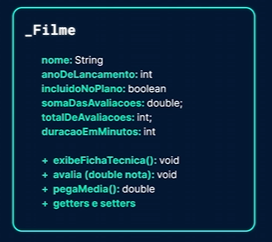
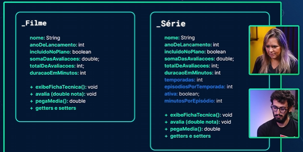
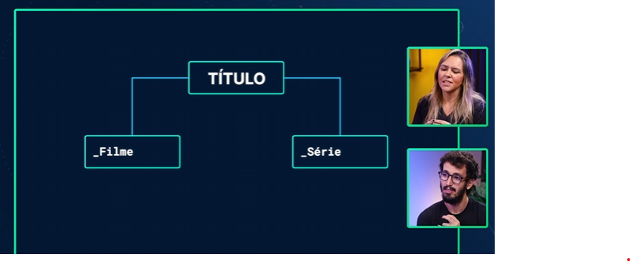
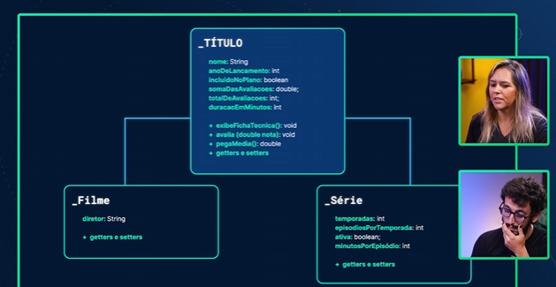

# <span style="color: #87BBA2">===   APLICANDO A ORIENTAÇÃO A OBJETOS   ===</span> <!-- omit in toc -->

# <span style="color: #87BBA2">INDICE</span> <!-- omit in toc -->
- [Aula XX: TituloAula](#aula-xx-tituloaula)
  - [Capitulo](#capitulo)


# <span style="color: #87BBA2">MODELANDO O SCREENMATCH</span>

## UM MODELO PARA REPRESENTAR FILMES
No curso anterior, estávamos falando sobre regras e condicionais. Na hora de montar o Screen Match, a nossa plataforma de streaming, começamos a implementar algumas regras - por exemplo, emitindo uma mensagem se um filme foi lançado a partir de determinada data, ou se está ou não incluído no plano, tudo isso com condicionais.

Mas isso não está muito adequado. E se precisarmos usar isso em outro momento? Teríamos que copiar e colar esse código? É um tipo de programação meio estruturada ou procedural, o que não é muito adequado para modificação. Ao espalhar regras pelo código, tornamos mais difícil fazer manutenção da aplicação ou mesmo entender o que nossa aplicação faz.

### Regras de negócio
As regras sobre como funciona a nossa empresa, por exemplo, no nosso caso:
- Se for assinante recente, tem que pagar
- Caso seja **plus**, não precisa

Pode ser que amanhã mude a regra, as regras de negócio são vivas e passiveis de mudança aolongo do tempo, como foi com a Netflix e a HBO Max, por exemplo:
- Se vai ter ad ou não
- Se vai aceitar família ou não

### Coding smell
Aí que mora o grande problema de se copiar código ao longo do sistema:
- Caso a regra de negócio mude, precisará mudar em todos os lugares aos quais a regra copiada foi realizada

Por exemplo: Caso formos iniciar uma cobrança para os assinantes, mas os assinantes antes de 2011 não serão cobrados, para realizar esse ajuste à nova regra de negócio, precisaremos utilizar o **CTRL + F (O Ctrl + C e Ctrl + V também)** e esse atalho é um bom indicativo que o código não está muito bem escrito em termos de reaproveitamento de código, e a refatoração trará muito mais risco de bug.

Isso mostra que este código está **muito espalhado**, ou seja, ele **não está em uma única capsula, não está ENCAPSULADO**.

### Encapsulamento de objetos
É quando deixamos uma regra de negócio dentro de um único ponto, onde, caso precisarmos realizar alguma manutenção ou refatoração, sabemos que só há um ponto onde ela pode estar.

Isso trata-se de **boas praticas de POO**. Algumas boas praticas a serem seguidas são:
- Clean Code
- DDD (Domain-driven Design)
- Design Patterns
- SOLID

### Soluções de POO
E é por isso que o vem o POO, para solucionar o problema de código espalhado e observar as coisas como se fossem objetos mesmo, centralizado em um ponto.

Objetos tendo caracteristicas, nomes, comportamentos.

### Construindo o sistema focado em POO
Não iniciamos, então, pela construção da classe de entrada (no caso, sendo a `Main`). Já que nosso projeto continuará com a tematica de filmes, a nossa primeira criação será a classe `Filme`.

### Classe
Criamos uma classe chamada `Filme`, e pensando no **Tob Gun** por exemplo, o que a classe seria?
- A Classe especifica o conteúdo de um Objeto

Então, nossa Classe especificará o que um filme tem, qual é a abstração ali.
- Abstração: Caracteristicas em comum de todos os filmes, o que todos os filmes tem.
- Como exemplo: Todo filme tem um nome, e caracteristicas de um objeto nós chamamos de atributo. Logo, todo filme tem um atributo nome.

A sintaxe da declaração de uma classe é diferente do que foi visto até então, por exemplo, a classe de entrada tem um método (comportamento) chamado `main`, com as definições de `public static void`. Em uma classe, estamos iniciando com declarações como `String nome`, isso, na realidade, são atributos.
- Atributos não estáticos são caracteristicas de um objeto, ou seja, nesse caso estamos dizendo que todo Filme terá um nome.


Ou seja, as especificações de uma classe para seus objetos geralmente é exemplificado como a planta de uma casa: A planta da casa dirá o que a casas no geral terão, como quarto, banheiro, cozinha, mas a construção da casa (seu objeto) será distinto. Qual a metragem do banheiro, qual a metragem da cozinha, quantas paredes o quarto terá e em que cor ele será pintado, isso cabe na especificação do objeto.

#### Definindo atributos
```java
public class Filme {
    String nome;
    int anoLancamento;
    boolean incluidoNoPlano;
    double avaliacao;
    int totalDeAvaliacoes;
    int duracaoEmMinutos;
}
```

Estes atributos são os que a instrutora sente que são importantes para filmes, mas, é natural levantarmos isso através de levantamentos de requisitos, é normal, também, revisitar acrescentando ou tirando atribuos.
- Muitas vezes os questionamentos sobre atributos são nada óbvios como "Será uqe a quantidade de avaliações é relavante para o meu sistema ou não?"

Os atributos podem ser infinitos, por isso é importante realizar uma boa abstração e sempre ter em mente **o que o sistema precisa.** Se formos elecar **todos os atributos de um filme** e não apenas os que achamos importantes para o sistema, teremos atributos infinitos. A importância reside nas informaçõas que são necessárias **para o sistema**.

Com isso, nosso modelo de classe está pronto, mas, não é possivel utilizá-lo ainda.

## ATRIBUINDO VALORES AO NOSSO FILME.

### Ponto de entrada
As vezes o projeto pode vir como ponto de entrada o `Main.java`, mas, criaremos nosso ponto de entrada nomeando-o como `Principal.java`.

Ponto de entrada é onde por onde o código iniciará sua execução.

### Declarando 
A ideia é de fato usarmos a nossa classe Filme. Anteriormente, quando queríamos criar uma variável, bastava informar o tipo - por exemplo, int - seguido do nome da variável e o valor que ela receberia.
```java
int valor = 555;
```

Porém, ao criar uma classe Filme, nós também criamos um tipo propriamente nosso. Passaremos esse tipo como qualquer outro, seguido do nome da variável, nesse caso meuFilme.
```java
Filme meuFilme = new Filme();
```

### Tipo referencia
Ao trabalharmos com instanciamento de uma classe, quando a atribuimos em uma variável, ela é um **tipo referencia**, ao contrário dos tipos primitivos que são **atraibuição de valores**.

No caso, ele atribui o endereço da memória onde está alocado o objeto criado.
> Em algum lugar da memória da máquina foi criado um espaço reservado para um objeto chamado Filme
>
> Isto é, um objeto chamado Filme que está na memória e possui um "espaço" para o nome, para o ano de lançamento e cada um daqueles itens que chamamos de atributos

Agora, a variável `meuFilme` carrega o endereço do objeto criado, e, por padrão, quando printamos `meuFilme` será retornado o endereço de onde está armazenado o objeto criado.

### Sintaxe de criar uma instancia
```java
Filme meuFilme = new Filme();
```
- new Filme() = Instanciamento, aqui que criamos o espaço na memória para o objeto
- Filme meuFilme = variável, com o tipo `Filme` que está atribuindo a nova instancia criada, ou seja, fará referencia ao endereço e se comportará como `Filme`, uma vez que a tipamos como `Filme`.
  - Estamos dizendo que `meuFilme`, que tem endereço de uma instancia de Filme, é do tipo `Filme`, ou seja, conseguiremos acessar seus atributos e métodos.

Parte direita está criando mesmo o obejto, parte da esquerda está guardando-a no script.

### Sintaxe (notação) por ponto
Sintaxe muito comum que indica acessar algo de alguém, já observamos este comportamento em `System.out`, o objeto de `Scanner` com o método `.nextLine()`.

### Printando seu nome
Quando printamos o objeto, teremos seu endereço:
```java
System.out.println(meuFilme); // Retorno: Filme@5f184fc6
```

Agora, quando imprimimos uma atributo, como o nome do filme, teremos, respectivamente, o seu nome:

```java
System.out.println(meuFilme.nome); // Retorno: "O Poderoso Chefão";
```

### Sobre classe e objetos
Lembrando que Classe é um arquétipo para os objetos que representará o que todo objeto tem. Por exemplo, não é possivel fazermos isso:
```java
Filme.nome = "Um nome de filme"
```
Isso não é possivel pois a classe `Filme` foi construida sem atributos estáticos, ou seja, a classe em si, como arquétipo, não possui caracteristicas. Mas, a classe descreve atributos não-estaticos, ou seja, atributos que **todas as instancias de objetos terão**.
> Um objeto, é uma instância de uma classe, sendo por meio dele que conseguimos representar informações na aplicação, pois a classe serve apenas para padronizar os objetos, mas não para representar um objeto em si. Para criar um objeto em Java, precisamos utilizar a palavra reservada new seguida do nome da classe e de parênteses vazios. 

```java
// Ação não possível
Filme.nome = "Um nome de filme";

// Ação possivel
Filme filme = new Filme();
filme.nome = "Um nome de filme";
```
Pois, a classe não possui atributo nome, mas a classe **define que TODOS OS OBJETOS terão o atributo nome**. E, atenção a diferençar um `Filme` de um `filme`. Isso já é convenção, onde PascalCase é utilizado apra Classes e camelCase para variáveis, **como objetos**.

## DEFININDO AÇÕES PARA O FILME
A gente já viu o que um filme tem. Agora podemos falar o que um filme faz, o que ele tem de comportamentos ou método. Por exemplo, não precisamos imprimir o nome ou o anoDeLancamento "de fora", podemos pedir que o próprio Filme exiba sua ficha técnica.


### Convenção de nomes de métodos
Há duas grandes vertentes em termos de nomear métodos, há quem nomeie no Imperativo, há quem nomeie no Infitivido
- exibeFichaTecnica (imperativo)
- exibirFichaTecnica (infinitivo)

O mais utilizado, por conveção, é o **imperativo** e é o que utilizaremos.

### exibeFichaTecnica
Agora, passamos o print que estavamos fazendo na main para a responsabilidade da classe:
```java
public class Filme {
    String nome;
    int anoLancamento;
    boolean incluidoNoPlano;
    double avaliacao;
    int totalDeAvaliacoes;
    int duracaoEmMinutos;

    public void exibeFichaTecnica() {
        System.out.println("Nome do filme" + nome);
        System.out.println("Ano do lançamento" + anoLancamento);
    }
}
```
Veja que não estamos indicando `nome` e não `meuFilme.nome`, já que `meuFilme` não existe nesse contexto, e tambem não estamos utilizando `Filme.nome` pois não trata-se de atributo estático.

Quando vamos referenciar um atributo ou método de objeto, geralmente a referenciamos com `this.atributo/método`, como `this.nome`, mas, acredito que agora não seja obrigatório.

A sintaxe de um método é:
- `<visualizacao> <retorno> <nome_do_metodo>(<parametros>) { <bloco_do_código> }`
- Ou seja, `public void exibeFichaTecnica() {}` quer dizer que
  - ele é visivel a todos que o invocar (public),
  - ele retorna nada (pois é void),
  - seu nome é exibeFichaTecnica
  - Ele tem nenhum paremetro: ()
  - Estes são suas instruções {}

**Observação sobre parametros**
- Tanto na declaração quanto na invocação de um método, sempre necessitará de paranteses, mesmo quando vazios.
```java
public class Principal {
    public static void main(String[] args) {
        Filme meuFilme = new Filme();
        meuFilme.nome = "O Poderoso Chefão";
        meuFilme.anoLancamento = 1970;
        meuFilme.duracaoEmMinutos = 180;

        meuFilme.exibeFichaTecnica();
    }
}
```

### avalia(double nota)
```java
public class Filme {
    String nome;
    int anoLancamento;
    boolean incluidoNoPlano;
    double avaliacao;
    int totalDeAvaliacoes;
    int duracaoEmMinutos;

    public void exibeFichaTecnica() {
        System.out.println("Nome do filme" + nome);
        System.out.println("Ano do lançamento" + anoLancamento);
    }

    public void avalia(double nota) {
        this.avaliacao += nota;
        this.totalDeAvaliacoes++;
    }
}
```

Mas, percebemos que faz mais sentido ser chamado de `somaDasAvaliacoes` ao invés de `avaliacao`, então, utilizamos o atalho `SHIFT + F6` para renomear (similar ao F2 no VS Code)

```java
public class Filme {
    String nome;
    int anoLancamento;
    boolean incluidoNoPlano;
    double somaDasAvaliacoes;
    int totalDeAvaliacoes;
    int duracaoEmMinutos;

    public void exibeFichaTecnica() {
        System.out.println("Nome do filme" + nome);
        System.out.println("Ano do lançamento" + anoLancamento);
    }

    public void avalia(double nota) {
        this.somaDasAvaliacoes += nota;
        this.totalDeAvaliacoes++;
    }
}
```

### Refact
Outra alternativa de arrumar o nome dos atributos e variáveis e, automaticamente, aplicar em quem esteja a utilizando, é o `BOTÃO DIREITO+ SEÇÃO REFACT`, lá existem varias opções de refatoração incluindo a de renomear.

### Auto Indent Line
No menu `Code`, podemos utilizar a ferramente `Auto-Indent line` para realizar a indentação automatica, caso precisarmos. Ou o atalho `CTRL + ALT + I`

### Curiosidade: Java como uma das primeiras grandes linguagens
O Java é uma das primeiras grandes linguagens em que os sistemas começaram a envolver grandes grupos de 5, 10 ou 20 pessoas. Até então, antes da década de 90, a maioria absoluta dos sistemas era criada por uma ou duas pessoas desenvolvedoras, e equipes de desenvolvimento eram muito raras.

Quando as equipes começaram a crescer, nasceu a necessidade de escrever código mais legível, com variáveis mais óbvias e de maneira mais elegante, facilitando o trabalho de grandes times em uma mesma base de código. Está aí a importância de boas práticas, nomenclatura e orientação a objetos, e o Java foi a principal linguagem na época a receber esse cuidado. Posteriormente, o .NET e outras linguagens vêm trazer esse propósito de facilitar a complexidade.

# <span style="color: #87BBA2">CONTROLANDO O ACESSO E A ESCRITA NOS DADOS DA APLICAÇÃO</span>

## CONFIGURANDO O QUE PODE SER VISTO E MODIFICADO
Imagina que sou muito fã do "O Poderoso Chefão". Do jeito que está nossa aplicação, é possivel alterar o valor da média diretamente:
```java
meuFilme.somaDasAvaliacoes = 10;
meuFilme.totalDeAvaliacoes = 1;
// A média passará a ser 10
```

### Trocando mensagens entre objetos
Para se comunicar com um objeto, é mais interessante (e seguro) utilizar **métodos**, ao invés de atribuir diretamente no coração do objeto.

> Trocar mensagens com objetos é um termo academico para realizar essas manipulações.

Ou seja, não é uma boa pratica deixar possivel alteração de dados diretamente no coração de um objeto, e sim, utilizar métodos pois assim dá maior controle ao desenvolvedor de como, quando e de que jeito o dado será acessado ou atribuido.

Uma outra analogia é:
- Uma pessoa pedindo dinheiro empresatado para outra, ela não irá pegar diretamente da carteira da outra pessoa mas sim irá pedir emprestado.

### Encapsulamento
Não podemos deixar que acessem os atributos do objetos e alterem a vontande, de forma não prevista pelo desenvolvedor. Encapsulamento é a proteção dos objetos e estruturar como seus dados poderão (e se poderão) ser manipulados.

Outro ponto é: As classes e o código necessitar ser auto explicativo e protegido. Não é legal deixar algo do objeto exposto que não é para ser mexido e pode ser quebrado. Um bom código já protege as partes sensíveis e deixa exposto o que é para estar exposto, deixando tudo que não é exposto não visível. Ou seja, é o principio da **não visibilidade**.

### Modificadores de acesso/visibilidade
Temos palavras chaves para definir como elementos de uma Classe/Objeto podem ser acessados, como `public`, `private` e `protected`.
- `public`: Todos que importaram o módulo poderão acessar estes elementos;
- `private`: Somente a própria Classe ou o Objeto pode utilizar deste elementos, este elementos são manipulados pelo autor e somente pelo autor deste elemento.
- `protected`: Somente a própria Classe e quem a implementa pode utilizar, ou seja, somente o autor e suas filhas podem acessar estes elementos.

### Refatorando
Agora, adicionando `private` no total de notas e na soma de notas, nosso código principal começará a apresentar erro de compilação pois ele não poderá mais acessar os elementos que antes acessava. Para isso, refletiremos os elementos que de fato pode ser interessante para quem consumirá deste objeto e criaremos métodos para buscar este dado.
- Por exemplo, não tem o porque entregarmos a `somaDeNotas`, o que mais irão se interessar é na `mediaDeNotas` e no `totalDeNotas`.

## VISUALIZANDO CARACTERISTICAS PRIVADAS
Da mesma forma que criamos um método para pegar média, faremos um método para pegar atributos privados, também conhecido como **Método Acessor**. A convenção do método acessor é ter em seu nome o termo **Get** e para atribuir valor, ter o termo **Set**, também são conhecido como métodos **getters e setters**.

```java
public int getTotalDeAvaliacoes() {
    return totalDeAvaliacoes;
}
```
- Ao iniciar o método com `get`, o IntelliJ já sugere alguns atributos para realizar o get.

### Utilidade do getter
Por que ter um método que simplesmente devolve o valor de um atributo? Não seria melhor deixar como estava antes de deixar o atributo privado?

Ao longo da formação e da prática diária veremos que esse tipo de lógica começa a esconder o funcionamento interno de uma classe, deixando de expor a nossa aplicação.

O nosso total de avaliações poderia estar em um banco de dados ou ter comunicação com um site parceiro. Além disso, pode acontecer de mudarmos a regra de negócios. Nesse caso, seria necessário procurar (como utilizando CTRL + F) e alterar cada ponto onde o total de avaliações estava sendo acessado.

Conforme vamos desenvolvendo e ganhando experiência em linguagens orientadas a objetos, vamos percebendo cada vez mais vantagens em encapsular a lógica da nossa aplicação.

```java
// Filme.java
public class Filme {
    String nome;
    int anoLancamento;
    boolean incluidoNoPlano;
    private double somaDasAvaliacoes;
    private int totalDeAvaliacoes;
    int duracaoEmMinutos;

    public int getTotalDeAvaliacoes() {
        return totalDeAvaliacoes;
    }

    public void exibeFichaTecnica() {
        System.out.println("Nome do filme" + nome);
        System.out.println("Ano do lançamento" + anoLancamento);
    }

    public void avalia(double nota) {
        this.somaDasAvaliacoes += nota;
        this.totalDeAvaliacoes++;
    }

    public double pegaMedia() {
        return somaDasAvaliacoes / totalDeAvaliacoes;
    }
}

// Principal.java
public class Principal {
    public static void main(String[] args) {
        Filme meuFilme = new Filme();
        meuFilme.nome = "O Poderoso Chefão";
        meuFilme.anoLancamento = 1970;
        meuFilme.duracaoEmMinutos = 180;

        meuFilme.exibeFichaTecnica();
        meuFilme.avalia(8);
        meuFilme.avalia(5);
        meuFilme.avalia(10);
        System.out.println("Total de avaliações: " + meuFilme.getTotalDeAvaliacoes());
        System.out.println(meuFilme.pegaMedia());
    }
}
```

## PARA SABER MAIS: MODIFICADORES DE ACESSO
Em Java, os modificadores de acesso são palavras-chave que definem o nível de visibilidade de classes, atributos e métodos, sendo que eles ajudam a garantir a segurança e encapsulamento do código.

Existem quatro tipos de modificadores de acesso em Java: public, protected, private e default (também conhecido como package-private).

### Public
O modificador de acesso public é o mais permissivo de todos. Uma classe, atributo ou método declarado como public pode ser acessado por qualquer classe em qualquer pacote. Ou seja, ele possui visibilidade pública e pode ser utilizado livremente. Por exemplo:
```java
public class Conta {

  public double saldo;

  public void sacar(double valor) {
    // lógica de saque...
  }
}
```
```java
public class Principal {
    
    public static void main(String[] args) {
        Conta c1 = new Conta();
        c1.saldo = 300;
        c1.sacar(100);
    }

}
```

### Default (Package-private)
O modificador de acesso default é aquele que não especifica nenhum modificador de acesso. Quando nenhum modificador de acesso é especificado, a classe, atributo ou método pode ser acessado apenas pelas classes que estão no mesmo pacote. Por exemplo:
```java
package br.com.alura.conta;

public class Conta {

  default double saldo;

  default void sacar(double valor) {
    // lógica de saque...
  }
}
```
```java
package br.com.alura.testes;

public class Principal {
    
    public static void main(String[] args) {
        Conta c1 = new Conta();
        c1.saldo = 300;
        c1.sacar(100);
    }

}
```

No código anterior, a classe Conta está em um pacote e a classe Principal em outro pacote distinto. A classe Conta pode ser instanciada dentro da classe Principal, pois ela possui o modificador de acesso public, entretanto, o atributo saldo e o método sacar tem o modificador default e, portanto, não podem ser acessados de dentro da classe Principal, o que vai causar um erro de compilação no código anterior.

### Private
O modificador de acesso private é o mais restritivo de todos. Uma classe, atributo ou método declarado como private só pode ser acessado dentro da própria classe. Ou seja, ele possui visibilidade restrita e não pode ser utilizado por outras classes. Por exemplo:
```java
public class Conta {

  private double saldo;

  private void sacar(double valor) {
    // lógica de saque...
  }
}
```
```java
public class Principal {
    
    public static void main(String[] args) {
        Conta c1 = new Conta();
        c1.saldo = 300;
        c1.sacar(100);
    }
}
```
No código anterior, vai ocorrer erro de compilação na classe Principal, pois o atributo saldo e o método sacar foram declarados como private, não podendo com isso serem acessados de fora da própria classe Conta.

Existe ainda um último modificador de acesso, que é o protected, mas falaremos dele mais adiante no curso, após ser apresentado o conceito de herança de classes.

## ORGANIZANDO O CÓDIGO
Explica-se sobre a alta presença de classes já nativamente na linguagem, por exemplo, `String`, que possui letra maiuscula não por coincidencia mas sim porque ela também é uma classe e não um primitivo.

Para saber mais sobre a linguagem Java e sua versão especifica, podemos consultar a documentação no **Java Doc**, que é algo similar ao **MDN** para o JavaScript. É a documentação do Java.

[Link para o Java Doc 19](https://docs.oracle.com/en/java/javase/19/docs/api/index.html)

### String no Java Doc
Aqui podemos ver os métodos da classe `String` (como `concatString`, `contains`, `split`, `format`, `toUppderCase`, `toLowerCase` e afins) e seus atributos (em ingles é `fields`).

### Dicas de desenvolvimento
Quando sentir a necessidade de uma mentalidade, é sempre interessante verificar na documentação da linguagem para verificar se essa soliução já foi implementada, pois, é muito comum que eça já exista.

Isso evita que nós **reinventemos a roda**.

Por exemplo, o que precisarmos trabalhar e operar com palavras, 99% das soluções já existem na classe `String` e o que não tiver nós vamos pesquisar biblioteca para isso.

### Notação por ponto
Ao utilizarmos a notação por ponto, o IntelliJ trará os métodos que essa classe possui, ordenando das mais usadas para as menos usadas.

### Organização
Como teremos diversas classes, não deixaremos tudo solto no `src`. Vamos separá-los em pacotes.
- **Pacote:** organiza código pela funcionalidade de suas classes

### Package e import
O **Import** é a forma que uma classe se referencia a outra quando estão em pacotes diferentes.
- Para importar uma classe, podemos utilizar as sugestões da IDE, ela consegue identificar se essa classe é existente.

Já a declaração de pacote (**Package**) indica a qual pacote a classe faz parte, sendo o endereço ao qual ele será importado.

### Visibilidade
Com a refatoração, a classe **Principal** passou a não enxergar os atributos de **Filme**. Isso se dá pelo fato de não termos declarado o **modificador de visibilidade**, onde, por padrão no Java é designado como **package-private**, ou seja, este atributo será visto por todas as classes do mesmo pacote. Ao mover **Filme** de pacote, os atributos passaram a não serem mais visiveis.

Importante: Apesar da classe estar como **public**, isso não é em cascata. Os atributos e métodos também precisam ter definição de modificador de visibilidade ou serão considerados como default (package-private).

### Sobre modificador de visibilidade em atributos
O modificador de visibilidade em atributos de classes instanciáveis **não devem ser publicos**. Veremos a frente que utilizaremos métodos de controle de acesso aos atributos, mantendo o atributo em si como **private**. Isso se chama encapsulamento.

Deixando um atributo publico, acrescentaremos uma vulnerabilidade e cairíamos no mesmo problema da avaliação, em que alguém poderia trocar o valor sem que desejássemos.

### JavaDoc
A documentação do Java, conhecida como JavaDoc, é uma referência completa para todas as classes, interfaces e métodos disponíveis na plataforma Java. Ela está disponível online e pode ser acessada neste [site da Oracle](https://docs.oracle.com/en/java/javase/17/docs/api/index.html).

Recomendo fortemente pela clareza e organização que essa documentação possui.

## PADRÃO DE NOMES DE PACOTES
Em Java, pacotes são usados para agrupar classes que estão relacionadas a alguma funcionalidade. Eles ajudam a organizar o código, facilitando o seu gerenciamento e evitando que centenas de classes distintas fiquem todas misturadas num único diretório.

A organização de classes dentro de um pacote também pode ser feita usando subpacotes ou colocando as classes diretamente dentro do pacote, dependendo da complexidade do projeto. Além disso, é importante seguir a convenção de nomeação de pacotes para garantir que os pacotes sejam facilmente identificados.

Em relação à nomenclatura de pacotes, outro aspecto importante é o uso do nome de domínio reverso da empresa ou organização como parte do nome do pacote. Por exemplo, se o nome de domínio da empresa fosse "minhaempresa.com.br" e o projeto Java fosse chamado de "meuprojeto", o nome do pacote de domínio reverso seria br.com.minhaempresa.meuprojeto, sendo que dentro desse pacote principal podemos ter diversos subpacotes, para melhor organização do código do projeto.

Isso ajuda a garantir que o nome do pacote seja exclusivo e evita conflitos de nome com outros pacotes em outros projetos. Além disso, o uso do nome de domínio reverso como parte do nome do pacote também ajuda a identificar facilmente o proprietário do projeto Java.

## CRIANDO MÉTODOS QUE MODIFICAM VALORES
Agora, deixamos todos os atributos com o modificador de visibilidade como `private`, que é o que comumente veremos em demais projetos.

Apesar de termos feito isso, ainda temos problemas em nossa classe `Principal`, pois, este tentava acessar diretamente aos atributos. Apesar de não queremos que acesse diretamente os atributos, queremos que o acesse de alguma forma.

### Getters e Setters
Para isso, criaremos o que chamamos de **Getter e Setter**, sendo **Getter** a forma de buscarmos o valor dos atributos e **Setter** a forma de incluir um valor ao atributo.

A IDE pode criar pra nós esse Getters e Setters através do **Generate (alt + insert)**.
> A ordem entre atributos e métodos não importa, mas, por convenção, desenvolve-se os métodos abaixo dos atributos.

#### Sintaxe do Setter
```java
public void setNome(String nome) {
    this.nome = nome;
}
```

Caso não queiramos utilizar o `this`, podemos fazer da seguinte forma:
```java
public void setNome(String n) {
    nome = n;
}
```
- Na IDE, o `nome` estará em roxo indicando que trata-se de um atributo de instancia.

O mais utilizado é com o termo `this.`, que se aponta explicitamente para a variável de instancia.

### O que é this
`this.` é uma palavra mágica que se refere a **essa instancia**, ou seja, `this.` no contexto de **Filme** se refere a **esse filme**, mas, de forma abstrata. Ou seja, é uma indicação de que estamos nos referindo a **instancia**, e não a **classe**, onde este atributo/método utilizará informações do filme especifico que encontra-se instanciado.

```java
Filme filme1 = new Filme();
```
- `Filme.tabela` = Busca **o atributo de Classe**, ou **atributo estático**, o qual será comum para **todos os filmes**.
- `filme1.nome` = Busca **o atributo da instancia**, o qual tem como retorno um `this.nome` (ou apenas nome, dependendo de como foi escrito). Ou seja, chamar métodos e atributos **não estáticos** na instancia de Filme chamada `filme1`, estaremos acessando **os dados DESSA INSTANCIA EM ESPECIFICO**, sendo **os dados de filme1, e não de Filme**, consequentemente, ao manipularmos essa instancia, os dados permanecerão nessa instancia.

#### Construindo os setters
Importante avaliarmos bem quais atributos queremos ter getter e quais atributos queremos ter setter. Não é uma boa pratica simplesmente criar getter e setter para todos os atributos sem refletir, e, haverá casos que criarmos getters mas não criaremos setters.

#### Refletindo sobre o getter
Apesar de paracer não muito claro o porque utiliza-se o getter, uma vez que neste caso só estamos buscando um valor no atributo e repassando-o, é muito comum termos validações também, e, apesar de não termos validações no nosso caso, estamos deixando a estrutura pronta para acrescentar caso seja necessário no futuro.

A padronização é importante para as boas práticas, pois, assim, faz com que todos os códigos sejam escritos e se comportem de forma parecida em situações como essa.

Sobre as validações, ao acessar um ano de lançamento, poderiamos, por exemplo, criar uma validação para só mostrar a informação caso o usuário esteja autenticado.

#### Refletindo sobre o setter
O mesmo pode ser aplicado ao setter, como, no nosso caso sendo uma plataforma de streaming, poderiamos validar e barrar datas de lançamento que são alem da data atual.
> O método setAnoDeLancamento() poderia ter uma lógica diferente. Ao invés de somente guardar a data, poderíamos ter uma condicional if verificando se o valor recebido é menor que 1900. Nesse caso, poderíamos retornar que esse valor é inválido.

Aí, se em um futuro o sistema passe a aceitar pré estreia, já se sabe onde atualizar o código.
> O setter encapsula, esconde a lógica do nosso objeto, de forma que alterações futuras possam ser concentradas em um único lugar. Ou seja, pode parecer bobo no começo, mas está nos ajudando a se preparar para o futuro.
>
> Ecapsular é visto como "proteger o atributo", onde, provavelmente começaremos a pensar que **todos os atributos deverão serem privado**

## PALAVRA THIS DIFERENCIANDO PARAMETRO E ATRIBUTO DE OBJETO
“This”, traduzindo para o português (Isto/este/esta), é usado para fazer referência aos atributos da classe, especialmente em métodos que têm parâmetros com o mesmo nome do atributo da classe em que estamos trabalhando.

Para compreendermos essa ideia na prática, vamos ver um exemplo:
```java
public class Conta { 
    private double saldo;
    private int numero;

    public void deposita(double valor) {
        saldo = saldo + valor;
    }
}
```

Repare que nesse primeiro exemplo, dentro da classe conta, nós temos os atributos saldo e numero, e em seguida o método deposita, que recebe como parâmetro um double valor. Nesse caso, não temos nenhum atributo com o mesmo nome do parâmetro e estamos dentro da classe, o que nos permite utilizar o atributo saldo a vontade, sem a necessidade do “this”.

Algo diferente ocorre quando temos um atributo da classe com o mesmo nome de um parâmetro de algum método dessa mesma classe:
```java
public class Lampada {
    private boolean ligada;
    private String modelo;

    public void acendeLampada(boolean ligada) {
       ligada = ligada;
    }
}
```
Perceba que nesse exemplo, temos um atributo da classe chamado ligada, e o método acendeLampada que define um novo valor para esse atributo.

O método recebe como parâmetro um boolean que tem o mesmo nome do atributo da classe. É aí que está o problema! O que faríamos para saber quem é o atributo da classe e quem é o parâmetro do método?

Nessa situação vamos fazer o uso da palavra chave “this”:
```java
public class Lampada {
    private boolean ligada;
    private String modelo;

    public void acendeLampada(boolean ligada) {
       this.ligada = ligada;
    }
}
```
Podemos concluir então que “this” se refere ao objeto atual e não ao parâmetro do método. É comum usarmos o this para eliminar essa confusão entre os atributos e parâmetros, sendo que ele não é uma exclusividade do Java, pois outras linguagens de programação orientadas a objetos também possuem esse recurso.

## REFLEXÃO SOBRE ENCAPSULAMENTO

Apesar de ter todos os getters e setters, este código possui um problema de encapsulamento:
```java
public class Conta {
    private int numero;
    private int agencia;
    private double saldo;

    public void deposita(double valor) {
        saldo += valor;
    }

    public void saca(double valor) {
        if (valor <= saldo) {
            saldo -= valor;
        } else {
            System.out.println("Saldo insuficiente.");
        }
    }

    public void setNumero(int numero) {
        this.numero = numero;
    }

    public void setAgencia(int agencia) {
        this.agencia = agencia;
    }

    public void setSaldo(double saldo) {
        this.saldo = saldo;
    }

    public int getNumero() {
        return numero;
    }

    public int getAgencia() {
        return agencia;
    }

    public double getSaldo() {
        return saldo;
    }
}
```

A classe não deveria ter o método setSaldo.
- O atributo saldo somente deveria ser modificado pela própria classe, por meio dos métodos sacar e depositar, mas ao declarar um método setter para ele o encapsulamento será quebrado, pois o seu valor poderá ser modificado arbitrariamente de fora da classe.

# <span style="color: #87BBA2">Reaproveitando caracteristicas e comportamentos</span>

## APROVEITANDO O MODELO PARA SÉRIES

### Modelo de classe




Percebemos que encontramos muitas coisas repetidas entre Filme e Serie, ou seja, muitos "possiveis ctrl+c e ctrl+v".

Já vimos que evitar repetição de código é algo extremamente desejável e uma forma muito boa para deixar o código mais organizado, semantico e evitar repetições, é na utilização de **Herança**, construindo uma **Super Classe** que contenha os atributos e métodos comuns a todas as classes que a herdarão.

Nas **classes filhas**, as que herdam a **super classe**, vamos especializá-las com suas especificadas
> Os dois modelos ficariam muito parecidos. Para evitar tanto código repetido, podemos usar o recurso de herança. Criaremos um tipo maior, um supertipo que centraliza os elementos comuns, e depois especializamos a classe Serie para separar o que ela tem a mais. Com o mecanismo da herança, a classe Serie herdará tudo do supertipo e poderá ter mais alguns atributos.

### Herança

Note que criaremos uma terceira classe, que será o **super tipo (super classe, classe ancestral)** chamada **TITULO**.

Como série terá todos os atributos e propriedades de Filme, **por que não herdamos Série a partir de Filme?**
- É muito comum dizermos que uma classe **é, também, aquele que ela herda**.
  - Algo como: **um Carro é um Veículo, assim como Moto é um Veículo, mas Carro não é Moto e nem vice-e-versa**.
  - É a mesma lógica acima, **Um Filme é um Titulo (do meu catalogo), uma Série também é um Titulo (do meu catalogo), mas Série não é um Filme**, e por isso não herdamos Série a partir de Filme. Fazer isso **seria uma gambiarra**.

> Como exemplo, vamos considerar cães e gatos. Gatos têm pelos, fazem barulhos e têm cores. Cães também têm pelos, fazem barulhos e têm cores. Então, para evitar repetição, podemos dizer que cães herdam todas as características de gatos? Cães são gatos?
>
> Essa relação estaria errada. Precisamos de um supertipo com características em comum, por exemplo, animal ou mamífero. Assim, cães e gatos podem herdar do supertipo: um cão é um animal e um gato é um animal também.

### Diagrama de classe com Herança


### Código com Herança
Agora, passaremos tudo o que `Filme` tinha para nova classe chamada `Titulo` e especializamos um pouco a classe `Filme`. Para criar a relação de herança, utilizaremos a palavra reservada do Java que aplica herança à uma classe, o **extends**.

Como lemos o código
- Class Filme: Todo filme
- Extends Titulo: Todo filme é um titulo
- Atributos e métodos: Todo filme tem um `<atributo>`, todo filma sabe fazer um `<metodo>`
- Herança: Além disso, ela fazer tudo o que Filme tem e faz, e ela tem tudo o que Titulo tem e faz

## MESMO NOME, COMPORTAMENTOS DIFERENTES
Agora, ao pensarmos em pegar a **duração de minutos em Série**, perceberemos que ela deverá funcionar diferente do que ocorre quando pegamos **duração de minutos em Filmes**.
- Em **Filmes**, atribuimos a duração em minutos diretamente através de um setter, pois, faz sentido, já que sua duração é estabelecida assim que um filme é lançado
- Em **Série**, esse calculo já é diferente, pois, uma série não conta com apenas um episódio, e sim uma série deles. Então, para buscar os minutos dessa classe, precisaremos fazer um calculo da soma dos minutos de cada episódio, sendo um comportamento distinto do que visto em filmes.
- Faremos isso utilizando o mesmo método, mas, com comportamento distinto.

### Sobrescrita de Métodos
Poderíamos considerar criar um método getDuracaoEmMinutosDeUmaSerie() na classe Serie, mas ficaríamos com dois métodos similares, o que pode causar confusão. Quando eu codar "lost.", aparecerão duas sugestões de métodos com nomes muito parecidos. Qual que eu uso?

Na verdade, queremos sobrescrever o método getDuracaoEmMinutos().

Ao irmos no código da classe de **Série**, ao digitarmos apenas `public getDu` já é sugerido a nós a criação de um método de `getDuracao`, preenchendo-se automaticamente da seguinte forma:
```java
@Override
public int getDuracaoEmMinutos() {
    return super.getDuracaoEmMinutos();
}
```
- O preenchimento foi automatico pois a classe **Série** extende da classe **Titulo**, o qual possuia esse método escrito.
- `@Override` indica a sobrescrita desse método, ou seja, utilizará a mesma assinatura do método com comportamento diferente **nas instancias DESTA classe**
  - Ou seja, quando chamarmos **Filme**, seguira o comportamento do **Titulo**. Quando chamarmos **Serie**, seguira o comportamento sobrescrito.
  - `@Override` é um **Java Notation** que indica a sobrescrita. **É opcional o acrescimo desta notação, mas é altamente recomendado**
- `return super.getDuracaoEmMinutos();`: `super.` significa indicar atributos ou métodos da **super classe (ou chamado classe mãe, classe ancestral, etc)**. Nesse caso está dizendo "retorne o retorno de `getDuracaoMinutos()` da classe mãe", o qual não utilizaremos, mas, poderiamos realizar operações em cima deste retorno.

- **Classe mãe**: Classe de generalização, chamada também de superclasse ou classe ancestral.
  - No nosso exemplo, trata-se de **Titulo**
- **Classe filha**: Classe de especialização, chamada também de classe herdeira ou subclasse
  - No nosso exemplo, trata-se de **Filme e Série**
- **Atributos**: Também conhecido como campos
- **Métodos**: Também conhecido como funções ou funções de instancia

### Importancia da notação
Apesar de opcional, a notação de **@Override** não é apenas para facilitar na visualização, mas sim para a IDE mapear que este método está sobrescrevendo o da classe mãe, e, então, qualquer alteração no método da classe mãe levantará avisos e rastreabilidade nas classes que herdam esse método, indicando a necessidade de aplicar as alterações realizadas nas classes filhas.

### O poder da sobrescrita
Sobrescrita de métodos é uma ferramenta poderosa e fundamental!

Quando começarmos a consumir serviços da internet para os filmes, vamos reparar que as bibliotecas que usaremos para conectar em web services e fazer o parser do JSON e do XML usam bastante esse recurso.

É interessante fazer uma analogia com encapsulamento do carro, por exemplo. Para dirigir um carro, temos o voltante e os pedais de aceleração e breque. Não importa se o motor é a álcool ou a gasolina, pisar no acelerador é como invocar um método, é a maneira como fazemos o combustível exercer seu papel.

Se temos uma especialização de um carro elétrico ou um carro voador, por exemplo, ele continua funcionando quando pisamos no acelerador. Não precisamos saber o que acontece debaixo capô — se o motor funciona com eletricidade, a gás, a hidrogênio etc.

No caso do nosso projeto, criamos as classes juntos, mas seria comum que quem desenvolveu a classe Principal não fosse a mesma pessoa que desenvolveu a classe Titulo.

Então, eu estou trabalhando na classe Principal e decido usar o método getDuracaoEmMinutos() da classe Serie, desenvolvida pela Jacque. Enquanto usuário dessa classe, não preciso saber qual é o cálculo realizado, estou apenas invocando o método para obter o resultado e mostrá-lo no front-end, por exemplo.

Não preciso me preocupar com a regra de negócio, alguém já pensou no cálculo e sobrescreveu o método, isto é, alterou o comportamento herdado da classe mãe.

Com o tempo, notaremos que esses recursos de herança, sobrescrita e polimorfismo (que aprenderemos em breve) aparecerão com muita frequência. Então, vale a pena prestar bastante atenção!

## MAIS SOBRE HERANÇA E SOBRESCRITA
A herança é um conceito fundamental da orientação a objetos, sendo implementada em Java através da relação é um entre classes. Isso significa que uma classe pode herdar atributos e métodos de outra classe, tornando com isso o código mais reutilizável.

No Java, a herança é realizada através da palavra-chave extends. A classe que herda é chamada de subclasse, e a classe que é herdada é chamada de superclasse. A subclasse pode acessar todos os atributos e métodos públicos e protegidos da superclasse, além de poder sobrescrever os métodos da superclasse para criar comportamentos específicos.

```java
public class Conta {

  private String titular;
  private double saldo;

  public void sacar(double valor) {
    if (valor <= 0) {
      System.out.println("Valor deve ser maior do que zero!");
    } else if (saldo >= valor) {
      saldo -= valor;
      System.out.println("Saque realizado com sucesso. Saldo atual: " +saldo);
    } else {
      System.out.println("Saldo insuficiente.");
    }
  }

  public void depositar(double valor) {
    if (valor > 0) {
      saldo += valor;
      System.out.println("Depósito realizado com sucesso. Saldo atual: " +saldo);
    } else {
      System.out.println("Valor deve ser maior do que zero!");
    }
  }

  //getters e setters
}
```
```java
public class ContaPoupanca extends Conta {

  private double taxaDeJuros;

  public void calcularJuros() {
    double juros = this.getSaldo() * taxaDeJuros;
    System.out.println("Juros atual: " +juros);
  }

  public void sacar(double valor) {
    double taxaSaque = 0.01;
    super.sacar(valor + taxaSaque);
  }

  //getters e setters
}
```

No código anterior, a classe Conta é a superclasse e a classe ContaPoupanca é a subclasse. A classe ContaPoupanca herda os atributos e métodos da classe Conta, e adiciona um novo atributo taxaDeJuros e um novo método calcularJuros. Embora os atributos sejam herdados, como eles foram declarados como private na superclasse, não poderão ser acessados diretamente na subclasse, devendo então serem utlizados os métodos getters/setter, que são públicos.

Repare também no código anterior que a subclasse sobrescreveu o método sacar, para que seja descontada a taxa de saque, além de utilizar a palavra chave super para chamar o método da superclasse, evitando com isso duplicar um código já existente. Essa é a grande vantagem da herança: reaproveitamento de código com flexibilidade para sobrescrever comportamentos.

### Herança multipla
Em Java, é importante notar que a herança múltipla não é permitida. A herança múltipla ocorre quando uma subclasse herda de duas ou mais superclasses. Por exemplo:
```java
public class ContaPoupanca extends Conta, Pagamento {
  //codigo da classe omitido
}
```

O código anterior não compila, pois o extends aceita apenas uma única classe, ou seja, uma classe pode ter apenas uma superclasse.

Entretanto, é possível criar uma hierarquia de classes utilizando herança, simulando com isso uma herança múltipla. Por exemplo:
```java
public class Conta {
  //codigo da classe omitido
}
```
```java
public class ContaCorrente extends Conta {
  //codigo da classe omitido
}
```
```java
public class ContaCorrentePessoaFisica extends ContaCorrente {
  //codigo da classe omitido
}
```
No código anterior, a classe ContaCorrentePessoaFisica está herdando de ContaCorrente, que por sua vez herda da classe Conta, ou seja, indiretamente a classe ContaCorrentePessoaFisica vai herdar de Conta, pois sua superclasse herda dela.

## MAIS SOBR ANNOTATIONS
As anotações, também conhecidas como annotations, são uma forma de adicionar configurações ao código Java de uma maneira bem simples. Elas são usadas para fornecer informações adicionais sobre o código, como o significado de uma classe, um método ou um atributo.

No Java, as anotações são definidas com o uso do símbolo "@" seguido do nome da anotação. Por exemplo, a anotação @Deprecated é usada para indicar que um método ou classe está obsoleto e não deve ser mais utilizado. Outra anotação muito útil é a @Override, conforme foi demonstrado no último vídeo, que indica que um método está sobrescrevendo o mesmo método definido na sua classe mãe.

Diversas especificações e frameworks Java, como Hibernate, Bean Validation e Spring, utilizam anotações. Por exemplo, no Bean Validation a anotação @NotNull é usada para validar que um atributo não seja nulo.

As anotações são muito úteis e comuns em aplicações Java, sendo importante que você esteja familiarizado com esse recurso, pois certamente o utilizará bastante em seus projetos.

## EVITANDO CÓDIGO DUPLICADO
Agora, criaremos uma classe para realizar calculo de tempo da quantidade de filmes e séries que pretendemos maratonar, e, para isso, criaremos um novo pacote também.

```java
package br.com.alura.screenmatch.calculos;

import br.com.alura.screenmatch.modelos.Filme;

public class  CalculadoraDeTempo {
    private int tempoTotal;

    public int getTempoTotal() {
        return tempoTotal;
    }

    public void inclui(Filme f) {
        // Pega o valor de duração do filme e incrementa no atributo tempoTotal dessa instancia
        tempoTotal += f.getDuracaoEmMinutos();
    }
}
```
- Nos atributos, não precisamos colocar valores de inicialização neles, pois, automaticamente o `Java` já os inicializa. Então, `tempoTotal` já é considerado 0, ou seja, seria igual escrevermos `private int tempoTotal = 0;`
  - Por isso, em variáveis, não se dá para fazer isso, pois as variaveis não são inicializadas automaticamente.

### Porque calculadora não possui setter?
Não colocaremos setter pois queremos que a calculadora some o atributo de um filme, e não nós jogarmos um valor para dentro do atributo da classe "diretamente". O método `inclui` já garante a funcionalidade que desejamos preservando a ideia de uma calculadora de tempo de filme.

É possivel, também, existir classes que nem getter e nem setter possui.
>  Por exemplo, se estivéssemos trabalhando com uma conexão com banco dados. Existem várias situações em que não precisamos manipular atributos diretamente. Voltando à analogia do carro, não precisamos abrir o capô para acionar algum botão, trata-se de um funcionamento interno.

### Sobrecarga de métodos
Agora, caso queiramos calcular o tempo para se maratonar uma série, não podemos simplesmente jogar no `incluir(Filme f)`, pois, uma série é da classe **Série**.

Para isso, **sobrecarregaremos** o método `incluir(Filme f)`, criando o `incluir(Serie s)`.

A **Sobrecarga** é quando utilizamos um mesmo método para ter comportamentos diferentes a depender dos parametros que são fornecidos a ele.

```java
public void inclui(Filme f) {
    // Pega o valor de duração do filme e incrementa no atributo tempoTotal dessa instancia
    this.tempoTotal += f.getDuracaoEmMinutos();
}

public void inclui(Serie s) {
    this.tempoTotal += s.getDuracaoEmMinutos();
}
```
Porém, ao realizar isso, aconteceu algo que não gostamos: **Cópia de código**. Ou seja, o método está realizando a **mesma ação**, mas, para entidades diferentes. Quando temos cópia de código dessa maneira, caso tivermos diversos outros casos, como, **inclui(DesenhoAnimado), inclui(Anime), inclui(Jogo)**, começaremos ter o mesmo comportamento copiado e colado.

Caso tivermos alguma refatoração a ser realizada, ocasionará na refatoração manual em todos os locais copiados. Isso é um sinal que o **Code Design (Design das Classes)** não está adequada.
- Neste caso, é por conta do **alto acoplamento** que está sendo gerado
  - O acoplamento, nesse sentido, é o "Se eu precisar mexer em algo, precisarei mexer aqui, aqui e ali", "adicionado algo, precisamos mexer aqui, aqui e ali".
- O **acoplamento** sempre existirá, mas, é importante que cheguemos no **mais baixo acoplamento possivel**

### Polimorfismo
Polimorfismo é poder chamar um objeto de várias formas, seja pela especialização ou pela generalização. Inclusive, o termo polimorfismo pode ser traduzido como "muitas formas".

Agora, para reduzir drasticamente o acoplamento:
```java
public void inclui(Titulo titulo) {
    this.tempoTotal += titulo.getDuracaoEmMinutos();
}
```
- Dessa forma, tanto **Filme** quanto **Série**, assim como **todas as classes que herdarem de Titulo** poderão utilizar este mesmo método e ter sua doração em minutos incrementada na calculadora.

#### Métodos sobrescritos são respeitados
O arquivo Principal não tem nenhum erro de compilação e, ao executar o projeto, verificaremos que ele continua somando como fazia antes. O resultado ainda é 5380 minutos.

Na verdade, esse titulo.getDuracaoEmMinutos() não chama o método da classe Titulo, não é? É só uma referência. Quando passamos uma série, mesmo que esteja escrito titulo.getDuracaoEmMinutos(), estamos chamando o método da subclasse específica. Se for uma série, ele usa o cálculo de série; se for um filme, ele usa o cálculo de filme.

Ou seja, quando o método `inclui(Titulo titulo)` chama o `titulo.getDuracaoEmMinutos()`, o método que será chamado corresponderá à classe passada em seu parametro:
- Se foi passado uma classe `Titulo`, o método será do `Titulo`;
- Se foi passado uma classe `Filme`, o método será o mesmo do `Titulo`, pois `Filme` herda este método para ele.
- Se foi passado uma classe `Serie`, o método **será o da sobrescrito pela `Serie`**, tendo um comportamento distindo dos acima, mesmo que o `inclui` tenha chamado um `Titulo titulo`.

**Esse é o poder do Polimorfismo!**

### Diferença na Compilação para Execução

```java
public void inclui(Titulo titulo) {
    System.out.println("Adicionando a duração em minutos de " + titulo);
    this.tempoTotal += titulo.getDuracaoEmMinutos();
}
```

Chamadas
```java
CalculadoraDeTempo calculadora = new CalculadoraDeTempo();
calculadora.inclui(meuFilme);
calculadora.inclui(outroFilme);
calculadora.inclui(lost);
System.out.println(calculadora.getTempoTotal());

/*
Adicionando a duração em minutos de br.com.alura.screenmatch.modelos.Filme@174d20a
Adicionando a duração em minutos de br.com.alura.screenmatch.modelos.Filme@66d2e7d9
Adicionando a duração em minutos de br.com.alura.screenmatch.modelos.Serie@1efbd816
5360
*/
```

"Ué? Mas ele não estava adicionando um monte de titulo?":
- Repare que estamos imprimindo na referência titulo, `System.out.println("Adicionando a duração em minutos de " + titulo);`, mas, no momento da execução o Java **sabe qual é essa referência e irá trata-la daquela forma**, se é uma Série, executará como uma Série, se é um Filme, executará o método que o Filme herdou.
- Com isso, notamos uma diferença entre **Compilação** e **Execução**, pois, em Compilação, definimos ao Java que este método aceita, como parametros, uma superclasse Titulo (assim como todas as quais o herda) e em **Execução**, o Java saberá **extamente** qual é a classe e o objeto que estará entrando ali.

Reparamos. também, que o nome da classe, na verdade, é o nome do seu pacote seguido de um ponto e o nome da classe. Esse nome reduzido que usamos no código é um **apelido que definimos na importação.**

Esse recurso será empregado em inúmeras classes. Por exemplo, uma conexão com banco de dados, em que temos opções como MySQL ou Oracle. Quando invocamos um método para abrir uma conexão, o sistema a abrirá conforme o elemento.

Ou seja, existem até conceitos abstratos que aplicam herança, polimorfismo e reescrita de métodos. Estamos ainda no início dos estudos e teremos exercícios e desafios para consolidar os novos conhecimentos.

## MODIFICADOR PROTECTED
Ao usar herança no Java, temos a possibilidade de utilizar o modificador de acesso protected, que permite que os atributos de uma classe sejam acessados por outras classes do mesmo pacote e também por suas subclasses, independentemente do pacote em que se encontram.

O modificador protected é útil em situações em que uma classe precisa permitir que suas subclasses acessem diretamente seus atributos, sem a necessidade de restringir o acesso apenas pelos métodos getters e setters. Por exemplo, suponha que temos as seguintes classes em um projeto:
```java
public class Conta {

  private String titular;
  private double saldo;

  public void sacar(double valor) {
    //implementacao do metodo omitida
  }

  public void depositar(double valor) {
    //implementacao do metodo omitida
  }

  //getters e setters
}
```
```java
public class ContaPoupanca extends Conta {

  private double taxaDeJuros;

  public void calcularJuros() {
    double juros = this.getSaldo() * taxaDeJuros;
    System.out.println("Juros atual: " +juros);
  }

  //getters e setters
}
```
No código anterior, repare que no método calcularJuros, da classe ContaPoupanca, o atributo saldo não é acessado diretamente, pois ele foi declarado como private na classe Conta, devendo então seu acesso ser feito pelo método getSaldo().

Podemos declarar o atributo saldo como protected, para evitar essa situação e liberar o acesso direto a ele pelas classes que herdam da classe Conta:
```java
public class Conta {

  private String titular;
  protected double saldo;

  public void sacar(double valor) {
    //implementacao do metodo omitida
  }

  public void depositar(double valor) {
    //implementacao do metodo omitida
  }

  //getters e setters
}
```
```java
public class ContaPoupanca extends Conta {

  private double taxaDeJuros;

  public void calcularJuros() {
    double juros = this.saldo * taxaDeJuros;
    System.out.println("Juros atual: " +juros);
  }

  //getters e setters
}
```
Repare que agora o atributo saldo foi acessado diretamente pela classe ContaPoupanca.'