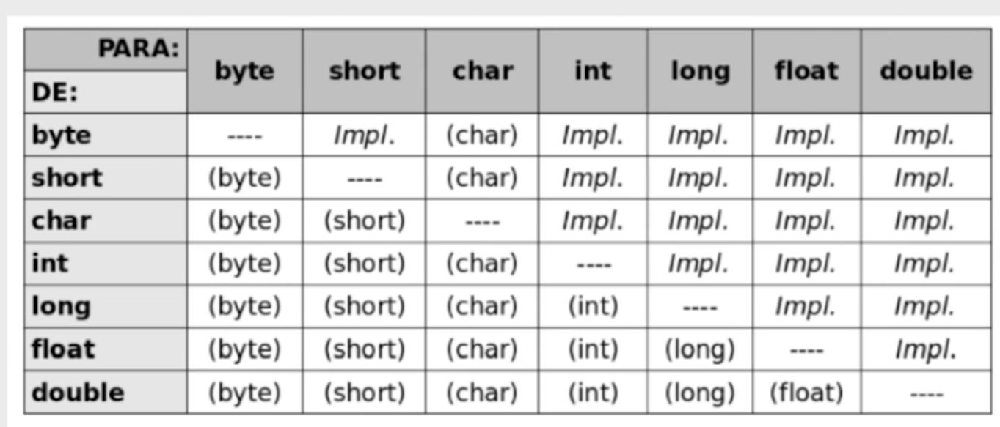

# <span style="color: #87BBA2">===   JAVA: CRIANDO A SUA PRIMEIRA APLICAÇÃO   ===</span> <!-- omit in toc -->

# <span style="color: #87BBA2">INDICE</span> <!-- omit in toc -->
- [PRIMEIRO PROGRAMA EM JAVA](#primeiro-programa-em-java)
  - [TABELA DE ATALHOS INTELLIJ](#tabela-de-atalhos-intellij)
  - [PREPARANDO AMBIENTE](#preparando-ambiente)
    - [Onde encontrar?](#onde-encontrar)
    - [JRE ou JDK?](#jre-ou-jdk)
    - [Escolha do JDK](#escolha-do-jdk)
    - [Qual IDE utilizar?](#qual-ide-utilizar)
  - [O PRIMEIRO PROGRAMA](#o-primeiro-programa)
    - [Informações interessantes](#informações-interessantes)
  - [ATALHOS, TEMPLATES, NAVEGAÇÃO (ATÉ O MOMENTO)](#atalhos-templates-navegação-até-o-momento)
    - [Atalhos](#atalhos)
    - [Templates](#templates)
    - [Navegação](#navegação)
    - [Shortcut para criar uma classe](#shortcut-para-criar-uma-classe)
    - [Code Generate](#code-generate)
      - [Gerando construtores](#gerando-construtores)
      - [Gerando o override de toString](#gerando-o-override-de-tostring)
    - [Muito e muito mais dicas de IntelliJ](#muito-e-muito-mais-dicas-de-intellij)
- [CONSTRUINDO CATALOGO DE FILMES](#construindo-catalogo-de-filmes)
  - [ATRIBUINDO VALORES AO FILME](#atribuindo-valores-ao-filme)
    - [Convenções de código](#convenções-de-código)
    - [O que aprendemos até agora](#o-que-aprendemos-até-agora)
  - [FORTALECENDO A BASE: OPERADORES](#fortalecendo-a-base-operadores)
    - [Operadores de atribuição:](#operadores-de-atribuição)
    - [Operadores aritméticos:](#operadores-aritméticos)
    - [Operadores relacionais:](#operadores-relacionais)
    - [Operadores lógicos:](#operadores-lógicos)
    - [Operadores de incremento:](#operadores-de-incremento)
  - [MAIS SOBRE CONVENÇÔES](#mais-sobre-convençôes)
  - [PRIMITIVOS NO JAVA](#primitivos-no-java)
  - [TRABALHANDO COM TEXTOS](#trabalhando-com-textos)
    - [Text Blocks](#text-blocks)
    - [Comparação de Strings](#comparação-de-strings)
    - [String.format e formatted](#stringformat-e-formatted)
  - [CONVERTENDO VALORES (Casting)](#convertendo-valores-casting)
    - [Tabela de Casting](#tabela-de-casting)
    - [Casting](#casting)
      - [Casting implícito](#casting-implícito)
      - [Casting explícito](#casting-explícito)
- [CONTROLANDO O FLUXO DA APLICAÇÃO](#controlando-o-fluxo-da-aplicação)
  - [TOMANDO DECISÕES](#tomando-decisões)
    - [Classe Condicional](#classe-condicional)
      - [If/else com operadores relacionais](#ifelse-com-operadores-relacionais)
      - [If/else com operadores lógicos](#ifelse-com-operadores-lógicos)
    - [Avisos do IntelliJ](#avisos-do-intellij)
    - [Atalhos usados neste capitulo](#atalhos-usados-neste-capitulo)
  - [SWITCH / CASE](#switch--case)
    - [Sintexe](#sintexe)
    - [Exemplo](#exemplo)
  - [LEITURA DE DADOS](#leitura-de-dados)
  - [AVALIANDO O FILME](#avaliando-o-filme)
    - [Ponto de observação](#ponto-de-observação)
  - [OUTRAS FORMAS DE ITERAR DADOS](#outras-formas-de-iterar-dados)
    - [Quando usar for e quando usar while](#quando-usar-for-e-quando-usar-while)
    - [Sintaxe do while](#sintaxe-do-while)
    - [Exemplo de aplicação](#exemplo-de-aplicação)
  - [DESAFIO](#desafio)
    - [Controle bancário](#controle-bancário)
    - [O que vamos fazer?](#o-que-vamos-fazer)


# <span style="color: #87BBA2">PRIMEIRO PROGRAMA EM JAVA</span>

## TABELA DE ATALHOS INTELLIJ
| **Atalho** | **Funcionalidade** |
|-----------|------------------|
| **Alt + 1** | Ocultar e mostrar a view |
| **Ctrl + Shift + F12** | Ocultar todas as telas de uma view |
| **Alt + Insert** | Permite criar algum arquivo |
| **“psvm” + Tab** | Escreve o método main automaticamente |
| **Alt + Shift + F10 / Ctrl + Shift + F10** | Executar a classe atual |
| **Alt + Enter** | Possibilidades de ação por meio da feature Show Intention Action - por meio de suas sugestões. |
| **Alt + Shift + Insert / CMD + Shift + 8** | Modificar o modo de seleção para coluna |
| **Ctrl + N / CMD + O** | Busca de classe |
| **Alt + Shift + setas para cima ou baixo** | Mover linhas de código |
| **Ctrl + Y / CMD + Delete/Backspace** | Apagar linhas de código |
| **Ctrl + Shift + A / CMD + Shift + A** | Find action: permite buscar qualquer funcionalidade do IntelliJ |
| **Ctrl + B / CMD + B** | Navegação por declaração |
| **Alt + setas (direita ou esquerda) / CMD + Shift + { ou }** | Navegação por tabs |
| **Ctrl + F4 / CMD + W** | Fecha a tab atual |
| **Alt + Shift + X** | Fecha todas as tabs |
| **F5** | Copia uma classe |
| **Ctrl + Alt + L / Alt + CMD + L** | Formata o código automaticamente, ajustando a indentação |
| **Shift + F6** | Renomeando variáveis (Rename) |
| **Ctrl + Alt + M / CMD + Alt + M** | Extração de método |
| **Shift + Shift** | Search everywhere: permite buscar qualquer coisa dentro do projeto |
| **Ctrl + E / CMD + E** | Visualizar todos os arquivos recentes |
| **Ctrl + Shift + Alt + N / CMD + Alt + O** | Busca de símbolos |
| **Ctrl + Shift + F / CMD + Shift + F** | Buscando trechos |
| **Ctrl + H** | Visualização de hierarquia |
| **Alt + F7** | Find Usages |
| **Alt + Home / CMD + seta para cima** | Navegação por barra |
| **Ctrl + D / CMD + D** | Copiando linhas |
| **Ctrl + Shift + A / CMD + Shift + A** | Find Action |
| **F7** | Step Into |
| **F8** | Step Over |
| **Shift + F8** | Step Out |
| **Ctrl + barra(/) / CMD + barra(/)** | Comentários |
| **Ctrl + Alt + V / CMD + Alt + V** | Variável Local |
| **Ctrl + Alt + F / CMD + Alt + F** | Atributo |
| **Ctrl + Alt + C / CMD + Alt + C** | Constante |


## PREPARANDO AMBIENTE
Para iniciarmos o desenvolvimento em Java, é necessária a instalação do Kit de desenvolvimento, o JDK (Java Development Kit).

### Onde encontrar?
No site da Oracle, sendo, atualmente, a empresa detentora da tecnologia.

Podemos ir direto na pagina de downloads buscando por "java download oracle"

### JRE ou JDK?
Ao entrar no site da Oracle, nos deparamos com uma quantidade de informações, como JRE, JDK, mas afinal, qual devemos baixar?
- JRE: **Java Runtime Environment**, ou seja, é a tecnologia necessária para rodar uma aplicação Java, o qual conta com a existencia de uma JVM (Java Virtual Machine), o qual fará a tradução do código em bytecode possibilitando ela ser multiplataforma.
  - JRE é recomendado para o **consumidor final**
- JDK: **Java Development Kit**, ou seja, é um conjunto de ferramentas em Java para desenvolvimento de uma aplicação, como compilador, depurador e etc.
  - JDK é o que será utilizado pelos **desenvolvedores**
> O JDK (Java Development Kit) é um conjunto de ferramentas e bibliotecas de software que permite o desenvolvimento de aplicativos Java.

### Escolha do JDK
É ideal escolher a versão do Java que esteja em LTS, ou seja, Long Term Support. Atualmente temos o seguinte informativo:

```plaintext
JDK 23 is the latest release of the Java SE Platform.

JDK 21 is the latest Long-Term Support (LTS) release of the Java SE Platform.

Earlier JDK versions are available below.
```

Ou seja, JDK21 é o LTS, então, optaremos por ele.

### Qual IDE utilizar?
Recomendou-se a utilização de **IntelliJ**, feita pela JetBrains, para o desenvolvimento em Java.

[O download pode ser feito aqui](https://www.jetbrains.com/idea/download/?section=windows)

Utilizaremos a **IntelliJ IDEA Community Edition** por ser Gratuito. A versão Ultimate tem mais funcionalidades mas ela é paga. A Community nos atenderá perfeitamente também.

## O PRIMEIRO PROGRAMA
Agora, para criar o primeiro programa, vamos:
1. Abrir o IntelliJ e clicar em **New Project**
2. Indicar o local que salvaremos o programa
3. Indicaremos a lingua desejada, no caso, Java
4. Indicaremos o sistema de Build, no caso, IntelliJ nesse momento (tem o Maven e o Gradle que é interessante futuramente)
5. JDK a ser utilizado
6. **Create**

### Informações interessantes
- As pastas onde se encontram os projetos geralmente tem como padrão estarem dentro de uma pasta chamada "src", sendo o "código fonte", ou seja, "source code".

## ATALHOS, TEMPLATES, NAVEGAÇÃO (ATÉ O MOMENTO)
**IMPORTANTE:** Os atalhos se alteram conforme o preset que utilizamos. Como instalamos o IntelliJ pegando as configurações do VsCode, importou-se também os atalhos do VsCode (preservando os atalhos unicos do IntelliJ).

Caso queiramos seguir o padrão do IntelliJ, devemos alterar para "Windows" no preset do Keymap. 

### Atalhos
- Alt + 1 (VsCode: CTRL + B para fechar, CTRL + E para abrir): Abre e fecha a aba lateral de projetos (aumenta a tela de código)
- Ctrl + F5: Roda o código
- F5: Roda em debugger
- IMPORTANTE: Alt + Insert sobre um diretório: Mostra a aba "New" com opções pré definidades de criação, como um package (aquele onde deixamos estruturados conforme o endereço de trás para frente o dominínio que estamos trabalhando).
  - Por exemplo, **alt + shift + E** para abrir a aba lateral, **navegue com as setas do teclado**, na pasta desejada dê o comendo **alt + insert**, escreva a letra **P** e aparecerá a função "Pakcage". Crie uma com o nome do dominio de trás pra frente, como "br.com.primeiroprojeto".

### Templates
- `psvm` dentro da classe: Gera a estrutura de public static void main()
- `sout` dentro de um método: Gera um System.out.Print já com o cursor dentro dos parenteses
  - Descrição: Prints a string to System.out

### Navegação
- `alt + Shift + Insert` - Ativa o modo coluna. É possivel ver o modo coluna ativado/desativado no canto inferior direito
  - Com este modo ativado, ao clicar com o mouse e arrastar, podemos selecionar multiplas linhas ao mesmo tempo (inclusive as em branco, como se fossem uma coluna)
  - O mesmo efeito ocorre quando este modo está ativado e clicamos `seta + shift` para cima ou para baixo
- **Importantissimo**: Esse modo é DIFERENTE de fazer `alt + ctrl + shift + seta` para cima ou para baixo. **O funcionamento no IntelliJ é igual ao VsCode**, mas o modo coluna é literalmente uma seleção em coluna vertical, o qual mantém-se vertical mesmo em linhas vazias. O multiseleção com o `alt + ctrl + shift + seta` se reajusta à linhas vazias.

### Shortcut para criar uma classe
- Caso tentarmos instanciar uma classe inexistente, podemos utilizar as **sugestões do IntelliJ** como corta caminho:
  - Primeiro, tentamos instanciar uma classe inexistente, como `new Teste`
  - Clicamos ***alt + enter** e abrirá a tela de sugestões do IntelliJ
  - Selecionamos **Create class 'Teste'**
  - Dado enter, surgirá a opção de criar um pacote para esta classe. Sugerimos dar o nome como algo parecido com `br.com.teste.model`, caso essa classe for um modelo para o sistema. Aí, podemos trocar o ultimo dado (que no caso está como model) dependendo da natureza da classe.

Para conferir dicas para utilização do IntelliJ, [verifique este artigo da Alura.](https://www.alura.com.br/artigos/intellij-idea-dicas-truques-usar-no-dia-a-dia)
- Nosso IntelliJ, por exemplo, pegou as configurações de nosso VsCode, então, ele tem alguns atalhos iguais ao VsCode!
- Outras facilidades, como o "psvm" que gerará a estrutura do "public static void main" automaticamente

### Code Generate
Podemos utilizar o gerador de código que já realiza operações comuns para nós quando o chamamos, como gerar getter e setter de atributos que indicamos.

Para acessar o Generate, clice **Alt + Insert**.

Por exemplo, em uma classe que criamos, podemos clicar **Alt + insert** na linha que queremos gerar este código e, ao selecionar **getter and setter**, indicar as atributos que desejamos e imediatamente esses métodos serão criados.

> Porque utilizamos Getter e Setter?
>
> De acordo com o princípio da orientação a objetos devemos de fato fazer com que os atributos das classes sejam encapsulados (deixá-las private ou protected), evitando o acesso direto. Dessa forma evitamos comportamentos indesejados.

#### Gerando construtores
Podemos gerar um construtor de duas formas:
- Dentro da propria classe, podemos utilizar o Code Generator (`alt + insert`) e indicar quais propriedades gerar o construtor
- Dentro da função que o está instanciando, utilizando a sugestão do IntelliJ (`alt + start / VsCode: ctrl + .`).

```java
// Para realizar a segunda opção, precisamos passar os parametros antes
Estudante joao = new Estudante("joao", 22, 123);
```

#### Gerando o override de toString
Assim como visto no getter e setter, podemos fazer com o caso do toString()
- Override no toString() faz a mesma ação de quando damos instruções ao `__str__` em uma classe Python, que seria alterar o que será retornado ao printar diretamente um objeto.

Para realizar essa ação, utilize a ferramenta de Generate Code (`alt + insert`) e selecione a opção toString().

### Muito e muito mais dicas de IntelliJ
[Para ver mais operações interessantes com IntelliJ, veja este artigo](https://www.alura.com.br/artigos/intellij-idea-dicas-truques-usar-no-dia-a-dia)

# <span style="color: #87BBA2">CONSTRUINDO CATALOGO DE FILMES</span>

## ATRIBUINDO VALORES AO FILME

### Convenções de código
- Classes e Interfaces: PascalClase
  - Exemplo: `MyClass`, `MyInterface`
- variaveis e funções (métodos): camelCase
  - Exemplo: `myVariable`, `calculateArea`
- Constantes = SCREAMING_SNAKE_CASE
  - Exemplo: `MAX_SIZE`, `DEFAULT_TIMEOUT`

### O que aprendemos até agora
```java
package br.com.primeiroprojeto;

public class Main {
    public static void main(String[] args) {
        System.out.println("Esse é o Screen Match!");
        System.out.println("Filme: Top Gun: Maverick");

        int ano = 2022;
        System.out.println("Ano de lançamento: " + ano); // Concatenação
        boolean incluidoNoPlano = false;
        double notaDoFilme = 8.1;
    }
}
```

## FORTALECENDO A BASE: OPERADORES
### Operadores de atribuição:
Os operadores de atribuição são usados para atribuir um valor a uma variável. O operador de atribuição básico é o "=" (sinal de igual). 

Por exemplo:
```java
int valor =  5;  //Atribui o valor 5 à variável valor  
```
Existem também operadores de atribuição combinados, que são uma forma abreviada de atribuição. Por exemplo, o operador "+=" adiciona um valor à variável existente. Assim:
```java
int valor =  10; 
valor += 15;  //Equivalente a valor = valor + 15, atribui o valor 25 à variável valor 
```

### Operadores aritméticos:
Os operadores aritméticos são usados para realizar operações matemáticas básicas. São eles:
- "+" (adição)
- "-" (subtração)
- "*" (multiplicação)
- "/" (divisão)
- "%" (resto da divisão)
Por exemplo:
```java
int a = 10 + 5; // Atribui o valor 15 à variável a
int b = 10 - 5; // Atribui o valor 5 à variável b
int c = 10 * 5; // Atribui o valor 50 à variável c
int d = 10 / 5; // Atribui o valor 2 à variável d
int e = 10 % 3; // Atribui o valor 1 à variável e (o resto da divisão de 10 por 3 é 1)
```
### Operadores relacionais:

Os operadores relacionais são usados para comparar valores. Eles retornam um valor booleano (verdadeiro ou falso). Trabalharemos melhor com eles quando estivermos na aula de condicionais, onde vamos modificar o fluxo da aplicação dada alguma condição. São eles:

- "==" (igual a)
- "!=" (diferente de)
- ">" (maior que)
- ">=" (maior ou igual a)
- "<" (menor que)
- "<=" (menor ou igual a)
Exemplo:
```java
int a = 10; // Atribui o valor 10 à variável a
int b = 5; // Atribui o valor 5 à variável b
int c = 30; // Atribui o valor 30 à variável c

boolean igual = (b == a); //Nesse caso a variável igual ficará com o valor *false*, pois o valor de b não é igual o valor de a.
boolean diferente = (b != c); //A variável diferente ficará com o valor *true*, pois o valor de b é diferente do valor de c.
boolean maior = (b > a); //A variável maior ficará com o valor *false*, pois o valor de b é menor que o valor de a.
boolean menorIgual = (b <= c); //A variável menorIgual ficará com o valor *true*, pois o valor de b é menor que o valor de c.
```

### Operadores lógicos:

Esses operadores são usados quando queremos verificar duas ou mais condições e/ou expressões na aplicação. Eles fazem a comparação de valores booleanos e retornam também um resultado booleano.

São três operadores: AND (&&), OR (||) e NOT (!).

O operador AND (&&), que traduzindo para o português seria o E, é usado para verificar se duas condições são verdadeiras. Se ambas as condições forem verdadeiras, o resultado será verdadeiro. Caso contrário, o resultado será falso. Aqui está um exemplo:
```java
boolean a = true;
boolean b = false;
if (a && b) {
   // Este código não será executado, já que a é verdadeiro e b é falso.
}
```
O operador OR (||), que traduzindo para o português seria o OU, é usado para verificar se pelo menos uma das condições é verdadeira. Se pelo menos uma das condições for verdadeira, o resultado será verdadeiro. Caso contrário, o resultado será falso. Aqui está um exemplo:
```java
boolean a = true;
boolean b = false;
if (a || b) {
   // Este código será executado, já que a é verdadeiro, mesmo que b seja falso.
}
```
O operador NOT (!) é usado para negar uma condição. Se a condição for verdadeira, o resultado será falso. Se a condição for falsa, o resultado será verdadeiro. Aqui está um exemplo:
```java
boolean a = true;
if (!a) {
   // Este código não será executado, já que a é verdadeiro.
}
```
### Operadores de incremento:

Além dos operadores citados anteriormente, o operador de incremento é usado para aumentar o valor de uma variável em 1. Existem dois tipos de operadores de incremento: o operador de pré-incremento (++variavel) e o operador de pós-incremento (variavel++).

O operador de pré-incremento (++variavel) aumenta o valor da variável em 1 antes de usar a variável em uma expressão. Aqui está um exemplo:
```java
int num = 5;
int resultado = ++num; //num é incrementado para 6 e depois atribuído a resultado
System.out.println(num); // imprime 6
System.out.println(resultado); // imprime 6
```
Já o operador de pós-incremento (variavel++) aumenta o valor da variável em 1 depois de usar a variável em uma expressão. Aqui está um exemplo:
```java
int num = 5;
int resultado = num++; //num é atribuído primeiramente à variável resultado e depois incrementado para 6
System.out.println(num); // imprime 6
System.out.println(resultado); // imprime 5
```

## MAIS SOBRE CONVENÇÔES
A convenção de código do Java é um conjunto de regras recomendadas para escrever código Java que é fácil de ler, entender e manter. Essas regras foram definidas pela Oracle, a empresa que mantém a linguagem Java, e são amplamente seguidas pela comunidade de desenvolvedores Java.

Aqui estão algumas das principais convenções de código do Java:

- Nomes de classes devem começar com letra maiúscula e usar a convenção PascalCase (também conhecida como Upper CamelCase).
  - Exemplo: `MinhaClasse`.
- Nomes de métodos devem começar com letra minúscula e usar a convenção camelCase.
  - Exemplo: `meuMetodo()`.
- Nomes de constantes devem ser totalmente em letras maiúsculas, separadas por underline.
  - Exemplo: `MINHA_CONSTANTE`.
- Nomes de variáveis devem começar com letra minúscula e usar a convenção camelCase.
  - Exemplo: `minhaVariavel`.
Todas as linhas de código devem ter no máximo 80 caracteres de largura para facilitar a leitura.
- Recomenda-se usar espaços em branco para separar operadores, palavras-chave e elementos de controle de fluxo.
  - Exemplo: `if (condicao) {`.

Use comentários para documentar seu código, explicando o que ele faz e por que ele faz isso. Comentários devem ser claros e concisos.

Esse ponto anterior, referente aos comentários, é polêmico, pois muitas pessoas desenvolvedoras consideram que um bom código deve ser autoexplicativo. Se você utiliza nomes intuitivos e descritivos para suas variáveis e métodos, fica mais claro de entender o que está acontecendo no código, dispensando a necessidade de uso de comentários.

Essas são apenas algumas das convenções de código mais comuns no Java. Seguir essas regras pode tornar seu código mais fácil de ler e entender, o que pode economizar tempo e esforço no longo prazo.

É importante lembrar que as convenções de código são apenas recomendações, e não regras obrigatórias. No entanto, seguir essas convenções pode ajudar a criar um padrão consistente em todo o seu código Java e também torná-lo mais fácil de compartilhar e colaborar com outros desenvolvedores.

## PRIMITIVOS NO JAVA
Java possui oito tipos primitivos diferentes: boolean, byte, char, short, int, long, float e double. Cada um desses tipos possui suas próprias características e faixa de valores permitidos, conforme será descrito a seguir.

boolean
- O tipo boolean é utilizado para representar valores lógicos, podendo assumir apenas dois valores: true ou false. É utilizado em expressões condicionais, loops e outros casos onde se deseja avaliar se uma determinada condição é verdadeira ou falsa.

byte
- O tipo byte é utilizado para representar valores numéricos inteiros de 8 bits. Ele possui uma faixa de valores de -128 a 127.

char
- O tipo char é utilizado para representar caracteres individuais. Ele pode armazenar qualquer caractere Unicode e é representado por aspas simples ('').

short
- O tipo short é utilizado para representar valores numéricos inteiros de 16 bits. Ele possui uma faixa de valores de -32.768 a 32.767.

int
- O tipo int é utilizado para representar valores numéricos inteiros de 32 bits. É um dos tipos de dados mais utilizados para representar números inteiros em Java e possui uma faixa de valores de -2.147.483.648 a 2.147.483.647.

long
- O tipo long é utilizado para representar valores numéricos inteiros de 64 bits. Ele é utilizado para representar valores inteiros muito grandes e possui uma faixa de valores de -9.223.372.036.854.775.808 a 9.223.372.036.854.775.807.

float
- O tipo float é utilizado para representar valores numéricos de ponto flutuante, ou seja, valores com casas decimais, sendo que ocupa 32 bits de memória. Ele pode representar números decimais com até sete dígitos e tem uma precisão limitada, o que significa que ele pode arredondar os números se eles forem muito grandes ou muito pequenos.

double
- O tipo double é similar o float, entretanto ele ocupa 64 bits de memória e pode representar números decimais com até 15 dígitos.

## TRABALHANDO COM TEXTOS
Importante lembrar, `String` não é um primitivo em Java, e sim uma classe (mas aparentemente não necessitamos instanciá-la).

### Text Blocks
No **Java 15** entrou um recurso novo chamado **Text Blocks** que já formata a String do jeito que estamos escrevendo-a, sem a necessidade de ficar replicando linhas de `System.out.println()`. Para fazermos um **Text Block**, escrevemos nossa string iniciando com 3 aspas duplas, seguido de uma quebra de linha, encerrando com outras 3 aspas duplas.
> Introduzido na versão 15 do Java, o Text Block é uma nova forma de representar Strings que facilitam a escrita de textos com múltiplas linhas. Em vez de utilizar aspas duplas para delimitar o texto e inserir quebras de linha manualmente, ou utilizar concatenações, é possível utilizar uma sintaxe mais simples que permite inserir o texto exatamente como ele é.

```java
// Sem Text Blocks
System.out.println("Filme Top Gun");
System.out.println("Filme de aventura com galã dos anos 80");
System.out.println("Muito bom!");

/* Retorno
Filme Top Gun
Filme de aventura com galã dos anos 80
Muito bom!
Ano de lançamento
*/

// Com Text Blocks
System.out.println("""
        Filme Top Gun
        Filme de aventura com galã dos anos 80
        Muito bom!
        """
);

// Teremos o mesmo retorno
```

Podemos realizar concatenações também:
```java
int anoDeLancamento = 2022;
String sinopse;
sinopse = """
        Filme Top Gun
        Filme de aventura com galã dos anos 80
        Muito bom!
        """ + anoDeLancamento;

System.out.println(sinopse);
```
Mas, neste caso acima, teremos um "Enter" a mais entre "Muito bom!" e o ano de lançamento.

Porém, existe uma forma mais inteligente de fazer isso que é chamando o método `Formatted`, mas, veremos isso em breve, inclusive, com possibilidade de interpolações.

### Comparação de Strings
Em Java, é possível comparar duas Strings utilizando o operador ==. Porém, esse operador verifica apenas se as duas variáveis apontam para o mesmo objeto na memória, e não se o conteúdo das Strings é igual. Para comparar o conteúdo de duas Strings, é necessário utilizar o método equals(). Por exemplo:

```java
String senha = "12345";
if (senha.equals("12345")) {
    System.out.println("Acesso autorizado!");
} else {
    System.out.println("Senha incorreta.");
}
```
Nesse caso, o método equals() é utilizado para comparar o conteúdo da variável senha com a String "12345". Se as duas Strings forem iguais, a mensagem "Acesso autorizado!" será impressa, caso contrário, a mensagem "Senha incorreta." será impressa.

Mais adiante trabalharemos também com o método equalsIgnoreCase(), que é usado para que a comparação de Strings desconsidere as letras maiúsculas e minúsculas. Utilizando apenas o equals, as String “alura” e “Alura” seriam consideradas diferentes.

Acredito que isso decorra de **Atribuição de valor** e **Atribuição de referência**, onde, se o tipo não for primitivo, será atribuido sua referência na memória. Por isso, em Java, utiliza-se um método para verificar igualdade de string, pois, o operador lógico verificará a igualdade do endereço de memória em caso de tipos não primitivos.

### String.format e formatted
Utilizamos os `String.format()` para escrever uma string com placeholders e o método `.formatted()` tem função similar, mas para Text Blocks.

Em Java, é possível formatar textos e números de diversas maneiras. Isso pode ser útil em diversas situações, como ao exibir valores para o usuário de uma maneira mais legível.

Uma das maneiras mais comuns de se formatar textos em Java é utilizando o método format(), da classe String. Esse método permite formatar um texto utilizando diversos placeholders, que são representados pelo caractere % seguido de uma letra que indica o tipo de dado que será inserido no placeholder. Por exemplo, %s indica que uma String será inserida no placeholder, %d indica um valor inteiro e %f indica um valor de ponto flutuante. Vamos ver um exemplo:
```java
String nome = "Maria";
int idade = 30;
double valor = 55.9999;
System.out.println(String.format("Meu nome é %s, eu tenho %d anos e hoje gastei %.2f reais", nome, idade, valor));
```

Nesse exemplo, os valores das variáveis nome, idade e valor são passados como parâmetros para o método String.format, substituindo os placeholders %s, %d e %.2f, respectivamente. O resultado impresso será "Meu nome é Maria, eu tenho 30 anos e hoje gastei 55,99 reais". Perceba também que o placeholder %.2f indica que o valor deve ser formatado com duas casas decimais.

Esse exemplo do que foi feito para o String.format também pode ser usado com Text Block, onde usa-se o método que citei em aula, o formatted, para informar as variáveis que deverão ser utilizadas no lugar dos placeholders. Veja esse exemplo:
```java
String nome = "João";
int aulas = 4;

String mensagem = """
                  Olá, %s!
                  Boas vindas ao curso de Java.
                  Teremos %d aulas para te mostrar o que é preciso para você dar o seu primeiro mergulho na linguagem!
                  """.formatted(nome, aulas);

System.out.println(mensagem);
```

## CONVERTENDO VALORES (Casting)
> Antes de darmos continuidade, vale lembrar que o Java (assim como a maioria das linguagnes de programação) possui palavras reservadas que não podem ser utilizadas fora de suas atribuições

O que é **Casting**?
- Casting seria a realização de conversão de tipos.
- Existem dois tipos de Casting: Explícito e Implicito.

```java
double media = 8.5;
int classificacao;
classificacao = media / 2; // Erro de compilação, pois uma variável int não pode armazenar um double

// Casting Explício
double media = 8.5;
int classificacao;
classificacao = (int) (media / 2);
```
Aqui, estamos explicitamente dizendo para transformar a operação acima em um **int**, o que isso ocasionará?
- Veja que o resultado real seria 4,25, mas, o valor que foi atribuido foi 4.
- Isso **não foi um arrendondamento**, mas sim, um **truncamento**, pois foi armazenado **apenas a parte inteira deste double**, que é o que caberia nessa variável.
  - Ou seja, se fizermos `classificacao = (int) (8.9);`, o valor que será atribuido em classificação será 8, por justamente ser a parte inteira.

### Tabela de Casting

Nessa tabela de casting conseguimos observar quais tipos serão necessários realizar **Casting explicito** e quais aceitam **Casting implicito**.

Qual é a diferença entre os tipos de casting?
- Casting implicito é quando o tipo que está sendo atribuido "cabe" na variável que a atribui.
- Casting explicito já necessita de uma operação, uma conversão, que poderá haver alguma perda pois o tipo que está sendo atribuido "não cabe" na variável que a atribui.

Interpretado essa tabela, podemos observar o DE/PARA, lembos DA coluna em cinza claro PARA a coluna em cinza escuro.

Nos quadrantes temos os seguintes valores:
- traço: é o mesmo tipo
- (tipo): Casting explicito
- Impl.: Casting Implicito

Exemplo de leitura:
- DE byte, PARa long, quadrante Impl.: Ou seja, podemos atribuir um Byte em Long de forma implicita
- DE float, PARA int, quadrante (int): Ou seja, precisaremos realizar um casting implicito de (int) para atribuir um float a uma variável int
- Importar visualizar que para char, sempre necessitaremos fazer Casting Explicito.

Note que **toda vez que iremos perder alguma informação em algum casting, o Java solicita Casting Explicito**, essa é a forma de dar controle das instruções e clareza no que está acontecendo.

### Casting
Casting é um recurso utilizado em Java para converter um tipo de dado em outro. Essa conversão pode ser feita de forma automática pelo compilador (conversão implícita), quando o tipo de dado de destino é compatível com o tipo de dado de origem, ou de forma manual (conversão explícita), utilizando o operador de casting.

O casting é utilizado para permitir que tipos de dados incompatíveis possam ser utilizados em uma mesma operação ou expressão. Por exemplo, se um método espera um parâmetro do tipo int e o valor que se deseja passar é do tipo double, é necessário fazer um casting para converter o valor em int.

#### Casting implícito
O casting implícito é realizado automaticamente pelo compilador quando o tipo de dado de origem é compatível com o tipo de dado de destino. Por exemplo, é possível atribuir um valor de tipo int a uma variável do tipo double, pois o tipo double é maior e suporta todos os valores que o tipo int pode armazenar:
```java
int x = 10;
double y = x; // casting implícito
```

#### Casting explícito
O casting explícito é realizado quando o tipo de dado de origem é incompatível com o tipo de dado de destino. Nesse caso, devemos utilizar o operador de casting para realizar a conversão:
```java
double x = 10.5;
int y = (int) x; // casting explícito
```
No exemplo anterior, o valor da variável x é convertido em um valor inteiro utilizando o casting explícito. É importante notar que, neste caso, a parte decimal será descartada e o valor atribuído à variável y será 10.

# <span style="color: #87BBA2">CONTROLANDO O FLUXO DA APLICAÇÃO</span>

## TOMANDO DECISÕES
Criaremos uma nova classe Java para realizar as operações, a chamaremos de `Condicional` e criaremos utilizando o atalho de criação de classe (Alt + insert na aba de projetos).

### Classe Condicional
Agora, iniciaremos a estrutura com o main
- digite `main + TAB` para criar a estrutura do main
- `psvm` para criar a estrutura do main

#### If/else com operadores relacionais
Para a condicional, estamos vendo a estrutura basica de `if` e `if/else` utilizando operadores relacionais.
```java
if (anoDeLancamento > 2022) {
    System.out.println("Lançamento que os clientes estão curtindo");
}

if (anoDeLancamento >= 2022) {
    System.out.println("Lançamento que os clientes estão curtindo, incluindo 2022");
}
```

#### If/else com operadores lógicos
Foi demonstrado também a utilização de operadores lógicos nas condicionais
```java
// Ao menos uma das condições necessita ser verdadeira
if (incluidoNoPlano || tipoPlano.equals("plus")) {
    System.out.println("Filme liberado");
}

// As duas condições necessitam ser verdadeiras
if (incluidoNoPlano && tipoPlano.equals("plus")) {
    System.out.println("Filme liberado");
}
```
- Lembrando a necessidade de utilizar o método `.equals()` para avaliar Strings.

### Avisos do IntelliJ
Podemos consultar, no canto superio direito, os avisos do IntelliJ representados por um simbolos:
- Exclamação vermelha: erros e, as vezes, sugestões;
- Simbolo de exclamação amarela: avisos;
- Ticks verdes: Sugestões, ou avisos que causam nenhum problema na operação da aplicação, como sugestões de correção de erros de escrita de uma palavra (como "Typos").

Alguns erros, o **IntelliJ** possuem **quick fixes** acessados pela **lampada**, ou **alt + enter**.

### Atalhos usados neste capitulo
- **Alt + insert (na aba do projeto):** Insere novos arquivos, possibilitando uso de templates
- **digite main + TAB**: Cria estrutura main
- **digite psvm**: Cria estrutura main
- **alt + enter**: Acessa lampada (dicas e quick fixes)

## SWITCH / CASE

### Sintexe
```java
switch (expressão) {
   case valor1:
      // código a ser executado se a expressão for igual a valor1
      break;
   case valor2:
      // código a ser executado se a expressão for igual a valor2
      break;
   case valor3:
      // código a ser executado se a expressão for igual a valor3
      break;
   ...
   default:
      // código a ser executado se a expressão não for igual a nenhum valor
      break;
}
```

### Exemplo
```java
int dia = 3;
String nomeDia;

switch (dia) {
   case 1:
      nomeDia = "domingo";
      break;
   case 2:
      nomeDia = "segunda-feira";
      break;
   case 3:
      nomeDia = "terça-feira";
      break;
   case 4:
      nomeDia = "quarta-feira";
      break;
   case 5:
      nomeDia = "quinta-feira";
      break;
   case 6:
      nomeDia = "sexta-feira";
      break;
   case 7:
      nomeDia = "sábado";
      break;
   default:
      nomeDia = "Dia inválido";
      break;
}

System.out.println("O dia " + dia + " é " + nomeDia);
```

## LEITURA DE DADOS
Neste capitulo, veremos como coletar entradas pelo console.

```java
package br.com.primeiroprojeto;

import java.util.Scanner;

public class Leitura {
    public static void main(String[] args) {
        Scanner leitura = new Scanner(System.in);

        // Coletando String
        System.out.println("Digite seu filme favorito");
        String filme = leitura.nextLine();
        System.out.println(filme);

        // Coletando int
        System.out.println("Qual o ano de lançamento? ");
        int anoDeLancamento = leitura.nextInt();
        System.out.println(anoDeLancamento);

        
        // Coletando double
        System.out.println("Diga sua avaliação para o filme: ");
        double avaliacao = leitura.nextDouble(); // No momento da coleta, separador por "." ou "," dependerá da região do programa
        System.out.println(avaliacao);
    }
}
```
- Instanciamos Scanner passando como parametro a propriedade `in` da classe `System`. Com isso, conseguiremos interagir com as entradas no terminal.
- Isso evita variáveis **hard coded** ("escritas em pedra"). Com isso, as variáveis serão inputadas pelas entradas de quem (ou o que) manipulará este sistema.

**Dica**: Para ver se a aplicação está rodando, como quando está esperando uma entrada, veja o simbolo de pause no console.

**Atenção ao double**
- O Java, em seu ambiente de desenvolvimento, sempre esperará que o separador do decimal seja um `.`, como em `9.9`, mas, na entrada do dado no terminal, isso já é algo que varia da região ao qual está configurada o Java. Por exemplo, se o Java estiver configurado na região brasileira, o dado inputado no console deverá ser com `,`, pois o Java já entende que a região brasileira possui como padrão a separação com `,` e automaticamente fará essa conversão.
- Então, o dado inserido em um terminal definido como região brasileira seria `9,9` e será automaticamente convertido no sistema para `9.9`.
- **formatMismatchException**: Receberemos essa exceção, por exemplo, se tentarmos atribuir o formato `9.9` em um terminal na região brasileira, o qual espera `9,9` como um valor `double`. Ou seja, essa exceção está dizendo que estamos tentando atribuir um formato que o sistema (ou o `Scanner`, talvez) esteja esperando.

## AVALIANDO O FILME
Para criar média dinamica conforme entradas feitas no terminal, utilizaremos o `for`, como exemplo:

```java
public static void main(String[] args) {
    Scanner leitura = new Scanner(System.in);
    double somaAvaliacao = 0;
    double nota = 0;
    int numeroDeNotas = 3;
//        double mediaAvaliacao = somaAvaliacao / numeroDeNotas;

    for (int i = 0; i < numeroDeNotas; i++) {
        System.out.println("Diga sua avaliação para o filme");
        nota = leitura.nextDouble();
        somaAvaliacao += nota;
    }

    double mediaAvaliacao = somaAvaliacao / numeroDeNotas;

    System.out.printf("Media de avaliações: %.2f.%n", mediaAvaliacao);
}
```

### Ponto de observação
Porque estamos criando a variável `mediaAvaliacao` depois do loop
- Pois, se fizermos antes do loop, o valor de `somaAvaliacao` ainda é 0, logo, `0 dividido por 3 será 0`.

Não utilizamos `System.out.println(String.format())`, mas escrevemos como se fosse, pois, utilizamos `System.out.printf()`.
- O próprio **IntelliJ** informa que `println(String.format())` é redundante e, como quick fix, realiza o `System.out.printf()`
- `System.out.printF()`: A convenience method to write a formatted string to this output stream using the specified format string and arguments.

## OUTRAS FORMAS DE ITERAR DADOS
Todo `for` pode ser escrito com `while` e todo `while` pode ser escrito com `for`, mas, tem momentos que um será mais legível que outro.

### Quando usar for e quando usar while
- Quando tem um número fixo de iterações (ou definido por variável), não necessariamente sendo booleano, e que desejamos incrementar a iteração, o mais adequado é o **for** (apesar de dar para escrever com o **while**)

### Sintaxe do while
```java
while(condicaoBooleana) {
  // faça algo
}
```
A estrutura de `while()` executará o loop caso a condição inserida em seus parenteses seja verdadeira. Ou seja, **caso a condição for verdadeira, execute essa ação**.

### Exemplo de aplicação
```java
Scanner leitura = new Scanner(System.in);
double somaAvaliacao = 0;
double nota = 0;
int totalDeNotas = 0;

while (nota != -1) {
    System.out.println("Diga sua avaliação para filme ou -1 para encerrar: ");
    nota = leitura.nextDouble();

    // Condição para não atribuir -1 à variável e ser considera na média por engano
    if (nota != -1) {
        somaAvaliacao += nota;
        totalDeNotas++; // Pós incremento
    }
}

double mediaAvaliacao = somaAvaliacao / totalDeNotas; // 0 dividido por 0 terá retorno de NaN, ou seja, Not A Number

System.out.printf("Media de avaliações: %.2f.%n", mediaAvaliacao);
```
**Notas importantes**
- Note a condição para não atribuir por engano o valor de -1;
- Note que quando ocorrer divisão de 0 por 0, teremos NaN.

## DESAFIO
### Controle bancário

**Dados iniciais do cliente**
- Deve ter asteriscos inicias e finais
- Texto Dados iniciais do cliente
- Nome do cliente
- Tipó da conta
- Saldo inicial
- Separação com espaços pre determinados entre valor e titulo

**Menu**
- Consultar saldos
  - Printa o saldo
- Receber valor
  - Pergunta valor
  - Ao colocar o valor, printa-se o saldo atualizado
- Transferir valor
  - Mesma operação acima, mas subtrai
  - Se tentar retirar mais que o necessário, barrar a operação
- Sair
  - Ao digitar, sai do sistema
- Ao digitar numero invalido, dizer que digitou-se numero invalido e loopar

### O que vamos fazer?
**Método checklist**
- Primeiro: Inicializar dados do cliente
- Depois: Menu de opções
- Depois: Visualização do saldo
- Depois: Envia valor
- Depois: Recebe valor