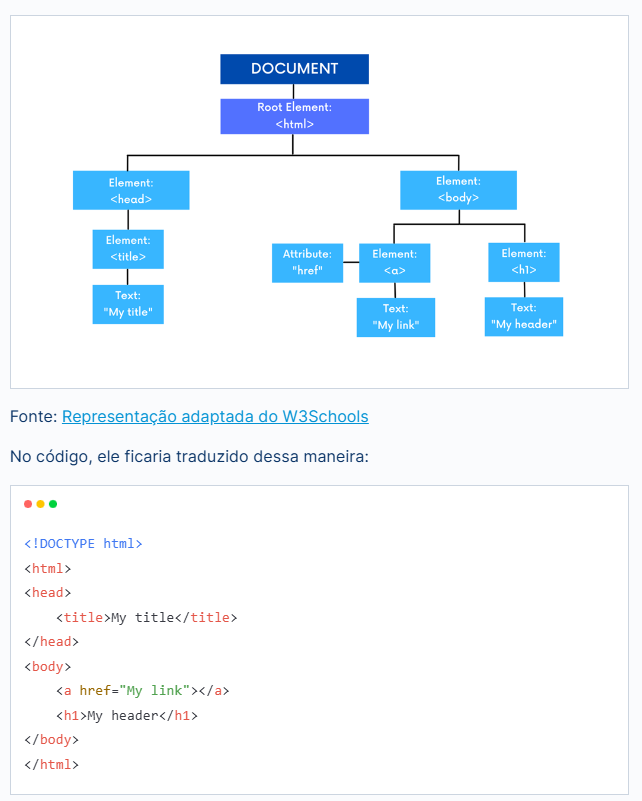

Quando uma página da web é carregada em um navegador, esse navegador cria uma representação do DOM dessa página. Mas o que é esse DOM, afinal?

O DOM (Document Object Model) é uma representação da estrutura de um documento HTML, onde os elementos são organizados em uma árvore hierárquica e cada nó possui propriedades e métodos. Isso permite que desenvolvedores acessem, modifiquem, removam ou adicionem elementos e conteúdo HTML dinamicamente através de scripts.

É por isso que, em nosso código JavaScript, frequentemente acessamos o valor de um elemento na página por meio do objeto document, referenciando-o pelo identificador ou por outra propriedade. Um exemplo disso é o uso de document.getElementById().

No artigo [O que é o DOM?](https://www.alura.com.br/artigos/o-que-e-o-dom), da Ellen Pimentel, você poderá aprofundar seu conhecimento sobre DOM e a forma de manipulá-lo.

