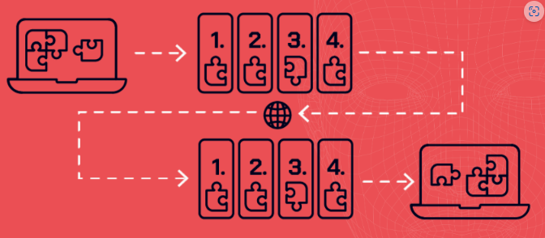
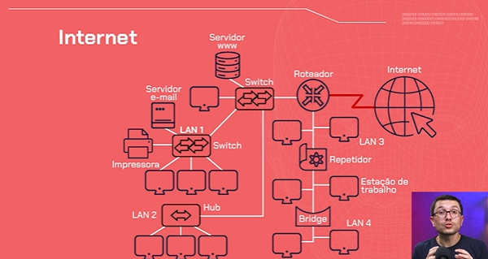
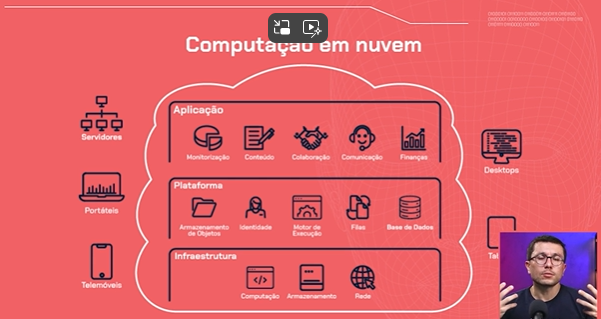
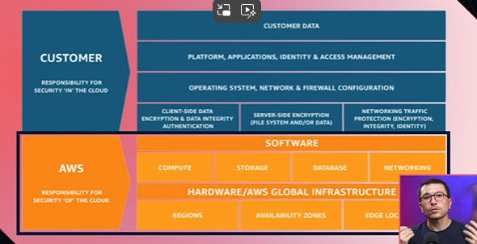

# ===   Começando em Cloud: usando a AWS e explorando os recursos da nuvem como serviço   === <!-- omit in toc -->

# INDICE <!-- omit in toc -->
- [Aula XX: TituloAula](#aula-xx-tituloaula)
  - [Capitulo](#capitulo)

# NAVEGANDO NA NUVEM

## INDENTIFICANDO A COMPUTAÇÃO COMO SERVIÇO
Segue-se o conceito de Cliente / Servidor, onde, lembrando, um servidor é um computador que armazena a aplicação e recebe as requisições do cliente para atender suas solicitações.

Os clientes podem ser telefones, notebooks, a televisão de casa.

### Onde fica o servidor?
O servidor poderia ser um computador que fica em nossa casa ligada 24h sempre respondendo as solicitações das pessoas, **ou**, podemos utilizar a Computação em Núvem, que seu conceito é a oferta de serviços computacionais como armazenamento e hospedagem de website como um serviço.

### Facilidades
Não precisamos, por exemplo, de nos preocuparmos com o estado deste computador, se ele está ligado, e afins, pois isso fica a cargo de um provedor de serviços.

### Outras ocorrencias
Além de armazenamento, podemos observar o Cloud Computing atuando em armazenar Softwares onde os clientes acessem via navegador, e o Software está executando na Clound. Isso se chama Software as a Service (SaaS).

## FUNCIONALIDADES COMUNS NA NUVEM

Armazenamento de dados

Um dos recursos mais populares da nuvem é o armazenamento de dados. Serviços de armazenamento em nuvem são oferecidos por provedores como Google, Microsoft, Amazon e Dropbox, permitindo acessar dados de qualquer dispositivo conectado à Internet. Isso elimina a necessidade de transferências manuais de arquivos e é uma opção confiável para backups e recuperação de dados, garantindo a disponibilidade das informações em caso de falhas.

Muitas aplicações em celulares e notebooks fazem uso desse recurso em suas operações. Anteriormente, os dados eram armazenados localmente em discos rígidos, SSDs e outros dispositivos físicos. Com os avanços tecnológicos, o armazenamento em nuvem se tornou mais popular, permitindo que os usuários armazenem seus dados de forma segura e acessível em servidores remotos.

Compartilhamento de arquivos

Outro recurso bem comum é o compartilhamento de arquivos, a nuvem facilita a colaboração e o compartilhamento de arquivos entre equipes. Ferramentas como Google Docs, Google Drive, Microsoft OneDrive, iCloud e Trello permitem criar, acessar, editar e colaborar em documentos, fotos, planilhas e apresentações, sincronizando e salvando tudo em tempo real na nuvem. Para isso, você só precisa de um dispositivo com conexão à Internet.

Hospedagem de aplicativos

A nuvem também permite a hospedagem de aplicativos, facilitando para pessoas desenvolvedoras e empresas gerenciarem seus aplicativos de maneira escalável e confiável, sem precisar configurar e manter servidores físicos. Amazon Web Services (AWS), Microsoft Azure e Google Cloud Platform possuem vários serviços que podem ser utilizados com essa finalidade.

Processamento de dados

Além de tudo o que já comentamos, a nuvem pode ser usada para processamento de dados, executando tarefas de processamento, análise e armazenamento de grandes volumes de dados.

A flexibilidade e acessibilidade oferecidas pela nuvem são essenciais para indivíduos e empresas modernas, promovendo uma maior colaboração e inovação. À medida que a tecnologia evolui, é provável que vejamos ainda mais recursos e capacidades sendo integrados às soluções em nuvem, solidificando ainda mais sua posição como uma ferramenta indispensável no cotidiano.

## ENTENDENDO ONDE ESTÁ A NUVEM
Indo em um site, na aba de inspecionar > rede, podemos observar as nossas solicitações.

Quando clicamos em algum botão, ou realizamos alguma ação, visualizamos que uma série de Solicitações de Recursos são feitas, e essas solicitações são feitas ao Servidor que está armazenando este site e, ao mesmo tempo, o Servidor está retornando o conteudo da escola de programação.

E o que faz a ligação entre o dispositivo do cliente e o servidor (que pode estar como serviço de computação em nuvem) é a internet. Ou melhor, são as redes de computadores.
> A internet é um sistema global de redes de computadores interligadas.

### Como funcionam as redes
Toda vez que dois dispositivos se conectam para transferencia de conjunto de dados são utilizados conjuntos de protocolos.

Utilizamos um conjunto de protocolos toda vez que interagimos com o site, precisamos nos conectar com um dispositivo, seja para enviar um arquivo ou receber um conjunto de dados.

### O que são protocolos
Eles nos ajudam a organizar o pedido ou o encaminhamento de dados em pacotes. Esses pacotes recebem o endereço de origem, que é o nosso computador encaminhando a solicitação para o site, e também precisam do endereço de destino, para onde o pacote deve ser enviado.

E por isso que todos os computadores recebem endereço (IP), o qual está na camada de Transporte do protocolo TCP/IP.

### Modelo TCP/IP

Essa imagem mostra que a requisição e o conjunto de dados passam por várias camadas antes de serem preparados para serem encaminhados através de uma série de dispositivos interconectados.

Isso porque o servidor que armazena esse site pode estar localizado fora da nossa cidade, possivelmente em outro país ou continente, além da área de cobertura do nosso provedor de internet. Para que nossa requisição alcance esse servidor, ela precisa passar por uma série de dispositivos de rede intermediários, como os roteadores, os quais frequentemente reiniciamos em casa quando a conexão está instável, até chegar ao endereço de destino.

### A Internet e estrutura de redes

### Camadas do TCP/IP
Nesse modelo, temos quatro principais camadas.

### Camada de aplicação
A primeira é a camada de aplicação, que está próxima ao nosso site. É nessa camada que inspecionamos os pacotes, solicitações e requisições. Um dos principais protocolos que operam nesta camada é o HTTP, e sua versão segura HTTPS.

### Camada de transporte
A camada de transporte utiliza o protocolo TCP para garantir a entrega confiável dos pacotes nessa conexão segura.

### Camada de rede
Na camada de rede, o principal protocolo é o IP, que realiza o endereçamento dos pacotes, especificando sua origem e destino.

### Camada de acesso à rede
A camada de acesso à rede, por sua vez, estabelece a conexão física entre os dispositivos.

Na formação das redes, não são apenas os dispositivos clientes, como nossos computadores ou celulares, que estão envolvidos. Também existem os dispositivos de rede, especializados em conectar diferentes redes ao redor do mundo e entre países, encaminhando pacotes e facilitando essa interconexão.

E onde a nuvem se encaixa nisso tudo?

### Localizando a Nuvem
A nuvem é um servidor ou um conjunto de servidores conectados à rede global de computadores, que é a internet.

Quando mencionamos serviços de computação em nuvem, geralmente nos referimos a data centers ("centro de dados"), que são sistemas compostos por múltiplos computadores com grande capacidade de processamento e armazenamento centralizados em um único local.

Esses data centers estão conectados à internet através de redes de alta velocidade, o que permite acessar e armazenar informações rapidamente, além de atender às solicitações rapidamente sempre que clicamos no ícone do site para enviar uma resposta ao nosso dispositivo.

Uma coisa que as pessoas usuárias nunca querem é esperar muito tempo para carregar uma página. Por isso, a conexão é fundamental tanto para a pessoa usuária quanto para os data centers.

Conclusão e Próximos passos
Era inimaginável ter a computação como um serviço usando computação em nuvem cerca de uma década atrás. Por quê? Nossas velocidades de conexão eram bastante baixas, então carregar um vídeo no YouTube, por exemplo, podia levar um tempo considerável. Usar um software como serviço no navegador era pouco prático. Era mais eficiente e rápido ter o software instalado diretamente em nosso desktop.

## TIPOS DE CLOUD

Atualmente temos três tipos principais de Cloud. Que tal analisarmos cada um deles?

### Cloud Pública
É o tipo mais comum de cloud, sendo amplamente utilizado por empresas de vários setores. Nesse tipo, os serviços são mantidos por um provedor, como Google, Microsoft, Amazon, Oracle ou IBM.

Esses provedores possuem data centers com servidores interconectados que compartilham recursos e serviços entre as pessoas usuárias. Trata-se, portanto, de uma solução de cloud bem prática e escalável.

### Cloud Privada
Ao contrário da cloud pública, a cloud privada oferece uma infraestrutura dedicada exclusivamente a uma organização. Isso significa mais controle e segurança, já que os recursos não são compartilhados com outras empresas. A nuvem privada pode ser hospedada no data center da própria empresa.

Você sabia que pode construir sua própria nuvem em casa? Um exemplo simples é usar uma Raspberry Pi para criar uma nuvem pessoal. A Raspberry Pi é um microcomputador de baixo custo e alta versatilidade, ideal para projetos de tecnologia. Com isso, você terá uma nuvem privada em casa, garantindo total controle e segurança sobre seus dados, similar ao que uma organização obteria com uma infraestrutura de cloud privada.

### Cloud Híbrida
Essa opção combina o melhor dos dois mundos, pública e privada. Por exemplo, você pode usar a nuvem pública para executar sistemas e a privada para armazenar dados sensíveis. É uma solução flexível que permite otimizar recursos e segurança conforme necessário.

Além desses tipos de cloud, você pode se deparar com o termo On Premises. Isso refere-se a quando toda a infraestrutura de TI, como servidores e máquinas, está localizada fisicamente na empresa, na conhecida "sala de servidores" ou CPD (Centro de Processamento de Dados). Enquanto a nuvem oferece flexibilidade e escalabilidade, o ambiente On Premises proporciona controle total sobre a infraestrutura.

Escolher a solução certa depende das suas necessidades específicas de segurança, controle e escalabilidade. Compreender essas opções permite tomar decisões informadas e alinhadas com as necessidades e objetivos da sua organização.

## CRIANDO UMA CONTA NA AWS

### Qual serviço escolher (SaaS, IaaS, PaaS)
Qual deles devemos escolher? Todos esses principais provedores oferecem conjuntos de serviços semelhantes. Eles disponibilizam serviços de infraestrutura, plataforma e aplicação. Por exemplo, **aplicação como serviço** para **hospedar software** e **plataforma como serviço** para **hospedar websites**.

E **infraestrutura como serviço** significa **descentralizar toda a infraestrutura, como o data center** que poderíamos ter localmente na nossa organização, e deixar isso sob os cuidados de um provedor de serviços de Computação em Nuvem.

### Maiores players
- Google Cloud
  - Destaca-se pelo foco em inteligência artificial, um campo atualmente em alta. A Google Cloud oferece uma variedade de serviços e soluções para desenvolver algoritmos de IA e disponibilizar essas soluções através da rede.
- Amazon Web Services (AWS)
  - A AWS é conhecida por ser um dos players mais famosos, justamente por ter um conjunto diversificado de serviços e uma abrangência global significativa de data centers.
- Micrososft Azure
  - Destaca-se especialmente quando precisamos integrar aplicações da própria Microsoft.

### Modelo de pagamento
Pay-as-you-go, ou seja, paga-se pelo o que você de fato utiliza.

### Criando uma conta na AWS
Escolhemos a AWS por ser a Cloud mais utilizada no mercado. No caso, as funções centrais costumam ser iguais entre as provedoras de clound, logo, o conhecimento poderá ser intercambéavel.
- Para criar sua conta, use este [link](https://aws.amazon.com/pt/)

# AVALIANDO SERVIÇOS, SEGURANÇA E REGIÕES

## SELECIONANDO SERVIÇOS NA CLOUD
A Dashboard da AWS mostra os serviços recentemente utilizados, box das aplicações que estamos rodando, box do custo e quais serviços estamos utilizando.

Visualizando os serviços disponibilizados, observamos uma lista variada e pode nos deixar perdidos. Vamos analisar as 5 principais categorias que se aplicam ao nosso problema a ser resolvido.

Clicamos no submenu de Todos os Servicos em Serviços por Categoria.

### Categoria Computação
Dedica-se a oferta de serviço para execução de aplicações em servidores virtuais.
- EC2: Acronimo para Elastic Compunting Cloud
  - Um dos serviços que oferecem para nós a opção de criar servidores virtuais como instancias. Ele será bem importante.
- Lambada: Esse é um serviço especial pois oferece serviços computacionais do tipo servless, ou seja, que não temos uma presença tão central de um servidor. No nosso caso, usaremos servidor então o EC2 nos servirá bem

O Amazon EC2 (Elastic Compute Cloud), é o serviço de computação em nuvem da AWS que permite criar e configurar servidores virtuais de acordo com as suas necessidades específicas.

Com o EC2, você pode selecionar a quantidade de armazenamento, memória, processador e sistema operacional que melhor atendem ao seu projeto.

Vamos imaginar que você está desenvolvendo um aplicativo que precisa processar grandes volumes de dados. Com o EC2, podemos facilmente escalar a capacidade de processamento adicionando ou removendo instâncias de servidores virtuais conforme necessário. Essa característica é muito útil durante picos de uso, como, por exemplo, em lançamentos de produtos ou períodos de promoções especiais (Black Friday, Festas de Fim de Ano, etc).

O Amazon EC2 permite executar diversas instâncias de servidores simultaneamente, garantindo alta disponibilidade e distribuição de carga de trabalho. Ele oferece várias camadas de segurança, incluindo configurações de firewall, permissões de acesso e redes privadas virtuais (VPC), garantindo que nossos dados e aplicações estejam protegidos.

### Categoria Armazenamento
Aqui armazenaremos dados, como textos que irão ser disponibilizados ao site, videos e afins (como a plataforma da Alura)
- S3: Single Storage Service, um dos serviços que realiza essa operação de armazenar

O Amazon Simple Storage Service (S3) é o principal serviço de armazenamento de dados da AWS. O S3 se destaca pela capacidade de fornecer segurança robusta, escalabilidade flexível e desempenho eficiente.

Com o S3, podemos armazenar e recuperar qualquer quantidade de dados a qualquer momento, de forma segura e acessível. Podemos adotá-lo em diferentes contextos, desde armazenamento de dados para websites e aplicativos móveis até backup e recuperação de desastres.

No S3, o armazenamento de dados trabalha com Objetos e Buckets.

Um objeto é composto por um arquivo e os metadados que descrevem esse arquivo. Já o bucket funciona como um contêiner para esses objetos.

### Categoria Banco de Dados
Bons serviços para validar o acesso de clientes.

O Amazon RDS (Amazon Relational Databases) é o serviço da AWS que disponibiliza o gerenciamento de base de dados relacionais na plataforma da AWS, focando em escalabilidade e no autogerenciamento. O RDS dá suporte a toda infraestrutura de banco de dados com um conjunto bem resumido de opções no console do RDS.

Por meio dele conseguimos automatizar rotinas de administração de banco de dados, provisionamento de hardware e configurações de backup e restore.

### Categoria Rede
Podemos ter acesso a esse serviço para melhorar a experiencia do usuário e também garantir a disponibilidade do conteúdo, como armazenar o website em 2 ou mais datacenteres em determinada região.

### Categoria Segurança, Identidade e Conformidade (IAM)
Serviço de gerenciamento de identidade e acesso, quem pode acessar um determinado serviço e como será esse acesso. 

**Tópico muito essencial para a aplicação.**

### Categoria Monitoramento
No Amazon CloudWatch, temos o serviço de monitoramento e observabilidade dos recursos da AWS. Com ele é possível configurar diversas opções de monitoramento e os gastos gerados no consumo de cada recurso.

Esse serviço tem foco especial em pessoas da área de DevOps, em pessoas desenvolvedoras, de engenharia de confiabilidade e de gestão de TI. O CloudWatch entrega uma série de dados e métricas de uso para monitorar as aplicações, a performance e a utilização de todo o sistema.

Entender essas ferramentas é essencial para aproveitar ao máximo o potencial da computação em nuvem e garantir que sua infraestrutura de TI seja eficiente, segura e escalável.

## GERENCIAMENTO DE acesso
Quando lidamos com serviço de computação em núvem, teremos segurança de responsabilidade compartilhada, entre o cliente e o provedor de serviço.

Basicamente, a provedora se responsabilizará pelos problemas de segurança quanto à infraestrutura, sendo de responsibilidade do cliente a segurança nos outros cenários que não envolva o hardware da provedora e seus serviços prestados.

No geral, a provedora se responsibiliza PELA Clouds, e o cliente pelo O QUE ACONTECE dentro da Cloud.
- Ou seja, a responsabilidade de quem pode acessar a conta é de responsabilidade estrita do cliente.

### Acessando o IAM (Identity and Access Management)
- Muito importante ativar o **MFA**, ou Multi Factorial Access, que é um método de acessar a conta utilizando mais do que a senha.
  - Hoje em dia, o vazamento de senhas é algo que está acontecendo mais, e se por acaso não configurar o MFA, quem tiver o usuário e senha conseguirá acessar a plataforma.

### Criando Politicas
Ao visualizar o menu da esquerda, podemos ver uma sequencia de sessões. Em Gerenciamento de Acesso, o conceito chave aqui é **Policitas**.

É onde definimos as permissões. Ou seja, uma politica nada mais é do que **um conjunto de regras de permissões.** Poderemos atribuir essa politica a um ou a um grupo de usuários para, por exemplo, criar e/ou gerenciar instancias dentro da organização, seja de EC2, de Banco de Dados, de Machine Learning e afins.

Logo em seguida, é perguntado a nós se queremos aplicar essa politica a um recurso específico ou a todos os recursos. Neste caso, aplicaremos a todos os recursos.

Por ultimo, é solicitado a nós a criarmos um nome e darmos uma descrição a politica que estamos criando. A descrição é opcional.

Apesar de podermos atribuir as politicas à usuários especificos, é uma boa pratica utilizarmos **grupo de usuários**, sendo a exceção uma atribuição de politica à usuários diretamente.

### Criando Grupo de usuários
- Clica-se no botão **Criar Grupo**
- Damos o nome para esse grupo, por exemplo, "devops"
- Selecione os usuários desejados
- Atribuie-se, agora, as politicas para o Grupo em criação. Podemos, por exemplo, procurar pela politica que acabamos de criar
- Um ponto interessante é que a AWS já disponibilza algumas politicas já pré-definidas, caso queiramos utiliza-las.
  - Como a politica "AdministratorAccess"
- Finalizamos clicando em "Criar grupo"

### Conclusão

Para entender melhor o fluxo de permissões e gerenciamento de acesso, precisamos definir políticas, que são as permissões que usuários ou grupos de usuários possuem dentro da nossa organização. Essas políticas determinam quais serviços um usuário pode acessar na AWS.

Toda vez que um usuário faz login na AWS, o sistema verifica se ele tem autorização para realizar ações como criar ou excluir uma instância, criar um banco de dados, ou visualizar informações armazenadas. Por isso, o gerenciamento dessas permissões é crucial. Ele nos permite, por exemplo, restringir o acesso a dados sensíveis dos nossos clientes, como no caso da clínica médica mencionado anteriormente.